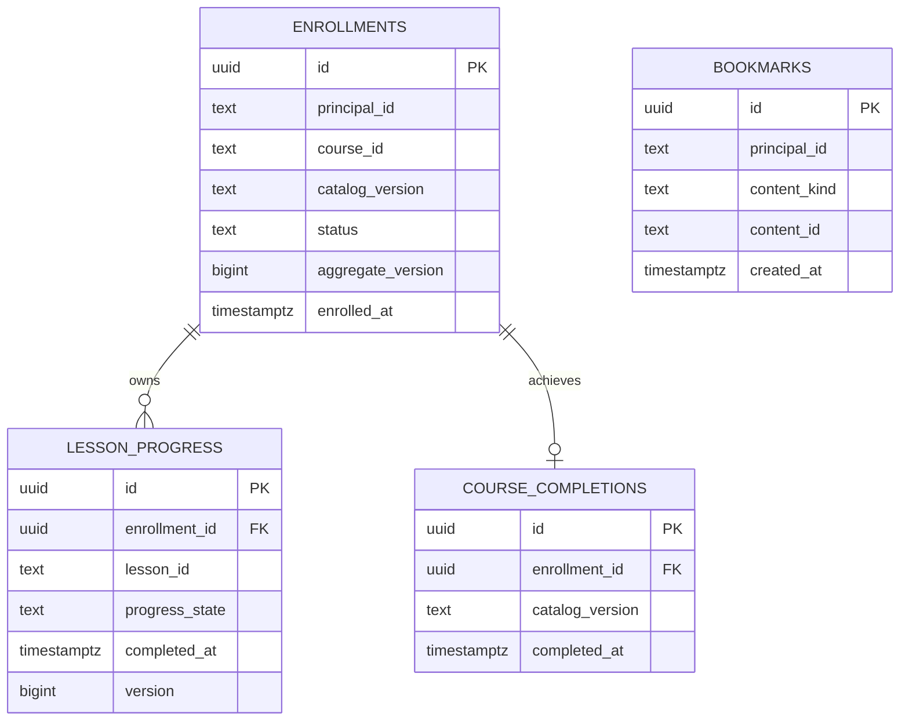
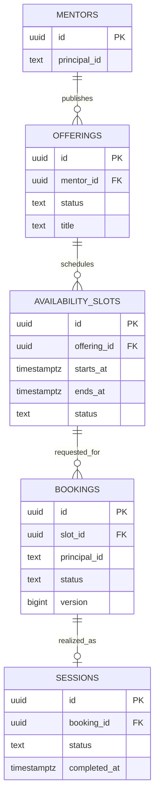
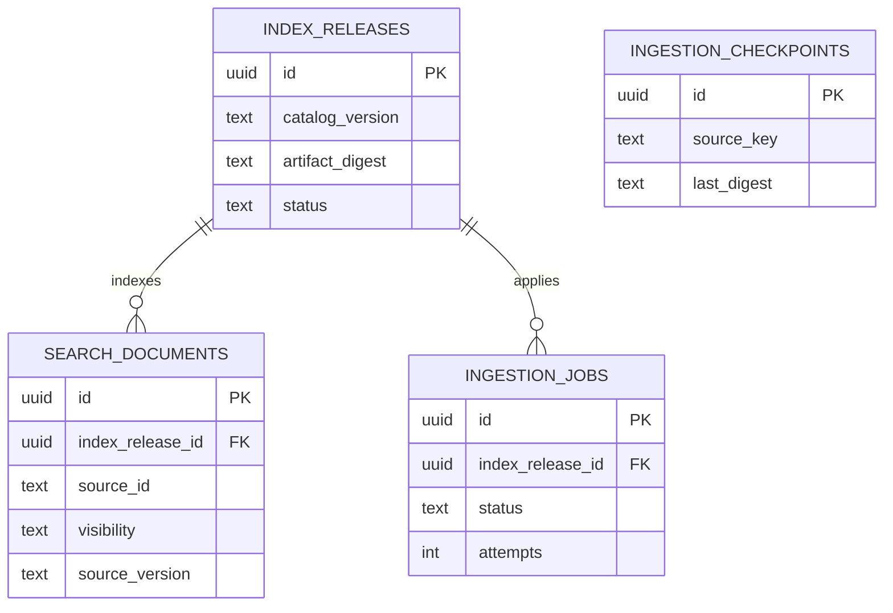
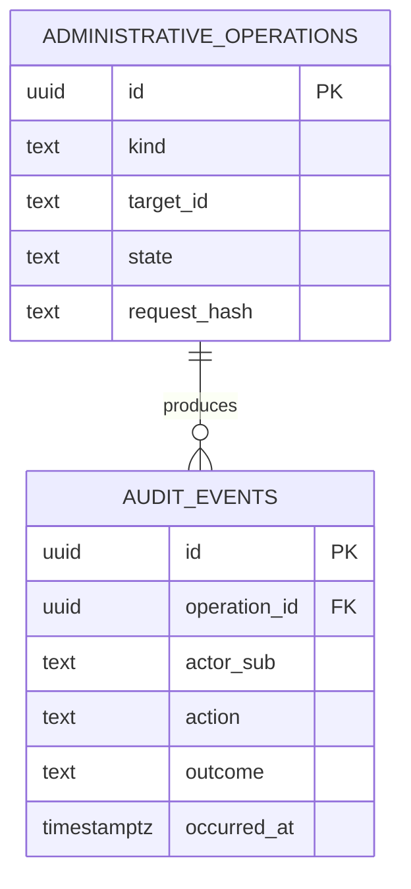

# Reltroner LMS — Phase 3A-03C-2C Realm Roles & Client Scopes Evidence

- **Observed at:** 2026-10-09T03:49:29+00:00 (10:49:29 WIB)
- **Environment:** Keycloak production realm `reltroner`, PostgreSQL 18 `keycloak_db`, Keycloak Admin Console.
- **Method:** SQL `BEGIN TRANSACTION READ ONLY`, `statement_timeout=5s`, SQL `COMMIT` observed; GUI read-only copy.
- **Status:** READ-ONLY DISCOVERY PASS. This does **not** certify effective claims, token issuance or LMS authorization.
- **Previous context:** Phase 3A-03C-2A and -2B identified 8 clients in `reltroner`, with no `lms-user`, `lms-admin`, `lms-api`, `lms-reltroner` in this realm; no matching LMS clients were found across the two observed realms.

## 1. Observed realm roles (6)

`default-roles-reltroner` (composite); `demo_user`; `production_user`; `service_account`; `offline_access`; `uma_authorization`.

The two HRM identity-class roles are described in Admin Console as eligibility classes, not HRM business permissions. No LMS `student`, `instructor`, or `admin` realm role was listed. Role membership or token outcomes were not inspected.

## 2. Observed client scopes (17)

| Client scope | Protocol | Mapper count | GUI assigned type |
|---|---|---:|---|
| AuthnContextClassRef | SAML | 1 | Default |
| acr | OIDC | 1 | Default |
| address | OIDC | 1 | Optional |
| basic | OIDC | 2 | Default |
| email | OIDC | 2 | Default |
| hrm-demo-identity | OIDC | 1 | None |
| hrm-production-identity | OIDC | 1 | None |
| microprofile-jwt | OIDC | 2 | Optional |
| offline_access | OIDC | 0 | Optional |
| organization | OIDC | 1 | Optional |
| phone | OIDC | 2 | Optional |
| profile | OIDC | 14 | Default |
| role_list | SAML | 1 | Default |
| roles | OIDC | 3 | Default |
| saml_organization | SAML | 1 | Default |
| service_account | OIDC | 3 | None |
| web-origins | OIDC | 1 | Default |

Total: **37 protocol mapper rows** in the SQL result. This is a global scope inventory, **not** an effective mapper count for any specific client/token.

The `roles` scope has `audience resolve` (`oidc-audience-resolve-mapper`), `client roles` (`oidc-usermodel-client-role-mapper`), and `realm roles` (`oidc-usermodel-realm-role-mapper`). HRM identity scopes each have one realm-role mapper (`reltroner-demo-identity-class`, `reltroner-production-identity-class`). Do not modify these shared/HRM scopes in Phase 3A.

## 3. Findings and limits

- Existing Keycloak provides OIDC role mapping primitives; LMS-specific clients/scopes/roles are not yet observed.
- The `roles` scope's audience-resolve mapper does not by itself prove `aud=lms-api`: its effect depends on client roles, assignments and applicable role scope mappings.
- `public_client`, authorization-code/PKCE, `azp`, audience, effective permission claims, and administrative privilege isolation **cannot** be verified for nonexistent LMS clients.
- The state of HRM effective scope assignments remains to be inventoried. GUI 'Assigned type' is not a substitute for evaluating a specific client.
- Avoid changing built-in `roles`, global realm defaults, HRM scopes/clients, Keycloak secrets, or database objects during discovery.

## 4. Candidate 3A-03C-2D architecture — NOT APPROVED

1. Create distinct OIDC public browser client identities `lms-user` and `lms-admin` (authorization code + PKCE S256; exact origin/redirect validation; no implicit/direct grants); this is a planning proposal, not execution authorization.
2. Represent the protected resource `lms-api` and define explicit audience issuance. Evaluate use of a **new LMS-only scope** for the `lms-api` audience, assigned only to LMS browser clients, rather than modifying realm-wide `roles` or existing HRM scopes.
3. Define API capabilities as `lms-api` client roles and verify the resulting `resource_access.lms-api.roles` claim (or approved equivalent) in *access tokens*, with full scope/role exposure tightly constrained.
4. Require Gateway signature/`iss`/`aud`/`exp`/`nbf`/`azp` plus capability checks, and require independent authorization + resource ownership checks in private services.
5. Do not equate existing `production_user`, `demo_user`, or the presence of an admin browser client with authorization to LMS privileged endpoints.
6. Record internal service caller identity, delegation and key/replay policy as a separate ADR, pending acceptance.

## 5. Next read-only evidence

- Enumerate client-scope associations for `hrm-web` and `hrm-demo-web` (names and default/optional only).
- Inspect `Full Scope Allowed` on those HRM clients via Keycloak GUI; no changes.
- Inspect each HRM client's `Client scopes → Evaluate` **metadata** if necessary. Never share token/JWT, secrets, user IDs or refresh tokens.
- Do not generate test tokens for LMS clients until those clients are provisioned under an authorized later phase.

## 6. Decision

**3A-03C-2C = DISCOVERY PASS; 3A-03C-2D = ADR DRAFT OPEN; NO PRODUCTION MUTATIONS AUTHORIZED.** Phase 3A overall remains IN PROGRESS. Phase 3B and Phase 4 remain NOT AUTHORIZED.

## References

- `Reltroner/progress-documentation/lms/logical-service-boundary-api-contract.md` Phase 1 identity invariants.
- `Reltroner/progress-documentation/lms/master-infrastructure-placement-contract.md` Phase 0C placement invariants.
- `Reltroner/progress-documentation/lms/engineering-end-to-end-progress-ledger.md` implementation state and ADR candidates.
- Keycloak Server Administration Guide, token role mappings, audience support and evaluating client scopes: https://www.keycloak.org/docs/26.7.0/server_admin/index.html

# Reltroner LMS — Phase 3A-03C-2D Identity Provisioning ADR (DRAFT)

- Date: 2026-10-09 (Asia/Jakarta)
- Status: PROPOSED — NOT ACCEPTED, NOT IMPLEMENTED, NO PRODUCTION MUTATIONS
- Phase: 3A Integration Discovery / 3A-03C Identity & Trust / 3A-03C-2D Identity Provisioning ADR
- Authoritative contracts: `lms/logical-service-boundary-api-contract.md` (blob `cf089b8df4b5ccb1761b504ffae662a0053bf03e`), `lms/master-infrastructure-placement-contract.md` (blob `b899761c9e833f9fa567055801b9ba0834ed56eb`), and `lms/engineering-end-to-end-progress-ledger.md` (blob `866cc8c3b126ee6fae0cab8ac5160552cf41ad4a`).
- Backend pinned `Reltroner/LMS-BE@e30a61780994d85671cbf079e6b9ce899b3fe837`; local and remote `main` identical, clean; all six `routes/api.php` only `<?php`, no tracked domain routes or migrations.
- Supporting FE evidence: `Reltroner/LMS-FE@f2d40417d0eea71e2c3e329ec6e32933b3e6cbd7`; `.env.example` points to `sso.reltroner.com` and `lms-reltroner`; source `extractRoles()` falls back to `student` for UX. No evidence of production frontend OIDC env.

## A. Directly observed evidence

| Evidence | Status | Detail |
|---|---|---|
| OIDC issuer metadata | VERIFIED | `https://auth.reltroner.com/realms/reltroner`, endpoint metadata successful HTTP 200 and canonical issuer exact match (2026-10-09 03:07 UTC). |
| Keycloak realm | VERIFIED | `reltroner` enabled (2026-10-09 03:27 UTC). |
| Client registry | VERIFIED ABSENT | `lms-user`, `lms-admin`, `lms-api`, legacy `lms-reltroner` not present in `reltroner` realm (2026-10-09 03:27 UTC). |
| Cross-realm candidates | VERIFIED | `master` 7 clients, `reltroner` 8; only `reltroner-realm` matches '%reltroner%' and located in `master`. |
| Realm client list GUI | VERIFIED | Eight clients: `account`, `account-console`, `admin-cli`, `broker`, `hrm-demo-web`, `hrm-web`, `realm-management`, `security-admin-console`. |
| Realm roles | VERIFIED | `default-roles-reltroner`, `demo_user`, `production_user`, `service_account`, `offline_access`, `uma_authorization`. No LMS persona or capabilities observed. |
| Client scopes | VERIFIED | 17 scopes, 37 associated protocol mappers; `roles` mappers: `audience resolve`, `client roles`, `realm roles`; HRM-specific `hrm-demo-identity`, `hrm-production-identity`. |
| HRM default/optional scope associations | VERIFIED | Both HRM clients have 12 scopes each (24 assignments). Common defaults: `acr`, `basic`, `email`, `profile`, `roles`, `web-origins`. Demo additionally `hrm-demo-identity` as default; production additionally `hrm-production-identity` as default. Common optional scopes: `address`, `microprofile-jwt`, `offline_access`, `organization`, `phone`. |
| HRM client-level scope restriction | VERIFIED | `hrm-demo-web` and `hrm-web` both `full_scope_allowed=false`, `public_client=false`. |
| Client-level protocol mappers | VERIFIED | No directly attached mapper rows for either HRM client. Their effective mapper behavior may still be inherited from linked scopes. |
| Effective HRM token claims | NOT VERIFIED | No Evaluate evidence/decoded sanitized claims. Do not infer emitted permissions or audience from mapper presence alone. |
| LMS SSO token behavior | NOT APPLICABLE | Target clients do not yet exist; no live target access token available. |
| Client effective admin capabilities | NOT VERIFIED | No LMS client/roles/mappers; never infer permissions from realm identity-class roles. |

Timestamp for 3A-03C-2D-1: `2026-10-09T04:00:59+00:00` (11:00:59 WIB); database transaction `BEGIN TRANSACTION READ ONLY`, `COMMIT` successful. Evidence ID `LMS-3A-03C-2D1-20261009-040059Z`.

## B. Threat/impact boundaries

1. **Shared realm is a multi-application trust environment.** Existing HRM and Keycloak clients are production clients. Editing shared `roles` scope, realm-default scope templates, `hrm-*-identity` scopes, existing client flow settings, or existing roles is outside this proposed LMS change scope.
2. `Full Scope Allowed=false` limits token role scope but does not prove zero role leakage. Effective token claim test is still mandatory.
3. No direct client mappers means **not** that clients have no mappers — linked client scopes contribute mappers.
4. The existing realm role `service_account` is an identity classification and does not by itself provide authenticated service-to-service transport or authorize admin rights.
5. There is no supported authority for creating/mutating user credentials or directly writing Keycloak tables through LMS. Provisioning, when approved, must use supported Keycloak administrative interfaces/automation with review and rollback.

## C. Candidate ADR — dedicated LMS identities, no HRM mutation

### C1. Browser clients (Phase 4 target; no mutation now)

- `lms-user`: public OIDC client, code flow enabled, PKCE S256 required, implicit flow OFF, direct access grants/password flow OFF, service accounts OFF. Exact redirect allowlist `https://lms.reltroner.com/auth/callback`; post-logout return, origin, and dev redirect entries only after documented verification. No wildcard, no broad sibling-subdomain cookie requirement.
- `lms-admin`: independent public OIDC client, same OAuth constraints; exact redirect allowlist `https://lms-admin.reltroner.com/auth/callback`; independent origin. Client name does not equal user authorization: server requires administrative capability and correct client context.
- Avoid implicit/deprecated flows, broad redirect wildcards, browser-held client secrets, and direct Keycloak admin credentials in UI.
- Frontend legacy OIDC env and `student` UX fallback are separate planned migration steps with explicit rollback; not changed during discovery.

### C2. Resource server and capability namespace

- `lms-api`: dedicated identity/resource indicator target for `aud=lms-api`. Candidate physical form: OIDC client with no user-facing browser flows, housing authorization roles. This is a design choice subject to ADR acceptance, not proof that a dedicated API client is technically mandatory for every audience strategy.
- Roles are **client roles of `lms-api`**, not new broadly assigned realm roles, under exact names from frozen contract:
  - Learning (6): `learning.enrollment.read.self`, `learning.enrollment.create.self`, `learning.progress.read.self`, `learning.progress.write.self`, `learning.bookmark.read.self`, `learning.bookmark.write.self`.
  - Mentorship (4): `mentorship.offering.read`, `mentorship.booking.read.self`, `mentorship.booking.create.self`, `mentorship.booking.cancel.self`.
  - Knowledge/Assistant (2): `knowledge.search`, `assistant.use`.
  - Administrative (7): `admin.principal.read`, `admin.principal.role.manage`, `admin.mentorship.read`, `admin.mentorship.manage`, `admin.learning.read`, `admin.learning.override`, `admin.audit.read`.
  - Total = 19 exact names. Coarse `student/instructor/admin` is not backend authorization.
- Candidate dedicated LMS scopes: `lms-api-audience`, `lms-learner-capabilities`, `lms-admin-capabilities` (names proposed, not frozen). Their mapper and role-scope settings must be narrow; do **not** change global realm-default or HRM scopes. Verify how `roles` default client scope interacts with these before enabling either browser client.
- Explicit audience mapper scoped only to LMS clients is a deterministic candidate; built-in `audience resolve` is **not** a guarantee that `aud=lms-api` will exist. Final decision (hardcoded audience vs role-driven resolver) remains open until controlled Evaluate tests.
- Set LMS browser clients `Full Scope Allowed=false` and explicitly allow only needed client-role mappings. Suggested initial allowlist: learner capabilities only on `lms-user`; admin capabilities only on `lms-admin` (add specific non-admin permissions to admin only when a demonstrated journey requires them). A user's admin assignment must never imply that `lms-user` tokens carry admin capability.
- Avoid emitting all capability roles in ID tokens or exposing privileged authority through frontend route flags. Backend validates access token's `resource_access.lms-api.roles` (or an explicitly ratified, proven equivalent claim), `aud`, `azp`, issuer, signature, temporal claims, and domain resource ownership. Exact claim location is an ADR decision requiring empirical token evaluation.

### C3. Gateway and private services

- Gateway public checks: bearer access-token class, cryptographic signature/trusted algorithms and JWKS, exact issuer, correct `aud=lms-api`, expiry and nbf, legitimate `azp`/client context, and per-operation capability; reject missing claims (no default student permissions).
- Domain services require authentic **workload identity plus integrity-protected, short-lived, recipient/operation-bound delegated principal context**. Never treat loopback or `X-Principal-ID` alone as authorization.
- Internal assertion format, key rotation, replay prevention, revocation freshness and Assistant-to-domain delegation remain separate ADR candidates. No role-mutation or Assistant tool execution authorized by this decision.
- `/api/v1/admin/principals/{id}/roles` must use least-privilege Keycloak Admin API adapter, durable audit intent/outcome, unknown-result reconciliation, and negative tests. No direct Keycloak DB writes.

## D. Negative acceptance and compatibility matrix (draft)

| ID | Test | Required result |
|---|---|---|
| ID-01 | `lms-user` issuer via metadata and code+PKCE S256 | correct login/token issuer |
| ID-02 | `lms-admin` independent public client, separate origin | no mixed redirects/origins |
| ID-03 | both browser clients have Full Scope Allowed disabled | confirmed after provisioning |
| ID-04 | learner token for normal learner | `iss` correct; `aud` contains `lms-api`; `azp=lms-user`; only allowed capabilities |
| ID-05 | admin token for properly authorized admin | `azp=lms-admin`, correct admin permissions, no blanket grant |
| ID-06 | admin user signing in via `lms-user` | no admin capabilities in learner-client access token |
| ID-07 | learner using `lms-admin` client | no administrative API authorization |
| ID-08 | missing capability, role-less principal, wrong audience | 403/401 policy-correct fail closed |
| ID-09 | ID token sent to API, forged/expired token, wrong issuer | reject |
| ID-10 | role revoked or rotated JWKS | verified freshness/error/revalidation behavior |
| ID-11 | spoofed internal principal headers | reject |
| ID-12 | HRM before/after client scope list, role scopes and sanitized Evaluate claim shape | no unintended drift |
| ID-13 | no LMS client scopes attached to HRM clients | verified |
| ID-14 | 19 capability mapping names correct | automated config/export diff plus mapping tests |
| ID-15 | `lms-api` audience absent/wrong | reject |
| ID-16 | Keycloak admin secrets never in frontend/export artifacts | verified |
| ID-17 | admin role mutation failure/timeout and audit partial outcome | durable reconciliation demonstrated |
| ID-18 | service asserts admin principal outside its trust audience/operation | reject |
| ID-19 | PKCE omitted/downgraded; implicit/password flow attempts | reject |
| ID-20 | existing HRM login/role identity flows after any controlled provisioning | no regression |

Status all tests: SPECIFIED / NOT EXECUTED. No real user JWT/token/shared client secret may be placed in reports.

## E. Controlled implementation sequencing (future; NOT AUTHORIZED)

1. Freeze this ADR, claim schema, exact role-scope semantics and rollback baseline after architect/human acceptance in Phase 3A.
2. Implement versioned configuration/contract/tests in Phase 3B under permitted repo mutation only.
3. At Phase 4 change window, capture redacted prechange Keycloak configuration/baseline plus HRM login control results; verify backups and rollback procedure.
4. Create `lms-api` resource identity, 19 LMS-specific roles and scoped mapper/client scopes; do not alter existing roles/scopes.
5. Create `lms-user` and `lms-admin` with least-privilege associations and strict flow/origin settings; verify effective claims against test identities in Keycloak Evaluate (no raw token disclosure).
6. Run negative matrix and existing HRM regression probes; ensure Gateway domain authorization rejects incorrect tokens and service-to-service spoofing.
7. Controlled FE OIDC cutover and separate admin deployment only after API gate and reversible rollback plan.
8. Pin evidence: Git SHA, client scope settings, sample *redacted* claim names/values, timestamps, verifier and pass/fail; no false production acceptance on config presence alone.

## F. Open decisions and explicit acceptance gates

- ADR-KC-01: `lms-api` client/resource representation and audience mapper strategy (including `aud=lms-api` token proof).
- ADR-KC-02: client scopes and role mapping mechanism; `resource_access.lms-api.roles` vs separately namespaced claim; prove non-admin token isolation.
- ADR-KC-03: effective client scope inheritance and role filtering with current installed Keycloak version.
- ADR-KC-04: frontend cutover and rollback strategy, separate admin origin; actual frontend deployed environment still unverified.
- ADR-KC-05: service-to-service assertion and service identity (separate ADR).
- ADR-KC-06: role revocation freshness and privileged Keycloak admin adapter/audit reconciliation (separate ADR).
- ADR-KC-07: exact HTTP error taxonomy and negative-test harness integration (Phase 3B).

**Decision gate:** 3A-03C-2D-1 scope association discovery = PASS. 3A-03C-2D candidate ADR = PREPARED, NOT SIGNED. Phase 3A overall = IN PROGRESS. Phase 3B and production provisioning = NOT AUTHORIZED. No changes to existing HRM/Keycloak database, clients, scopes, roles or secrets were made.

## Sources

- User-supplied VPS PostgreSQL output (`2026-10-09T04:00:59+00:00`), including 24 scope association rows, 2 client settings, 0 direct client mapper rows.
- Earlier user-supplied PostgreSQL and GUI evidence (`03:27`, `03:31`, `03:49` UTC).
- Frozen Reltroner GitHub contracts listed above.
- Keycloak official Server Administration Guide, https://www.keycloak.org/docs/26.8.0/server_admin/ and https://www.keycloak.org/docs/26.7.0/server_admin/index.html (general documentation; test actual installed runtime version before final ratification).

# Reltroner LMS — Phase 3A-03C-2D Identity Provisioning Architecture Decision Record

**ADR ID:** `ADR-LMS-KC-001`  
**Version:** `review-candidate-1`  
**Date:** 2026-10-09 (Asia/Jakarta)  
**Review outcome:** `RECOMMENDED FOR SIGN-OFF / DESIGN REVIEW COMPLETE`  
**Governance status:** `NOT HUMAN-RATIFIED; NOT IMPLEMENTED; NO PRODUCTION MUTATION`  
**Parent phase:** `3A — Integration Discovery`; preceding evidence `3A-03C-2D-1 — ACCEPTED (read-only discovery)`  
**Next conditional gates:** ADR sign-off as part of 3A; 3B for versioned contract/tests; Phase 4 for controlled Keycloak provisioning.

## 0. What this ADR decides—and does not decide

The proposed logical identity architecture is explicit enough for architect/human sign-off and Phase 3B configuration specification. It does **not** authorize provisioning, migration, token retrieval, changing existing Keycloak objects, or making a production claim of security readiness. Runtime efficacy is proven only by future test evidence. The service-to-service workload assertion, audit reconciliation, frontend cutover and revocation freshness require separate ADRs and cannot be silently treated as accepted by this record.

**Decision shorthand:** `dedicated browser clients + lms-api resource client/roles + explicit audience + explicitly scope-limited access-token capabilities + preserve HRM unchanged + fail closed`.

## 1. Authoritative sources and pinned evidence

| Class | Evidence/source | Conclusion |
|---|---|---|
| Frozen logical contract | `Reltroner/progress-documentation/lms/logical-service-boundary-api-contract.md`, blob `cf089b8df4b5ccb1761b504ffae662a0053bf03e` | Binding issuer, browser clients, audience, capability namespace, Keycloak authority, no frontend authorization authority |
| Frozen placement contract | `Reltroner/progress-documentation/lms/master-infrastructure-placement-contract.md`, blob `b899761c9e833f9fa567055801b9ba0834ed56eb` | Independent origins; no broad subdomain session requirement; public Gateway/private services |
| Engineering ledger | `Reltroner/progress-documentation/lms/engineering-end-to-end-progress-ledger.md`, blob `866cc8c3b126ee6fae0cab8ac5160552cf41ad4a` | 3A read-only, 3B/4 future stage gates, 19 capabilities, explicit threats and negative tests |
| Backend implementation | `Reltroner/LMS-BE@e30a61780994d85671cbf079e6b9ce899b3fe837` | Six independent Laravel app foundations; empty domain `routes/api.php`; Gateway CORS allowlists two frontends |
| Frontend source | `Reltroner/LMS-FE@f2d40417d0eea71e2c3e329ec6e32933b3e6cbd7` | `.env.example` legacy issuer/client; UX-only `student` default in `auth-roles.ts`; production FE env not verified |
| E-2A 03:27:37 UTC | read-only SQL | `reltroner` realm enabled; `lms-user`, `lms-admin`, `lms-api`, `lms-reltroner` absent within that realm |
| E-2B 03:31:11 UTC | read-only SQL + user Admin Console | `master=7` clients; `reltroner=8`; 8 client IDs agree between SQL/GUI; no LMS-like client cross-realm except unrelated `reltroner-realm` on master |
| E-2C 03:49:29 UTC | read-only SQL + GUI | 6 realm roles, 17 scopes, 37 mappers; shared `roles` scope: realm roles, client roles and audience resolve |
| E-2D1 04:00:59 UTC | read-only SQL | HRM clients each 12 scope associations; each `full_scope_allowed=false`, `public_client=false`; no directly attached protocol mappers |
| Issuer probe 03:07 UTC | external OIDC metadata via production VPS | exact canonical `iss=https://auth.reltroner.com/realms/reltroner`, discovery HTTP 200 |

**Observed existing roles:** `default-roles-reltroner`, `demo_user`, `production_user`, `service_account`, `offline_access`, `uma_authorization`; none grants the LMS capabilities by itself. **Observed HRM-specific scopes:** `hrm-demo-identity`, `hrm-production-identity`. **Unverified:** live LMS tokens (clients absent), installed Keycloak version, HRM effective token claim samples, current FE production OIDC env.

## 2. Decision drivers and exclusions

Drivers: conform to 20 infrastructure and 24 logical frozen invariants; independent public learner/admin trust contexts; avoid access-token privilege escalation; do not alter HRM; deterministic and testable `aud`, `azp` and role claims; easy rollback and no additional paid infrastructure; preserve Keycloak as identity authority.

Exclusions: Keycloak user/password/MFA replacement, browser-held Keycloak Admin credentials, new IAM product, shared LMS user database, changing built-in `roles` mapper or realm-wide defaults, changing existing `hrm-web`/`hrm-demo-web`, and new LMS admin role-edit privileges before audited adapter release.

## 3. Chosen target architecture (RECOMMENDED)

### 3.1 Three identities

| Identity | Purpose | Recommended properties | Explicit prohibitions |
|---|---|---|---|
| `lms-user` | Browser OAuth client for `https://lms.reltroner.com` | Public OIDC; standard Authorization Code ON; PKCE **S256 required**; exact callback `https://lms.reltroner.com/auth/callback`; dedicated allowed origin | client secret in browser; implicit grant; password/direct grants; service accounts; admin capability in learner access token |
| `lms-admin` | Browser OAuth client for `https://lms-admin.reltroner.com` | Independent public OIDC; code+PKCE S256; callback `https://lms-admin.reltroner.com/auth/callback`; dedicated allowed origin; `Full Scope Allowed=false` | admin entitlement by virtue of client ID; wildcard redirects; client secret; broad origin/cookie sharing |
| `lms-api` | OIDC resource identity + owner of 19 API capability client roles | Dedicated OIDC resource-server client; target `aud=lms-api`; no interactive browser flow or password grant; service accounts OFF initially | treating this client as a third learner surface; Keycloak Admin APIs exposed to frontend |

For **both** browser clients: `Full Scope Allowed=false`, explicitly restricted role scope mappings, no implicit/direct/resource-owner-password flows, service accounts OFF. Disable unneeded scopes such as `offline_access` until a specific use case/review proves necessary. Enforce exact redirects and web origins; add dev origins only in documented nonproduction settings, never wildcard production origins. OIDC RP-initiated logout URIs require exact review, not guessed. Confirm settings against the installed Keycloak version before configuration.

In newer Keycloak documentation `Full Scope Allowed` is marked deprecated, but disabling broad role visibility and explicitly specifying role scope mappings remains the security objective. Do not change global client policies solely for LMS without separately evaluating HRM impact.

### 3.2 Audience mechanism (chosen candidate)

**Choose an explicit, dedicated audience mapper** in an LMS-only OIDC client scope, proposed name `lms-api-audience`. Configure it to include `lms-api` in the **access token** of both LMS browser clients; link it as a **DEFAULT client scope only to** `lms-user` and `lms-admin`. Do not attach to HRM clients, realm-default scope template, or the built-in `roles` scope. Do not emit unnecessary audience into ID tokens.

Why: the built-in `audience resolve` mapper only derives `aud` when relevant client roles are effectively available. Even a user with zero granted LMS capabilities must be possible to authenticate without an inconsistent audience result; authorization must subsequently deny protected operations with 403. Dedicated mapper makes the intended resource audience stable independent of role assignments.

Accept string or array `aud` as permitted by JWT, but require membership/equality to exact `lms-api`; extra audiences never confer LMS privilege. The presence of audience is **not** an authorization decision. Validate authorized client separately.

### 3.3 Capability roles and claim contract (chosen candidate)

Exact **19** capability names are created as `lms-api` **client roles** (not realm roles and not ad hoc server constants). External protected API evaluates only explicit allowed values from the **access-token** claim `resource_access["lms-api"].roles` after cryptographic checks. This claim location is an implementation contract candidate; runtime example-token evaluation is a mandatory provisioning acceptance gate.

**6 Learning:**

- `learning.enrollment.read.self`
- `learning.enrollment.create.self`
- `learning.progress.read.self`
- `learning.progress.write.self`
- `learning.bookmark.read.self`
- `learning.bookmark.write.self`

**4 Mentorship:**

- `mentorship.offering.read`
- `mentorship.booking.read.self`
- `mentorship.booking.create.self`
- `mentorship.booking.cancel.self`

**2 Knowledge/Assistant:** `knowledge.search`, `assistant.use`.

**7 Admin:** `admin.principal.read`, `admin.principal.role.manage`, `admin.mentorship.read`, `admin.mentorship.manage`, `admin.learning.read`, `admin.learning.override`, `admin.audit.read`.

The 19 roles are a **namespace**, not 19 roles granted to every LMS account. A user's assignments and the client's allowed role scope mappings must both permit a capability. No role or claim inferred from `student`, `instructor`, `admin`, `production_user`, `demo_user`, `service_account` or frontend `RoleGate` may substitute for backend capability verification.

### 3.4 Effective scope isolation (chosen candidate)

Candidate dedicated client scopes:

| Scope name | Linked to | Assignment | Scope and content |
|---|---|---|---|
| `lms-api-audience` | `lms-user`, `lms-admin` | DEFAULT | Access-token Audience mapper for `lms-api` ONLY |
| `lms-learner-capabilities` | `lms-user` ONLY | DEFAULT | Explicit role scope mappings for the **12** nonadmin capabilities, subject to per-user role assignment |
| `lms-admin-capabilities` | `lms-admin` ONLY | DEFAULT | Explicit role scope mappings for **7** admin capabilities, subject to per-user role assignment |

Use the existing Keycloak `roles` mapper behavior to render effective client roles into `resource_access`, **without editing the shared built-in scope**. On both clients, turn off Full Scope Allowed and verify effective role scope mapping intersection in the *Evaluate* tab. Ensure no dedicated LMS scope is added as a realm default or to any HRM client. Check whether a scope with role scope mappings is omitted for users without matching roles and what effect that has on intended tokens.

Admin flows requiring particular nonadmin APIs require an **explicit contract-approved addition** of exactly the needed capability to admin scope; don't pregrant all learner actions just for convenience. Instructor privileged workflows live on admin origin but receive only the permissions needed. Public catalog and permitted guest offerings do not require granting an authenticated capability to every anonymous visitor; guest behavior is independently decided at endpoint layer.

**Allowed does not mean assigned:** A client-scoped role cannot enter an access token unless the subject is actually assigned that role (or inherits it through an explicitly approved group/composite mechanism). Avoid realm default roles that autoassign LMS admin; never grant `admin.*` by account registration.

### 3.5 Expected sanitized access-token claim shape (ILLUSTRATIVE, NOT OBSERVED)

Learner authorized for reading progress:

```json
{
  "iss": "https://auth.reltroner.com/realms/reltroner",
  "aud": ["lms-api"],
  "azp": "lms-user",
  "sub": "<redacted-test-subject>",
  "exp": 0,
  "resource_access": {
    "lms-api": {
      "roles": ["learning.progress.read.self"]
    }
  }
}
```

Here `exp: 0` is a **redacted placeholder**, not a sample valid token. Do not copy as live test fixture; validators require a future valid timestamp and signature. An authorized admin token similarly has `azp=lms-admin` plus actual assigned `admin.*` capability, **not** implied all 7 admin capabilities. No client secret, raw JWT, session cookie, private/public key material, user email or real subject ID belongs in handoff logs.

### 3.6 Gateway policy: deterministic checks

For every protected `/api/v1` operation: trusted issuer + JWKS signature with algorithm allowlist; token is access token of an accepted type/profile (verify actual Keycloak issued format; do **not** assume `typ=at+jwt` without evidence); `exp`, `nbf` if present and time tolerance bounded; `aud` contains `lms-api`; valid `azp` in approved browser client allowlist; required explicit `resource_access.lms-api.roles` capability. For admin operations add mandatory `azp=lms-admin`; nonadmin routes apply approved route/client allowlists rather than assuming universal client access. Missing capability => deny, do not default to student. Derive principal ID from signed `sub`. Enforce resource-owner checks **within owning service**, not solely Gateway.

Classification candidate: missing/invalid/expired token -> `401` with safe Problem Details; authenticated principal with insufficient rights/client context -> `403`; distinguish infrastructure/key fetch unavailable from invalid identity without fail-open. Exact final HTTP error taxonomy remains the Phase 3A API schema/3B contract gate; never invent successes.

No direct browser request to private Learning/Mentorship/Knowledge/Assistant/Audit services. CORS allowlist is **browser access behavior**, not a substitute for authentication/authorization. Maintain host-scoped credentials; avoid `Domain=.reltroner.com` cookies.

### 3.7 Internal service trust is explicitly NOT decided here

Gateway-to-service calls require authenticated **workload caller identity** AND a signed, short-lived, recipient- and operation-bound principal delegation. Service must validate caller, principal context and domain ownership. `X-Principal-ID`, `X-Roles`, `X-Permissions` or loopback alone are unacceptable. Assistant-to-domain delegation must be audience-bound. Token transport format, signing keys, replay control, clock skew, revocation, rotation and service-caller allowlists remain `ADR-LMS-INTERNAL-TRUST` **OPEN**; no silent adoption of a specific signing algorithm or key.

### 3.8 Role administration boundary

`PATCH /api/v1/admin/principals/{principal_id}/roles` cannot ship based on client provisioning alone. It requires the approved restricted Keycloak Admin API adapter (least privilege), authorization of the initiating principal, durable audit intent/outcome, retry/reconcile for ambiguous Keycloak result, prevention of self-escalation if required, and regressions. Never edit Keycloak database directly or share admin credentials with browser. This is `ADR-LMS-ADMIN-ROLE-OPERATIONS` OPEN.

## 4. Alternatives considered

| Candidate | Decision | Reason |
|---|---|---|
| One shared browser client for learner/admin | REJECT | Inconsistent with frozen separate-browser-client invariant and weak separation |
| Realm `production_user` as LMS permission | REJECT | Identity class is not app capability; risks privilege confusion |
| `lms-api` roles under client-role namespace | PREFERRED | Exact capability mapping and Keycloak resource identity, limited role scope |
| `audience resolve` alone | NOT PRIMARY | `aud` changes with effective role grants; more conditional behavior to prove |
| Explicit dedicated audience mapper for both LMS clients | PREFERRED | Predictable `aud=lms-api`; avoids changing shared scope |
| Change built-in `roles`/realm default scopes for LMS | REJECT | Potential impact to HRM clients in shared realm |
| Realm role for `student` implies all learner capabilities | REJECT | Fail-closed capabilities required; role-persona not authority |
| Bypass Keycloak and implement LMS passwords | REJECT | Violates frozen identity authority |
| Provision all now | REJECT FOR PHASE 3A | Read-only discovery gate, not runtime change authorization |

## 5. Threat, negative, and compatibility acceptance matrix

Every row: **SPECIFIED / NOT EXECUTED**. Tests require pinned environment, user role fixture, sanitized claim shape, actual request, status/result, timestamp and reviewer.

| Test ID | Condition / attempt | Required result |
|---|---|---|
| KC-T01 | `lms-user` authorization code without S256 PKCE | Reject |
| KC-T02 | `lms-admin` authorization code without S256 PKCE | Reject |
| KC-T03 | Implicit/password/direct access grant attempted against LMS clients | Reject |
| KC-T04 | Redirect to sibling, wildcard, unregistered or HTTP production URL | Reject |
| KC-T05 | Public browser clients contain secret/service account privilege | Reject config |
| KC-T06 | Legitimate learner access token | Correct `iss`, `aud=lms-api`, `azp=lms-user`, only actual permitted roles |
| KC-T07 | Legitimate admin with one allowed capability | `azp=lms-admin`, only granted admin capabilities; no blanket all-admin |
| KC-T08 | Same authorized admin subject authenticates via `lms-user` | No admin capability in learner-client access token |
| KC-T09 | Learner signs in through `lms-admin` and requests admin API | Deny 403; client name not permission |
| KC-T10 | Wrong `aud`, valid signature | Deny before domain call |
| KC-T11 | Wrong `azp`, valid signature/audience/capability | Deny per route client policy |
| KC-T12 | ID token passed as access token | Reject |
| KC-T13 | Forged/untrusted-signature, wrong issuer, expired token | Reject |
| KC-T14 | Missing capability / subject no roles | Deny; no default `student` privilege |
| KC-T15 | Client is allowed to expose a role but subject not granted role | No role in token; deny request |
| KC-T16 | `lms-user` allowed scope accidentally includes `admin.*` | Deployment BLOCKED |
| KC-T17 | LMS audience scope linked to `hrm-web` or `hrm-demo-web` | Deployment BLOCKED |
| KC-T18 | Guest offering endpoint accessed without token | Only as explicitly allowed by route policy; protected endpoints reject |
| KC-T19 | Cross-user learning/booking resource ID | Deny by service ownership rule |
| KC-T20 | Replayed/spoofed internal delegation | Reject in independent internal trust gate |
| KC-T21 | JWT JWKS rotation, missing key, Keycloak outage | Fail closed with documented cache/outage policy |
| KC-T22 | Capability revoked while old token remains valid | Enforced freshness/revocation policy; do not claim instant effect absent mechanism |
| KC-T23 | HRM scope assignment/mapper/role export before and after provisioning | Diff exactly zero for existing HRM objects |
| KC-T24 | HRM existing auth/login and authorization regression | PASS before and after rollout |
| KC-T25 | Keycloak role-admin mutation ambiguous result | No false success; durable audit/reconciliation (separate gate) |
| KC-T26 | Ingress token contains CORS-approved origin but no capability | Reject; CORS not authorization |
| KC-T27 | Realm default roles or shared `roles` mapper mutated | Deployment BLOCKED without separate contract authorization |
| KC-T28 | Actual `resource_access.lms-api.roles` and `aud` evaluated for both clients using test identities | Match schema and allowlist; no HRM-specific role/claim leakage |
| KC-T29 | Optional `offline_access` scope requested without authorization | No unintended offline access |
| KC-T30 | Revocation/missing-claim and request-ID error response | Sanitized Problem Details; no tokens/stack traces |

**Hard preproduction blockers:** KC-T06..T17, KC-T21, KC-T23, KC-T24, KC-T28 and any route-relevant negative tests. Full release acceptance additionally depends on all mandatory domain/service tests and separately signed ADRs.

## 6. Rollout/rollback order — for future approved Phase 4 ONLY

0. Complete review and accept this ADR as part of 3A; version config specification and test harness in 3B. Do NOT make live changes from this document alone.
1. During approved change window: verify installed Keycloak version, Admin Console permissions, production env, issuer/JWKS, HRM effective behavior; prepare access-controlled backup/export securely (never paste exported secrets) and tested restore/rollback method; capture scoped redacted baseline including HRM role/scope associations.
2. With approved Keycloak Admin API/GUI or reviewed automation, create a **new** disabled/unexposed `lms-api` resource client as appropriate; disable unneeded grants/service accounts; create **exactly 19** client roles; no global default grants.
3. Create dedicated `lms-api-audience`, `lms-learner-capabilities`, `lms-admin-capabilities` scopes; enforce exact role scope mappings; no HRM bindings and no mutation of default templates.
4. Create `lms-user` and `lms-admin`, strict public/code/S256/redirect/origin settings; explicitly disable unwanted flows, offline grants, Full Scope Allowed; attach only correct LMS-specific scopes.
5. Use Keycloak Client Scopes -> Evaluate with synthetic/nonproduction test identities and test role assignments; inspect **redacted claim structure only**; confirm audience and client-context isolation, including admin principal via learner client.
6. Compare HRM configuration scoped diff to frozen baseline and run HRM regression tests. If any HRM drift or client permissions mismatch: stop; disable/remove only newly created LMS entities with dependency-aware rollback; never wipe realm or HRM clients; follow documented backup restore procedure if necessary.
7. Only after Gateway JWT validation, internal auth, API tests and domain authorization are green, enable controlled FE OIDC cutover with independent learner/admin deployment and rollback; no production token accepted by unverified domain handler.
8. Evidence-based promotion and human approval: SHA, immutable config export hash (redacted), timestamp, actor, test results, before/after differences and rollback rehearsals.

**No package upgrade, OS reboot, DNS/TLS change, Keycloak mutation, Laravel code write, database migration, role assignment or production test-user creation is authorized by Phase 3A.**

## 7. RACI / decision owner and immutable constraints

| Deliverable/role | Decision ownership |
|---|---|
| Target identity contract and canonical requirements | Frozen Phase 0C/1 contracts; not subject to unilateral change |
| Design recommendation and threat analysis | ChatGPT architecture reviewer (this ADR) |
| Ratification / accepted ADR | User/project owner explicit approval after review |
| Keycloak provisioning implementation | Authorized operator in later controlled Phase 4 change window |
| Backend token validator and tests | IDE coding agent after accepted 3B spec/change scope; independently reviewed |
| HRM compatibility | Existing HRM production contract + observed baseline, no implicit modifications |
| Release readiness | Product DoD evidence reviewers, not inferred from source existence |

## 8. Unresolved dependencies (not blockers to design review; blockers to release as applicable)

| Ref | Remaining question | Completion evidence | Gate |
|---|---|---|---|
| KC-OPEN-01 | Exact installed Keycloak version and feature/UI semantics | version probe + admin UI screenshots, sanitized | Pre-implementation |
| KC-OPEN-02 | `lms-api` resource client exact flags/automation schema | reviewed config fixture and later Evaluate claims | 3B specification/Phase 4 |
| KC-OPEN-03 | Effective role scope algorithm and no HRM claim leakage | synthetic test token claim-shape matrix | Phase 4 |
| KC-OPEN-04 | Actual FE deployed OIDC env and separate admin-origin implementation | read-only CI/Cloudflare env metadata, no secrets | Frontend cutover |
| KC-OPEN-05 | Internal workload identity and delegated-principal assertion | separate signed ADR + forged/replay tests | Phase 4 |
| KC-OPEN-06 | Revocation freshness and JWKS outage rotation | explicit SLO/policy and negative tests | Phase 4 |
| KC-OPEN-07 | Restricted admin Keycloak adapter / audit uncertain outcome | separate signed ADR + reconciliation | Before role PATCH release |
| KC-OPEN-08 | Final error taxonomy/schema | OpenAPI + provider/consumer tests | Phase 3B |

## 9. Final review decision

- `3A-03C-2D-1`: **DISCOVERY ACCEPTED** (user-provided SQL/GUI evidence).
- `ADR-LMS-KC-001`: **RECOMMENDED FOR HUMAN SIGN-OFF**. The above identity provisioning design is internally consistent with the pinned frozen contracts on the reviewed requirements. Independent implementation and live token proof are not available, so **not** implementation-accepted.
- `3A-03C-2D`: **ARCHITECTURAL REVIEW COMPLETED; SIGN-OFF PENDING**.
- `3A`: **IN PROGRESS**; subsequent persistence/event, catalog and final DoD/traceability gates remain.
- `3B`: **NOT AUTHORIZED**.
- Production Keycloak/HRM/Gateway/FE modification: **NOT AUTHORIZED**.

## 10. Primary technical references

- Keycloak official Server Administration Guide: https://www.keycloak.org/docs/26.8.0/server_admin/ (role scope mappings, audience mapper and Client Scopes Evaluate; **not** evidence that this is installed runtime version).
- OAuth 2.0 Security Best Current Practice: https://www.rfc-editor.org/rfc/rfc9700
- JWT Best Current Practices: https://www.rfc-editor.org/rfc/rfc8725
- JWT Access Token Profile: https://www.rfc-editor.org/rfc/rfc9068 (token type/profile compatibility must be tested rather than assumed).
- Frozen GitHub contracts and user-supplied runtime evidence listed in §1.

# Reltroner LMS — Phase 3A-03D Persistence & Event Model

> **Status:** DESIGN DRAFT COMPLETE / REVIEW PENDING / NOT HUMAN-RATIFIED / NOT IMPLEMENTED  
> **Date:** 2026-10-09 (Asia/Jakarta)  
> **Architecture:** six independent Laravel 13 services in one repository; **microservices, not modular monolith**  
> **Phase:** 3A Integration Discovery; subphase 03D (persistence, events, failure recovery)  
> **Mutation authority:** NONE — no DB creation, migrations, runtime configuration writes, Redis changes, or GitHub writes authorized by this document  
> **Decision record candidates:** `ADR-LMS-DATA-001`, `ADR-LMS-EVENT-001`, `ADR-LMS-BOOKING-001`, `ADR-LMS-ADMIN-OPERATIONS-001`  
> **Assurance:** schema/ERD/payloads/tests below are design **candidates**, not live implementation evidence.

## 0. Read-first AI handoff and precedence

1. Binding Phase 0C physical placement: `Reltroner/progress-documentation/lms/master-infrastructure-placement-contract.md`, observed blob `b899761c9e833f9fa567055801b9ba0834ed56eb`, 20 invariants `I-01..I-20`.
2. Binding Phase 1 logical/API: `Reltroner/progress-documentation/lms/logical-service-boundary-api-contract.md`, observed blob `cf089b8df4b5ccb1761b504ffae662a0053bf03e`, 24 invariants `P1-I01..P1-I24`.
3. Living progress ledger: `Reltroner/progress-documentation/lms/engineering-end-to-end-progress-ledger.md`, observed blob `866cc8c3b126ee6fae0cab8ac5160552cf41ad4a`.
4. Identity ADR review: `Reltroner/progress-documentation/lms/reltroner-lms-phase3a-03c-2d-provisioning-adr-review-20261009.md`, observed blob `6d472d554c5750d9345929533c788569f7e166ce`; status explicitly `RECOMMENDED FOR SIGN-OFF / NOT HUMAN-RATIFIED`. That GitHub file contains three successive Markdown document headers (3A-03C-2C evidence; 3A-03C-2D original draft; 3A-03C-2D review ADR). For machine ingestion, anchor to the final `# ... Identity Provisioning Architecture Decision Record` section; this is a documentation hygiene issue and does NOT silently approve the ADR.
5. Backend baseline: `Reltroner/LMS-BE@e30a61780994d85671cbf079e6b9ce899b3fe837`, verified complete Git tree (440 entries, nontruncated) with six `services/*/routes/api.php`, **no tracked `database/migrations` paths**. Business endpoints and domain schemas are NOT implemented.
6. Frontend observed baseline: `Reltroner/LMS-FE@f2d40417d0eea71e2c3e329ec6e32933b3e6cbd7`; source-controlled `content/` and `src/catalog/` are catalog authority. Versioned manifest format still Phase 3A candidate.
7. User-provided live VPS discovery on 2026-10-09: Ubuntu 24.04.5 LTS, 1 vCPU, ~3.8 GiB RAM, ~42 GB free disk, PostgreSQL 18 `18/main`, Redis authenticated/loopback, Keycloak/HRM active; only `hrm_db`, `keycloak_db`, `postgres` DBs exist. `hrm_app` and `keycloak_app` own separate DBs and reciprocal cross-DB CONNECT is denied. No `lms_*` DB exists. These are timestamped observations, not a production change authorization.
8. Phase 2D foundation PASS tests are historical foundation evidence, NOT 03D persistence/event tests. **No 03D tests have run.**

## 1. Definition of completion for 3A-03D

Design must describe: (a) six-context data authority + 4 PostgreSQL ownership boundaries; (b) minimal ERD with candidate keys/constraints/indexes, especially concurrency; (c) event families, producer/consumer/PII/version; (d) durable outbox/inbox state machine, replay, ordering and recovery; (e) cross-authority Keycloak/Admin/Audit uncertainty; (f) catalog provenance/search rebuild; (g) backup/retention/least-privilege; (h) negative acceptance tests; (i) open ADR decisions and phase boundaries. This document fulfills **draft specification**, not production proof or ADR sign-off.

## 2. Boundaries: frozen versus proposed

| Service | Frozen durable authority | Proposed persisted tables | Explicit non-authority |
|---|---|---|---|
| Gateway | None by default | None | Enrollment, booking, audit, canonical identity/roles; no `lms_gateway_db` by default |
| Learning | `lms_learning_db` | `enrollments`, `lesson_progress`, `course_completions` (optional derived record), `bookmarks`, `outbox_events`, optional `inbox_events` | Course/module/lesson canonical definitions; credentials |
| Mentorship | `lms_mentorship_db` | `mentors`, `offerings`, `availability_slots`, `bookings`, `sessions`, `idempotency_requests`, `outbox_events`, optional `inbox_events` | Zoom as booking truth; finance ledger/payment authority |
| Knowledge | `lms_knowledge_db` | `search_documents`, `index_releases`, `ingestion_jobs`, `ingestion_checkpoints`, `outbox_events`, `inbox_events` where needed | Canonical catalog; canonical learner state; authority for permissions |
| Assistant | None by default | None; transient Redis TTL context if approved | Direct writes to any domain DB; canonical conversation history by default |
| Audit | `lms_audit_db` | `audit_events`, `administrative_operations`, `outbox_events` if needed, `inbox_events`/dedup | Changing Keycloak identities itself; analytics/source-state replacement |

**No cross-DB FK** (`principal_id`, `course_id`, `lesson_id`, `mentor_id`, `booking_id` in other services are opaque references). Only in-database FK relationships are permitted. PostgreSQL server shared; business schemas, write credentials and migration ownership separate. Keycloak `sub` remains principal identity; no generic LMS `users` table.

### 2.1 Logical ERDs (candidate, NOT deployed)









Every service that publishes correctness-critical events has its **own** local `outbox_events`; each durable consumer has its **own** local `inbox_events`. These are **repeated table patterns in separate databases**, not shared global storage.

## 3. Learning Service schema and invariants (candidate)

### `enrollments`
- `id` opaque globally unique ID, PK; `principal_id` from validated OIDC `sub` (string, not copied identity row); `course_id` stable catalog ID; `catalog_version_at_enrollment` and `source_artifact_digest`; `status` in `active/completed/cancelled` (final lifecycle decision OPEN); `enrolled_at`, `completed_at`, `aggregate_version`, `created_at`, `updated_at`.
- Initial **simplest MVP** proposed `UNIQUE(principal_id, course_id)`; alternative partial unique for *active* only if repeated enrollment/cohorts explicitly approved. Do **not** simultaneously claim repeated cohorts and total uniqueness. Status transition must have version compare/locking, not only preflight `SELECT`.
- API enrollment POST must derive principal internally and check published/stable course ID against approved manifest. Archived course prevents new enrollment by policy, but existing learner state stays queryable.

### `lesson_progress`
- `id`, `enrollment_id` FK to local `enrollments`, `lesson_id` stable catalog ID, `progress_state`/optional position metadata, `completed_at`, `version`, `catalog_version_seen`, timestamps.
- `UNIQUE(enrollment_id, lesson_id)`. Validate lesson is in the enrolled course at an approved manifest version; reject arbitrary client-supplied progress for a different course. If a lesson is renamed/archived, use version/alias mapping, **never orphan historic progress**.
- `PUT` is idempotent for the same requested state. Decide whether regress/reset are allowed (candidate: completed state monotonic absent explicitly authorized reset). Store a material-change `learning.progress.updated` event and version increment in same transaction; no event on exact no-op.

### `course_completions` (candidate optional durable fact)
- `enrollment_id` unique FK, `catalog_version`, `completed_at`, `evidence_summary`/rule version. Always *derivable* from actual durable lesson state and a pinned catalog version; if stored, never independently editable as canonical false truth. Completion event exactly once for a transition, with UNIQUE transition key or version constraint.

### `bookmarks`
- `principal_id`, `content_kind` (course/lesson/path/resource allowlist), `content_id`, `created_at`; `UNIQUE(principal_id, content_kind, content_id)`. PUT is upsert; DELETE deletes bookmark relation only (not canonical source content, historical enrollment, or audit record). No cross-DB foreign key to catalog.

**Learning concurrency acceptance:** double POST enrollment produces one row; concurrent PUT progress cannot regress unexpectedly; duplicate completion events leave a single completion; wrong subject cannot see/change another's progress.

## 4. Mentorship Service schema and invariants (candidate)

### Tables
- `mentors`: `id`, `principal_id` Keycloak `sub`, public professional profile projection, `status`. No credentials/password.
- `offerings`: `id`, `mentor_id` local FK, title, availability policy/duration, published status, version, timestamps. Pricing/financial authority excluded; if future paid checkout, separate ADR before recording payable amounts.
- `availability_slots`: `id`, `offering_id` local FK, `starts_at`, `ends_at`, `status`, optional timezone presentation info; UTC `timestamptz` durable. `CHECK (ends_at > starts_at)`; index for availability browsing.
- `bookings`: `id`, `slot_id` local FK, `principal_id` Keycloak sub, `status`, `version`, `created_at`, `cancelled_at`/reason; no actor-submitted self principal override.
- `sessions`: `id`, `booking_id` unique FK, provider reference (non-authoritative), session lifecycle and results. Provider API errors do not rewrite booking history into fictitious states.
- `idempotency_requests`: `id`, `principal_id`, `operation_name`, `idempotency_key_digest`, `request_hash`, `state` (`processing/succeeded/failed_retriable` candidate), `http_status`, sanitized `response_body` or stable result reference, `booking_id`, timestamps, expiry policy; durable in Mentorship PostgreSQL. **UNIQUE(principal_id, operation_name, idempotency_key_digest)**; retention must span realistic client retries, final duration OPEN.

### Anti-double-booking — two independent guarantees
1. **Request deduplication:** same principal + operation + idempotency key + same payload resolves to same outcome; same key but different canonical payload -> `409` candidate; concurrent same-key requests serialize in a transaction/unique reservation. Never authorize a replay based solely on knowing the key; validate principal each time.
2. **Slot collision protection:** candidate v1 is 1:1 sessions, 1 occupied booking per slot. Partial unique index, conceptually `UNIQUE(slot_id) WHERE status IN ('confirmed','in_session','completed')`, with a transaction row lock on slot and versioned booking state machine. Exact occupied statuses must match the final state machine, or collision bypass is possible. Cancellation releases slot only if allowed by explicit rules; completed bookings must not automatically free historic slots. Simpler alternative: model `active_booking_id` on slot and enforce uniqueness within a transaction; must be formalized before migration.
3. If arbitrary overlapping time windows (not predefined slot IDs) become required, use a PostgreSQL range/GiST exclusion constraint for mentor/time overlap; do not implement a naïve `SELECT COUNT(*)` check. Adding `btree_gist` must be an explicitly approved migration and PostgreSQL18-compatible proof. This is **alternative**, not a preapproved requirement.
4. Booking cancellation is a domain command: attempt and state transition must be idempotent for repeated identical requests. Unknown-time external meeting provider failures must be reconciled, not recorded as unconditional success.

**Mentorship concurrency acceptance:** 20 concurrent booking attempts for one capacity-one slot yield at most one confirmed/in-session booking; repeated idempotency key returns same persisted booking; different keys cannot double-book the same slot; crash after commit does not lose booking; external Zoom failure cannot create false session-completed result.

## 5. Knowledge Service persisted derived state (candidate)

- `index_releases`: `id`, immutable source `catalog_version`, `artifact_digest`, `schema_version`, `status` (`building/ready/failed/superseded`), `built_at`; unique version+digest rule.
- `search_documents`: `id`, `index_release_id`, `source_kind`, stable `source_id`, source/version digest, text vector/FTS metadata, `visibility` and security classification, optional approved permission labels, immutable source reference, `updated_at`. `UNIQUE(index_release_id,source_kind,source_id)`. Index with PostgreSQL GIN on generated `tsvector` as justified by benchmark. Do not index raw private PII without approved classification.
- `ingestion_jobs`: durable `source_artifact_digest`, idempotency key (e.g. catalog_version+digest), state/attempt/error code; safe retry after queue loss.
- `ingestion_checkpoints`: durable per-source accepted digest/version and completion timestamp; append release history, never mark active release as ready on partial failed import.
- Build new release side-by-side; validate counts, published status, access classification, and retrieval relevance; promote pointer **atomically within Knowledge DB** after complete validation; rollback pointer to prior ready release without changing Git source. Exact pointer model OPEN.
- Public static search is a frontend build artifact, not a query against backend permission-bound documents. For private/mixed results, the consumer must enforce effective permissions **at request time**; stale index metadata alone cannot confer access. Avoid returning unauthorized snippets, counts, embeddings or diagnostics.
- `knowledge.index.requested` must be backed by a durable Knowledge-owned ingestion request even if the original trigger is a Git/static-content release. `knowledge.index.completed` emitted after completed/promoted state transaction; Git remains truth.

## 6. Audit Service append-only persistence (candidate)

### `audit_events` (application-immutable)
- `event_id` opaque PK, `operation_id` optional local FK, `occurred_at`, `actor_sub`/service actor, `action`, `resource_type`, `resource_id`, `outcome` (`requested/succeeded/failed/uncertain/reconciled` candidate), `reason_code` sanitized, `correlation_id`, `causation_id`, `source_service`, `schema_version`, `payload_digest`, optional minimal before/after diffs subject to allowlist.
- **No UPDATE/DELETE path from normal application identity**; insert-only/granted policy, separate retention/archive role and reviewed migration role. This is application-level immutability, not an unqualified tamper-proof guarantee (DB superuser, backup operators and disks are separate threat boundaries).
- Deny public reads absent `admin.audit.read` and applied filters; no private secrets/tokens/credentials or arbitrary raw request bodies in audit.

### `administrative_operations` (durable, mutable workflow state)
- `operation_id` PK, `kind`, `actor_sub`, `target_sub`, `requested_change_hash`, `idempotency_key_digest`, `state` (`prepared/in_flight/confirmed/uncertain/reconciled/rejected` candidate), `result_digest`, `last_checked_at`, `attempt_count`, timestamps; unique operation/idempotency identity.
- This table can update status; status changes generate **new immutable** `audit_events` rows; operation row is not a substitute for audit trail.

### Special case: Keycloak role mutation
1. Gateway authenticates and authorizes human actor and authorized role delta. Adapter obtains durable `AuditService.prepareOperation` **before** Keycloak role call; if Audit unavailable, privileged mutation stops/fails closed.
2. A narrow privileged Keycloak adapter calls Keycloak Admin API, with approved workload credential; no direct `keycloak_db` write and no browser-held admin credentials.
3. If Keycloak returns definitive success, write Audit outcome; if Audit writes fail afterward, persist/reconcile from the prepared operation. If Keycloak times out/disconnects, mark **uncertain**; inspect **canonical Keycloak current role state** before any retry. Never blindly repeat a non-idempotent administrative action, never report success with unknown result.
4. Only after verified canonical change should `identity.role.changed` be published via Audit-owned durable outbox transaction; its semantics are **observed confirmed identity change**, not a claim of atomic Keycloak+Audit DB commit.
5. Reconciler scans pending/uncertain operations with restricted authorization and produces append-only `reconciled` audit evidence; retain human escalation path for irreconcilable outcomes.
6. This is a design requiring `ADR-LMS-ADMIN-OPERATIONS-001` sign-off and Phase 6 tests; it is **not** a presently active admin flow.

## 7. Event registry — nine frozen semantic event names

| Event name (frozen semantic) | Suggested producer | Proposed consumers | Durable trigger/notes |
|---|---|---|---|
| `learning.enrollment.created` | Learning | Audit only where policy requires, analytics read models future | Enrollment insert and outbox row commit together; no user PII |
| `learning.progress.updated` | Learning | Knowledge only for approved derived progress read model, future analytics | Material state change; monotonic aggregate_version and key |
| `learning.course.completed` | Learning | Future certificate/read model/notifications; Audit if privileged | Derivable completion transition, unique once |
| `mentorship.booking.created` | Mentorship | Audit/notification adapters as approved | Confirmed booking row and outbox together; no meeting credentials |
| `mentorship.booking.cancelled` | Mentorship | Audit/notification adapters as approved | Valid state transition and outbox together |
| `mentorship.session.completed` | Mentorship | Audit/learning integration only on signed contract | Authoritative domain completion, not LLM/provider guess |
| `identity.role.changed` | Audit-controlled Keycloak adapter workflow | Audit/authorized caches/projections | Only after canonical state confirmed + durable operation evidence; cross-system uncertain state reconciled |
| `knowledge.index.requested` | Knowledge ingestion adapter | Knowledge publisher/worker | Persist ingest intent and outbox; Git provenance key |
| `knowledge.index.completed` | Knowledge | Frontend deploy/status systems, observability as approved | Ready release transaction, version/digest pinned |

Consumers shown are *candidates*, not required subscribers. Do not use semantic names as proof the event is implemented. Avoid creating events that transfer canonical ownership to a consumer.

## 8. Proposed versioned event envelope

```json
{
  "event_id": "opaque-event-id",
  "event_type": "mentorship.booking.created",
  "event_version": 1,
  "producer": "mentorship",
  "aggregate_type": "booking",
  "aggregate_id": "opaque-booking-id",
  "aggregate_version": 1,
  "occurred_at": "2026-10-09T04:00:00Z",
  "correlation_id": "opaque-request-id",
  "causation_id": null,
  "payload": {
    "booking_id": "opaque-booking-id",
    "slot_id": "opaque-slot-id",
    "status": "confirmed"
  }
}
```

**Illustrative only.** `event_id` unique, schema/version obligatory, timestamp UTC, IDs opaque; producer immutable on publication. Exact ID encoding UUID/ULID, version compatibility, authoritative source artifact reference, JSON schema paths, and payload retention OPEN. Do not put JWTs, email addresses, session links, message contents or unapproved identity attributes into event payloads. Where identity reference is essential, use minimally scoped `principal_id` and strict consumer ACL/retention; pseudonyms are still sensitive.

### Candidate routing/topology

```text
[Learning PostgreSQL] business tx + learning.outbox -> publisher --(Redis)--> declared consumer
[Mentorship PostgreSQL] business tx + mentorship.outbox -> publisher --(Redis)--> declared consumer
[Knowledge PostgreSQL] ingestion tx + knowledge.outbox -> publisher --(Redis)--> declared consumer
[Audit PostgreSQL] admin op/audit tx + audit.outbox -> publisher --(Redis)--> declared consumer
           ^                         ^
           | owner-only credentials  | bounded / authenticated consumers
           +----- no cross-db writes, no Redis-only correctness -----+
```

Redis mechanism (Laravel queue vs Redis Streams vs other minimal broker encoding) remains ADR/open design; do not silently assume consumer groups or broker acknowledgments have been implemented. Systemd workers and resource limits must be budgeted for 1 vCPU VPS with existing Keycloak/HRM workload.

## 9. Transactional outbox and inbox mechanics (ADR candidate)

### Per-producer `outbox_events`
- Candidate columns: `event_id` PK, `event_type`, `event_version`, `aggregate_type`, `aggregate_id`, `aggregate_version`, `payload_json`, `occurred_at`, `state` (`pending/leased/published/dead` candidate), `attempt_count`, `available_at`, `lease_owner`, `lease_expires_at`, `last_error_code`, `published_at`, timestamps.
- Index on `state,available_at`, plus `lease_expires_at` for expired leases; unique on `(event_type,aggregate_id,aggregate_version)` *only if* one event per aggregate version is a verified invariant. Distinct event types may coexist at one version, so decide key carefully.
- Inside the SAME service-owned SQL transaction: validate domain authority, write business row, insert event. Commit both or neither. **Never** `dispatch()` before commit as the durable event intent itself; queue-after-commit alone cannot guarantee delivery after a crash between DB commit and dispatch.

### Publisher flow
1. Poll bounded batch of pending or expired-lease events and claim via transaction, `FOR UPDATE SKIP LOCKED` with claim lease / owner; commit claim before network publish.
2. Publish to configured Redis transport; on explicit acceptance/ack only mark `published`. If Redis unavailable, let lease expire and retry with bounded exponential backoff and jitter. Avoid marking published before broker accepts.
3. Crash *after* broker accept but *before* outbox update creates **duplicate delivery**. This is EXPECTED; a durable consumer must deduplicate. `published` means accepted by broker, **not** consumed by all subscribers. End-to-end delivery health requires independently monitored consumer acknowledgments/checkpoints.
4. Recover abandoned leases by timeouts. Backoff/retry budget/retention/poison-event quarantine and manual replay require an approved policy. Never delete unsent events automatically just because a retry budget was exhausted.
5. `SKIP LOCKED` improves contention for queue-like rows, not general consistent queries; proper reservation transaction isolation and failure tests still apply.

### Per-consumer `inbox_events` (where correctness depends on side effect)
- Primary/unique `(consumer_name,event_id)` with `received_at`,`processed_at`,`event_version`, `outcome_code`; producer event ID must not be regenerated on retries.
- In a LOCAL consumer PostgreSQL transaction, insert dedup receipt with uniqueness guard, then apply allowed consumer-owned projection changes, then mark receipt processed, then COMMIT. A redelivery either recognizes committed receipt or safely resumes after rollback. Merely storing an inbox row *before* side effects in a separate commit is NOT safe.
- If consumer performs an external side effect, use durable operation state/idempotency at the external boundary and reconciliation; the inbox only provides exact-once local DB effect, not global exactly-once execution.
- Enforce producer allowlist, event type/version schema validation, payload size limits, signed/authenticated channel, and consumer capability. Unauthorized/unknown versions quarantine rather than silently skip.

### Ordering and semantic upgrades
- No global FIFO promise across services. `aggregate_version` enables per-aggregate monotonic handling. On duplicate/stale event, no-op; on gaps/out-of-order, hold/reconcile with owner through declared API or rebuild, not silent drop.
- Breaking payload changes require explicit new `event_version` and transition readers/writers. Producers maintain backward compatibility during migration window; replay archived version with version-specific parser.
- Correlation IDs propagate across HTTP and async operations; diagnostic logs must redact payload PII.

## 10. Failure matrix and required recovery

| Failure injection | Required invariant | Candidate recovery |
|---|---|---|
| Domain SQL rollback | No business row and no outbox event | Database rollback together |
| Domain DB commit then worker crash | Business truth/event intent still exists | Publisher resumes pending durable outbox |
| Redis down | No business truth lost | Queue degrades, backlog stays in PostgreSQL, replay after recovery |
| Publish accepted then publisher crash | Duplicate possible, no silent loss | Durable inbox/dedup; publisher may retry same ID |
| Consumer transaction crashes | No half-committed projection/inbox | Local rollback then safe retry |
| Two workers claim same outbox | One effective lease owner per row | Row lock, lease fencing and claim tests |
| Out-of-order aggregate events | No lost newest state | Version-aware handler + resync |
| Booking concurrency | <=1 occupied booking per capacity-one slot | PostgreSQL unique/lock; no count-before-write race |
| Same idempotency key, changed payload | No different side effect under same key | Persist hash; conflict response |
| Content renamed/removed | Historic learner state remains | Stable IDs/aliases, catalog-version compatibility |
| Failed Knowledge rebuild | Prior READY index remains queryable | Staged build + atomic promotion / rollback |
| Stale private search index | No unauthorized snippet or count leak | Query-time permission check and denials |
| Audit unavailable before role change | No privileged mutation | Fail closed before Keycloak API call |
| Keycloak role applied, ack lost | No fabricated success/repeated blind privilege change | Durable uncertain operation + canonical reconciliation |
| PostgreSQL outage | Stateful mutation fails closed | No fall back to Redis as truth |
| Backup restore with outbox pending | No accidental missing/duplicate business effects | Reconcile outbox/inbox, replay with stable IDs; exercise restored snapshot |
| Provider meeting creation uncertain | Booking not falsely marked session complete | Provider adapter idempotency/reconcile; LMS remains booking authority |

## 11. Database access, migrations, and capacity (candidate)

- New DBs are **not yet provisioned**: `lms_learning_db`, `lms_mentorship_db`, `lms_knowledge_db`, `lms_audit_db`. PostgreSQL 18 existing `hrm_db` and `keycloak_db` must not change.
- Define one **runtime** PostgreSQL login per owned service with CONNECT to its DB only, no superuser/createdb/cross DB write; separate limited **migration** role where justified. Revoke/default-deny unwanted PUBLIC privileges and cross-DB CONNECT, establish owner-only schema USAGE/DML and sequence privileges, test negative CONNECT and DML. No live grant is authorized now.
- All migrations and seeders live in `services/{owner}/database/migrations` within owned Laravel app; migration ordering independent across services. Cross-service ID constraints are enforced via API/manifest validation instead of FK/ORM.
- Backup plans: PITR/WAL archive or equivalent credible backup path, restore drill with checksums, versioned catalog artifact and deployment SHA. **RPO/RTO targets not yet approved**. Backup/restore access and encryption must be specified, with no secrets in public repo.
- Data retention for outbox/inbox/idempotency/audit and PII minimization is an OPEN design decision. Destructive retention processing requires explicit governance; audit append-only application posture does not mean legally infinite retention.
- VPS observed ~1 vCPU/~3.8 GiB RAM, Keycloak/HRM active. **DB pool sizes, max_connections budget, idle worker count, Redis queue concurrency, disk growth, memory/CPU SLOs and spending ceiling remain MEASUREMENT-GATED**; do not invent safe worker count or auto-provision extra infrastructure.
- Avoid introducing Kafka, RabbitMQ, Elasticsearch, Docker, service mesh or separate paid database just to implement events; PostgreSQL outbox + current Redis is the contract-preferred minimal architecture.

## 12. Proposed negative/acceptance tests (NOT EXECUTED)

**Data ownership**
- `PD-T01` Postgres has only expected 4 LMS DBs after later provisioning; HRM/Keycloak untouched.
- `PD-T02` Learning runtime role can CONNECT only `lms_learning_db`; cannot CONNECT/read/write Mentorship, Knowledge, Audit, HRM, Keycloak.
- `PD-T03` Repeat T02 for each other owning role; no direct cross-DB FK/joins in source; no shared ORM models.
- `PD-T04` Gateway/Assistant have no business DB credentials by default; Redis loss does not delete canonical business state.
- `PD-T05` Each migration runs using its own service scope; rerun/idempotence and rollback defined.

**Learning correctness**
- `PD-T06` Two concurrent enrollment POSTs produce one valid enrollment under approved uniqueness policy.
- `PD-T07` Wrong principal cannot mutate/read another learner's enrollment/progress/bookmark.
- `PD-T08` Two concurrent same lesson PUT calls obey version/concurrency policy; no accidental regression.
- `PD-T09` Duplicate completion attempt emits one canonical completion transition.
- `PD-T10` Archived/renamed lesson preserves historic progress; invalid/unpublished ID denied.

**Mentorship correctness**
- `PD-T11` 20 concurrent booking requests for capacity-one slot yield at most one occupied booking.
- `PD-T12` Same idempotency key and payload reused after HTTP timeout gives same durable result.
- `PD-T13` Same key with conflicting payload is rejected, no new booking.
- `PD-T14` Concurrent distinct keys for occupied slot reject collisions, don't oversell.
- `PD-T15` Repeated cancellation applies at most one state transition and no duplicate cancellation event.
- `PD-T16` Failed/unknown meeting provider outcome cannot convert to false confirmed/completed LMS state.

**Outbox and inbox**
- `PD-T17` Force rollback after business write: zero business row, zero outbox row.
- `PD-T18` Commit business+outbox then kill publisher: row remains pending/leased recoverable.
- `PD-T19` Redis unavailable: no lost durable event, backlog accumulates observably.
- `PD-T20` Crash after Redis ack before `published`: replay duplicate with same event ID, consumer has single durable effect.
- `PD-T21` Two publishers and abandoned lease: no permanent lost row; fencing/claim safe.
- `PD-T22` Consumer rolls back mid-handler: inbox+projection rollback atomically.
- `PD-T23` Event version unsupported/malformed/unauthorized: quarantine, no DB mutation.
- `PD-T24` Events out of sequence: consumer defers/repairs without overwriting newer state.
- `PD-T25` Poison event crosses retry threshold: preserved in durable dead/quarantine state and alert; manually replayable with audit.

**Knowledge and catalog**
- `PD-T26` Same catalog version/digest ingested twice -> one effective READY index.
- `PD-T27` Interrupted reindex -> old published index stays available.
- `PD-T28` Private document access revoked but stale index exists -> no unauthorized result, snippet, count, embedding leak.
- `PD-T29` Full rebuild succeeds from pinned Git catalog artifact and documented domain APIs, without reading other services' DB directly.

**Audit and reconciliation**
- `PD-T30` Audit unavailable before Keycloak mutation => mutation denied.
- `PD-T31` Keycloak success followed by Audit outcome write failure => pending operation reconciled, no false final success.
- `PD-T32` Keycloak timeout/ambiguous role update => canonical state inspected before retry; exactly one resolved final audit decision.
- `PD-T33` Normal Audit runtime DB role cannot UPDATE/DELETE immutable `audit_events`.
- `PD-T34` Sensitive fields/tokens never appear in event envelope, audit record, exception body or logs.
- `PD-T35` Synthetic end-to-end privileged flow emits correlated intent/result and correct identity.role.changed event only after confirmation.

**Ops and recovery**
- `PD-T36` Restore PostgreSQL snapshot and recover unacknowledged durable outbox without identity collision.
- `PD-T37` Queue backlog cap and worker concurrency measured within 1-vCPU VPS while HRM/Keycloak remain acceptable.
- `PD-T38` Postgres down: domain state mutation fails closed; frontend public static content remains independently accessible where cached.
- `PD-T39` Future release schema/event backward compatibility tested with old clients/consumers.
- `PD-T40` All evidence includes pinned service SHA, DB snapshot/migration version, negative outcome, timestamp, reviewer and sanitized logs.

All 40 rows `SPECIFIED / NOT RUN`. Exact load quantity `20` is a candidate stress test input, not throughput target or production capacity claim.

## 13. ADR and implementation gate register

| ID | Candidate decision | Recommendation | Required acceptance before implementing |
|---|---|---|---|
| `PD-ADR-01` | Four separate logical DBs, one shared physical PG18 | ADOPT as binding-compatible design | Human sign-off on roles, schema names, grants, migrations |
| `PD-ADR-02` | Enrollment lifecycle/uniqueness and completion version | Simple one enrollment/principal/course initially | Product policy on retakes, archives, completion reset |
| `PD-ADR-03` | Slot-based 1:1 mentorship + partial unique occupied slot | Preferred minimal version; prevent DB-level race | Lifecycle/occupied statuses, capacity, time zones, cancellation policy |
| `PD-ADR-04` | Booking idempotency scope/hash/response/retention | Durable Mentorship-owned ledger | API TTL/error schema and concurrency tests |
| `PD-ADR-05` | Outbox/inbox JSON envelope, claim lease, dead/replay | Preferred at-least-once | Signing, event versions, transport selection, ordering/retries, PII |
| `PD-ADR-06` | Knowledge release staging + atomic publication | Preferred | Artifact manifest IDs, access labels and indexing rules |
| `PD-ADR-07` | Audit append-only facts + mutable admin operation state | Preferred | Migration grants, retention, tamper surface and auditor policy |
| `PD-ADR-08` | Role-administration reconciliation across Keycloak + Audit | Required before admin role PATCH | Keycloak adapter privileges, operation intent, retry semantics, ACL |
| `PD-ADR-09` | Backup/restore/retention and capacity | Defer final thresholds to measurement | RPO/RTO, restore drill, memory/worker budget |

### Phase boundaries
- **3A-03D result:** this architecture specification **DRAFT COMPLETE**. No runnable schema, migrations or events created; product tests NOT RUN; human sign-off/ADR freeze PENDING.
- **3A remaining:** catalog manifest identity/version schema (`3A-03E`), deployment capacity remainder, final DoD/ADR approval, change-control acceptance.
- **3B after 3A approval:** versioned event schema, migration contract fixtures/CI, schema tests, outbox/inbox provider-consumer harness, no silent live mutations.
- **Phase 4+ after separately approved change window:** provision per-service DB/roles, implement migrations/trust/private endpoints/workers, run integration/negative tests; HRM/Keycloak remain protected.

**End-state label:** `3A-03D DESIGN DRAFT COMPLETE / REVIEW PENDING / NO PRODUCTION MUTATION`.

## 14. Technical reference links (non-normative)

- PostgreSQL 18 `SELECT ... FOR UPDATE SKIP LOCKED`: https://www.postgresql.org/docs/18/sql-select.html
- PostgreSQL 18 range and exclusion constraints: https://www.postgresql.org/docs/18/rangetypes.html
- Laravel 13 queue / database transactions and after-commit behavior: https://laravel.com/docs/13.x/queues
- Frozen project source: https://github.com/Reltroner/progress-documentation/tree/main/lms
