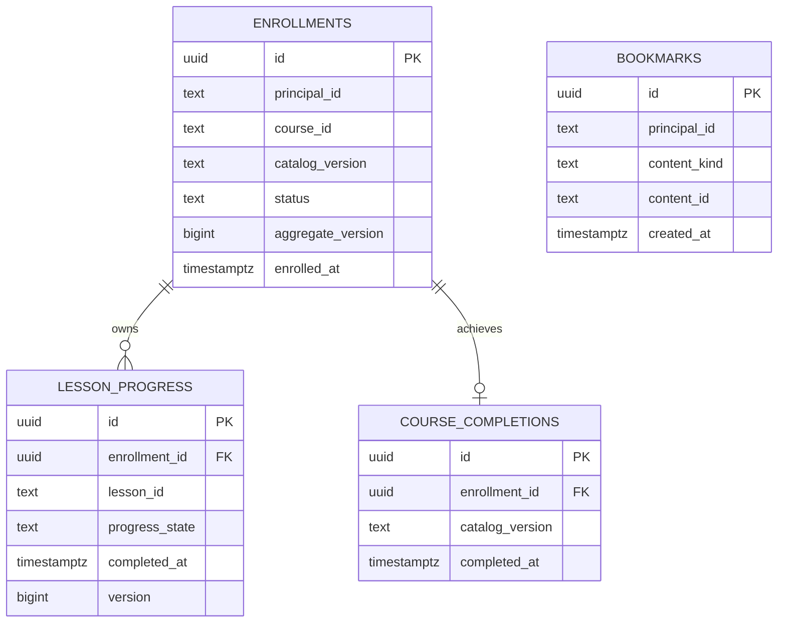
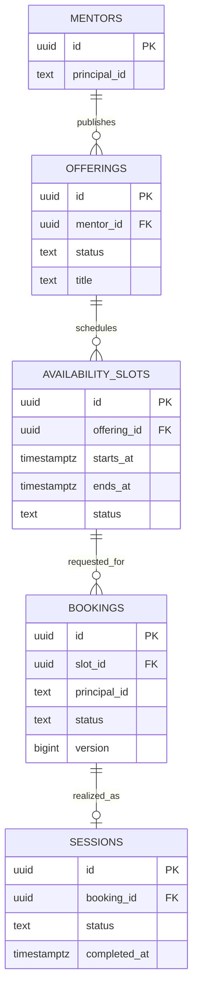
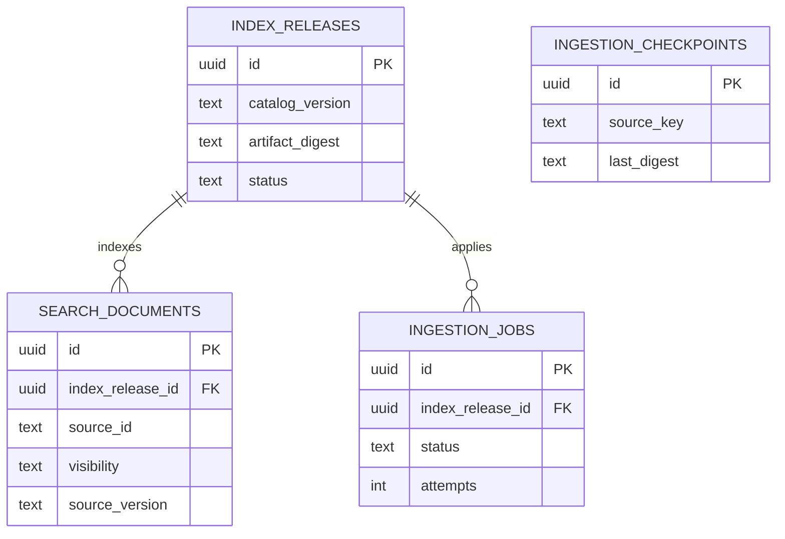
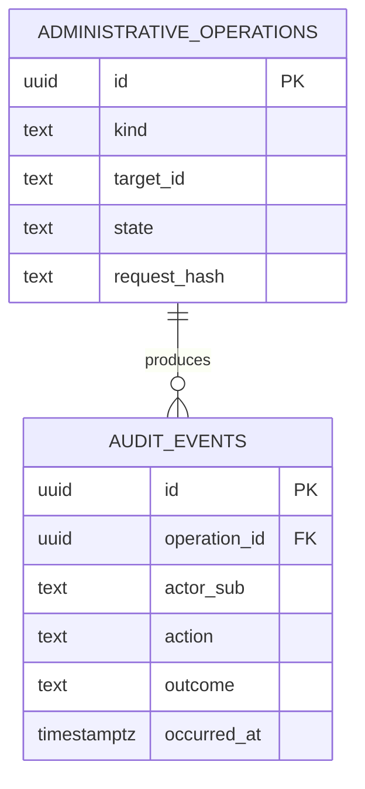

# Reltroner LMS — Phase 3A-03D Persistence & Event Model

> **Status:** DESIGN DRAFT COMPLETE / REVIEW PENDING / NOT HUMAN-RATIFIED / NOT IMPLEMENTED  
> **Date:** 2026-10-09 (Asia/Jakarta)  
> **Architecture:** six independent Laravel 13 services in one repository; **microservices, not modular monolith**  
> **Phase:** 3A Integration Discovery; subphase 03D (persistence, events, failure recovery)  
> **Mutation authority:** NONE — no DB creation, migrations, runtime configuration writes, Redis changes, or GitHub writes authorized by this document  
> **Decision record candidates:** `ADR-LMS-DATA-001`, `ADR-LMS-EVENT-001`, `ADR-LMS-BOOKING-001`, `ADR-LMS-ADMIN-OPERATIONS-001`  
> **Assurance:** schema/ERD/payloads/tests below are design **candidates**, not live implementation evidence.

## 0. Read-first AI handoff and precedence

1. Binding Phase 0C physical placement: `Reltroner/progress-documentation/lms/master-infrastructure-placement-contract.md`, observed blob `b899761c9e833f9fa567055801b9ba0834ed56eb`, 20 invariants `I-01..I-20`.
2. Binding Phase 1 logical/API: `Reltroner/progress-documentation/lms/logical-service-boundary-api-contract.md`, observed blob `cf089b8df4b5ccb1761b504ffae662a0053bf03e`, 24 invariants `P1-I01..P1-I24`.
3. Living progress ledger: `Reltroner/progress-documentation/lms/engineering-end-to-end-progress-ledger.md`, observed blob `866cc8c3b126ee6fae0cab8ac5160552cf41ad4a`.
4. Identity ADR review: `Reltroner/progress-documentation/lms/reltroner-lms-phase3a-03c-2d-provisioning-adr-review-20261009.md`, observed blob `6d472d554c5750d9345929533c788569f7e166ce`; status explicitly `RECOMMENDED FOR SIGN-OFF / NOT HUMAN-RATIFIED`. That GitHub file contains three successive Markdown document headers (3A-03C-2C evidence; 3A-03C-2D original draft; 3A-03C-2D review ADR). For machine ingestion, anchor to the final `# ... Identity Provisioning Architecture Decision Record` section; this is a documentation hygiene issue and does NOT silently approve the ADR.
5. Backend baseline: `Reltroner/LMS-BE@e30a61780994d85671cbf079e6b9ce899b3fe837`, verified complete Git tree (440 entries, nontruncated) with six `services/*/routes/api.php`, **no tracked `database/migrations` paths**. Business endpoints and domain schemas are NOT implemented.
6. Frontend observed baseline: `Reltroner/LMS-FE@f2d40417d0eea71e2c3e329ec6e32933b3e6cbd7`; source-controlled `content/` and `src/catalog/` are catalog authority. Versioned manifest format still Phase 3A candidate.
7. User-provided live VPS discovery on 2026-10-09: Ubuntu 24.04.5 LTS, 1 vCPU, ~3.8 GiB RAM, ~42 GB free disk, PostgreSQL 18 `18/main`, Redis authenticated/loopback, Keycloak/HRM active; only `hrm_db`, `keycloak_db`, `postgres` DBs exist. `hrm_app` and `keycloak_app` own separate DBs and reciprocal cross-DB CONNECT is denied. No `lms_*` DB exists. These are timestamped observations, not a production change authorization.
8. Phase 2D foundation PASS tests are historical foundation evidence, NOT 03D persistence/event tests. **No 03D tests have run.**

## 1. Definition of completion for 3A-03D

Design must describe: (a) six-context data authority + 4 PostgreSQL ownership boundaries; (b) minimal ERD with candidate keys/constraints/indexes, especially concurrency; (c) event families, producer/consumer/PII/version; (d) durable outbox/inbox state machine, replay, ordering and recovery; (e) cross-authority Keycloak/Admin/Audit uncertainty; (f) catalog provenance/search rebuild; (g) backup/retention/least-privilege; (h) negative acceptance tests; (i) open ADR decisions and phase boundaries. This document fulfills **draft specification**, not production proof or ADR sign-off.

## 2. Boundaries: frozen versus proposed

| Service | Frozen durable authority | Proposed persisted tables | Explicit non-authority |
|---|---|---|---|
| Gateway | None by default | None | Enrollment, booking, audit, canonical identity/roles; no `lms_gateway_db` by default |
| Learning | `lms_learning_db` | `enrollments`, `lesson_progress`, `course_completions` (optional derived record), `bookmarks`, `outbox_events`, optional `inbox_events` | Course/module/lesson canonical definitions; credentials |
| Mentorship | `lms_mentorship_db` | `mentors`, `offerings`, `availability_slots`, `bookings`, `sessions`, `idempotency_requests`, `outbox_events`, optional `inbox_events` | Zoom as booking truth; finance ledger/payment authority |
| Knowledge | `lms_knowledge_db` | `search_documents`, `index_releases`, `ingestion_jobs`, `ingestion_checkpoints`, `outbox_events`, `inbox_events` where needed | Canonical catalog; canonical learner state; authority for permissions |
| Assistant | None by default | None; transient Redis TTL context if approved | Direct writes to any domain DB; canonical conversation history by default |
| Audit | `lms_audit_db` | `audit_events`, `administrative_operations`, `outbox_events` if needed, `inbox_events`/dedup | Changing Keycloak identities itself; analytics/source-state replacement |

**No cross-DB FK** (`principal_id`, `course_id`, `lesson_id`, `mentor_id`, `booking_id` in other services are opaque references). Only in-database FK relationships are permitted. PostgreSQL server shared; business schemas, write credentials and migration ownership separate. Keycloak `sub` remains principal identity; no generic LMS `users` table.

### 2.1 Logical ERDs (candidate, NOT deployed)









Every service that publishes correctness-critical events has its **own** local `outbox_events`; each durable consumer has its **own** local `inbox_events`. These are **repeated table patterns in separate databases**, not shared global storage.

## 3. Learning Service schema and invariants (candidate)

### `enrollments`
- `id` opaque globally unique ID, PK; `principal_id` from validated OIDC `sub` (string, not copied identity row); `course_id` stable catalog ID; `catalog_version_at_enrollment` and `source_artifact_digest`; `status` in `active/completed/cancelled` (final lifecycle decision OPEN); `enrolled_at`, `completed_at`, `aggregate_version`, `created_at`, `updated_at`.
- Initial **simplest MVP** proposed `UNIQUE(principal_id, course_id)`; alternative partial unique for *active* only if repeated enrollment/cohorts explicitly approved. Do **not** simultaneously claim repeated cohorts and total uniqueness. Status transition must have version compare/locking, not only preflight `SELECT`.
- API enrollment POST must derive principal internally and check published/stable course ID against approved manifest. Archived course prevents new enrollment by policy, but existing learner state stays queryable.

### `lesson_progress`
- `id`, `enrollment_id` FK to local `enrollments`, `lesson_id` stable catalog ID, `progress_state`/optional position metadata, `completed_at`, `version`, `catalog_version_seen`, timestamps.
- `UNIQUE(enrollment_id, lesson_id)`. Validate lesson is in the enrolled course at an approved manifest version; reject arbitrary client-supplied progress for a different course. If a lesson is renamed/archived, use version/alias mapping, **never orphan historic progress**.
- `PUT` is idempotent for the same requested state. Decide whether regress/reset are allowed (candidate: completed state monotonic absent explicitly authorized reset). Store a material-change `learning.progress.updated` event and version increment in same transaction; no event on exact no-op.

### `course_completions` (candidate optional durable fact)
- `enrollment_id` unique FK, `catalog_version`, `completed_at`, `evidence_summary`/rule version. Always *derivable* from actual durable lesson state and a pinned catalog version; if stored, never independently editable as canonical false truth. Completion event exactly once for a transition, with UNIQUE transition key or version constraint.

### `bookmarks`
- `principal_id`, `content_kind` (course/lesson/path/resource allowlist), `content_id`, `created_at`; `UNIQUE(principal_id, content_kind, content_id)`. PUT is upsert; DELETE deletes bookmark relation only (not canonical source content, historical enrollment, or audit record). No cross-DB foreign key to catalog.

**Learning concurrency acceptance:** double POST enrollment produces one row; concurrent PUT progress cannot regress unexpectedly; duplicate completion events leave a single completion; wrong subject cannot see/change another's progress.

## 4. Mentorship Service schema and invariants (candidate)

### Tables
- `mentors`: `id`, `principal_id` Keycloak `sub`, public professional profile projection, `status`. No credentials/password.
- `offerings`: `id`, `mentor_id` local FK, title, availability policy/duration, published status, version, timestamps. Pricing/financial authority excluded; if future paid checkout, separate ADR before recording payable amounts.
- `availability_slots`: `id`, `offering_id` local FK, `starts_at`, `ends_at`, `status`, optional timezone presentation info; UTC `timestamptz` durable. `CHECK (ends_at > starts_at)`; index for availability browsing.
- `bookings`: `id`, `slot_id` local FK, `principal_id` Keycloak sub, `status`, `version`, `created_at`, `cancelled_at`/reason; no actor-submitted self principal override.
- `sessions`: `id`, `booking_id` unique FK, provider reference (non-authoritative), session lifecycle and results. Provider API errors do not rewrite booking history into fictitious states.
- `idempotency_requests`: `id`, `principal_id`, `operation_name`, `idempotency_key_digest`, `request_hash`, `state` (`processing/succeeded/failed_retriable` candidate), `http_status`, sanitized `response_body` or stable result reference, `booking_id`, timestamps, expiry policy; durable in Mentorship PostgreSQL. **UNIQUE(principal_id, operation_name, idempotency_key_digest)**; retention must span realistic client retries, final duration OPEN.

### Anti-double-booking — two independent guarantees
1. **Request deduplication:** same principal + operation + idempotency key + same payload resolves to same outcome; same key but different canonical payload -> `409` candidate; concurrent same-key requests serialize in a transaction/unique reservation. Never authorize a replay based solely on knowing the key; validate principal each time.
2. **Slot collision protection:** candidate v1 is 1:1 sessions, 1 occupied booking per slot. Partial unique index, conceptually `UNIQUE(slot_id) WHERE status IN ('confirmed','in_session','completed')`, with a transaction row lock on slot and versioned booking state machine. Exact occupied statuses must match the final state machine, or collision bypass is possible. Cancellation releases slot only if allowed by explicit rules; completed bookings must not automatically free historic slots. Simpler alternative: model `active_booking_id` on slot and enforce uniqueness within a transaction; must be formalized before migration.
3. If arbitrary overlapping time windows (not predefined slot IDs) become required, use a PostgreSQL range/GiST exclusion constraint for mentor/time overlap; do not implement a naïve `SELECT COUNT(*)` check. Adding `btree_gist` must be an explicitly approved migration and PostgreSQL18-compatible proof. This is **alternative**, not a preapproved requirement.
4. Booking cancellation is a domain command: attempt and state transition must be idempotent for repeated identical requests. Unknown-time external meeting provider failures must be reconciled, not recorded as unconditional success.

**Mentorship concurrency acceptance:** 20 concurrent booking attempts for one capacity-one slot yield at most one confirmed/in-session booking; repeated idempotency key returns same persisted booking; different keys cannot double-book the same slot; crash after commit does not lose booking; external Zoom failure cannot create false session-completed result.

## 5. Knowledge Service persisted derived state (candidate)

- `index_releases`: `id`, immutable source `catalog_version`, `artifact_digest`, `schema_version`, `status` (`building/ready/failed/superseded`), `built_at`; unique version+digest rule.
- `search_documents`: `id`, `index_release_id`, `source_kind`, stable `source_id`, source/version digest, text vector/FTS metadata, `visibility` and security classification, optional approved permission labels, immutable source reference, `updated_at`. `UNIQUE(index_release_id,source_kind,source_id)`. Index with PostgreSQL GIN on generated `tsvector` as justified by benchmark. Do not index raw private PII without approved classification.
- `ingestion_jobs`: durable `source_artifact_digest`, idempotency key (e.g. catalog_version+digest), state/attempt/error code; safe retry after queue loss.
- `ingestion_checkpoints`: durable per-source accepted digest/version and completion timestamp; append release history, never mark active release as ready on partial failed import.
- Build new release side-by-side; validate counts, published status, access classification, and retrieval relevance; promote pointer **atomically within Knowledge DB** after complete validation; rollback pointer to prior ready release without changing Git source. Exact pointer model OPEN.
- Public static search is a frontend build artifact, not a query against backend permission-bound documents. For private/mixed results, the consumer must enforce effective permissions **at request time**; stale index metadata alone cannot confer access. Avoid returning unauthorized snippets, counts, embeddings or diagnostics.
- `knowledge.index.requested` must be backed by a durable Knowledge-owned ingestion request even if the original trigger is a Git/static-content release. `knowledge.index.completed` emitted after completed/promoted state transaction; Git remains truth.

## 6. Audit Service append-only persistence (candidate)

### `audit_events` (application-immutable)
- `event_id` opaque PK, `operation_id` optional local FK, `occurred_at`, `actor_sub`/service actor, `action`, `resource_type`, `resource_id`, `outcome` (`requested/succeeded/failed/uncertain/reconciled` candidate), `reason_code` sanitized, `correlation_id`, `causation_id`, `source_service`, `schema_version`, `payload_digest`, optional minimal before/after diffs subject to allowlist.
- **No UPDATE/DELETE path from normal application identity**; insert-only/granted policy, separate retention/archive role and reviewed migration role. This is application-level immutability, not an unqualified tamper-proof guarantee (DB superuser, backup operators and disks are separate threat boundaries).
- Deny public reads absent `admin.audit.read` and applied filters; no private secrets/tokens/credentials or arbitrary raw request bodies in audit.

### `administrative_operations` (durable, mutable workflow state)
- `operation_id` PK, `kind`, `actor_sub`, `target_sub`, `requested_change_hash`, `idempotency_key_digest`, `state` (`prepared/in_flight/confirmed/uncertain/reconciled/rejected` candidate), `result_digest`, `last_checked_at`, `attempt_count`, timestamps; unique operation/idempotency identity.
- This table can update status; status changes generate **new immutable** `audit_events` rows; operation row is not a substitute for audit trail.

### Special case: Keycloak role mutation
1. Gateway authenticates and authorizes human actor and authorized role delta. Adapter obtains durable `AuditService.prepareOperation` **before** Keycloak role call; if Audit unavailable, privileged mutation stops/fails closed.
2. A narrow privileged Keycloak adapter calls Keycloak Admin API, with approved workload credential; no direct `keycloak_db` write and no browser-held admin credentials.
3. If Keycloak returns definitive success, write Audit outcome; if Audit writes fail afterward, persist/reconcile from the prepared operation. If Keycloak times out/disconnects, mark **uncertain**; inspect **canonical Keycloak current role state** before any retry. Never blindly repeat a non-idempotent administrative action, never report success with unknown result.
4. Only after verified canonical change should `identity.role.changed` be published via Audit-owned durable outbox transaction; its semantics are **observed confirmed identity change**, not a claim of atomic Keycloak+Audit DB commit.
5. Reconciler scans pending/uncertain operations with restricted authorization and produces append-only `reconciled` audit evidence; retain human escalation path for irreconcilable outcomes.
6. This is a design requiring `ADR-LMS-ADMIN-OPERATIONS-001` sign-off and Phase 6 tests; it is **not** a presently active admin flow.

## 7. Event registry — nine frozen semantic event names

| Event name (frozen semantic) | Suggested producer | Proposed consumers | Durable trigger/notes |
|---|---|---|---|
| `learning.enrollment.created` | Learning | Audit only where policy requires, analytics read models future | Enrollment insert and outbox row commit together; no user PII |
| `learning.progress.updated` | Learning | Knowledge only for approved derived progress read model, future analytics | Material state change; monotonic aggregate_version and key |
| `learning.course.completed` | Learning | Future certificate/read model/notifications; Audit if privileged | Derivable completion transition, unique once |
| `mentorship.booking.created` | Mentorship | Audit/notification adapters as approved | Confirmed booking row and outbox together; no meeting credentials |
| `mentorship.booking.cancelled` | Mentorship | Audit/notification adapters as approved | Valid state transition and outbox together |
| `mentorship.session.completed` | Mentorship | Audit/learning integration only on signed contract | Authoritative domain completion, not LLM/provider guess |
| `identity.role.changed` | Audit-controlled Keycloak adapter workflow | Audit/authorized caches/projections | Only after canonical state confirmed + durable operation evidence; cross-system uncertain state reconciled |
| `knowledge.index.requested` | Knowledge ingestion adapter | Knowledge publisher/worker | Persist ingest intent and outbox; Git provenance key |
| `knowledge.index.completed` | Knowledge | Frontend deploy/status systems, observability as approved | Ready release transaction, version/digest pinned |

Consumers shown are *candidates*, not required subscribers. Do not use semantic names as proof the event is implemented. Avoid creating events that transfer canonical ownership to a consumer.

## 8. Proposed versioned event envelope

```json
{
  "event_id": "opaque-event-id",
  "event_type": "mentorship.booking.created",
  "event_version": 1,
  "producer": "mentorship",
  "aggregate_type": "booking",
  "aggregate_id": "opaque-booking-id",
  "aggregate_version": 1,
  "occurred_at": "2026-10-09T04:00:00Z",
  "correlation_id": "opaque-request-id",
  "causation_id": null,
  "payload": {
    "booking_id": "opaque-booking-id",
    "slot_id": "opaque-slot-id",
    "status": "confirmed"
  }
}
```

**Illustrative only.** `event_id` unique, schema/version obligatory, timestamp UTC, IDs opaque; producer immutable on publication. Exact ID encoding UUID/ULID, version compatibility, authoritative source artifact reference, JSON schema paths, and payload retention OPEN. Do not put JWTs, email addresses, session links, message contents or unapproved identity attributes into event payloads. Where identity reference is essential, use minimally scoped `principal_id` and strict consumer ACL/retention; pseudonyms are still sensitive.

### Candidate routing/topology

```text
[Learning PostgreSQL] business tx + learning.outbox -> publisher --(Redis)--> declared consumer
[Mentorship PostgreSQL] business tx + mentorship.outbox -> publisher --(Redis)--> declared consumer
[Knowledge PostgreSQL] ingestion tx + knowledge.outbox -> publisher --(Redis)--> declared consumer
[Audit PostgreSQL] admin op/audit tx + audit.outbox -> publisher --(Redis)--> declared consumer
           ^                         ^
           | owner-only credentials  | bounded / authenticated consumers
           +----- no cross-db writes, no Redis-only correctness -----+
```

Redis mechanism (Laravel queue vs Redis Streams vs other minimal broker encoding) remains ADR/open design; do not silently assume consumer groups or broker acknowledgments have been implemented. Systemd workers and resource limits must be budgeted for 1 vCPU VPS with existing Keycloak/HRM workload.

## 9. Transactional outbox and inbox mechanics (ADR candidate)

### Per-producer `outbox_events`
- Candidate columns: `event_id` PK, `event_type`, `event_version`, `aggregate_type`, `aggregate_id`, `aggregate_version`, `payload_json`, `occurred_at`, `state` (`pending/leased/published/dead` candidate), `attempt_count`, `available_at`, `lease_owner`, `lease_expires_at`, `last_error_code`, `published_at`, timestamps.
- Index on `state,available_at`, plus `lease_expires_at` for expired leases; unique on `(event_type,aggregate_id,aggregate_version)` *only if* one event per aggregate version is a verified invariant. Distinct event types may coexist at one version, so decide key carefully.
- Inside the SAME service-owned SQL transaction: validate domain authority, write business row, insert event. Commit both or neither. **Never** `dispatch()` before commit as the durable event intent itself; queue-after-commit alone cannot guarantee delivery after a crash between DB commit and dispatch.

### Publisher flow
1. Poll bounded batch of pending or expired-lease events and claim via transaction, `FOR UPDATE SKIP LOCKED` with claim lease / owner; commit claim before network publish.
2. Publish to configured Redis transport; on explicit acceptance/ack only mark `published`. If Redis unavailable, let lease expire and retry with bounded exponential backoff and jitter. Avoid marking published before broker accepts.
3. Crash *after* broker accept but *before* outbox update creates **duplicate delivery**. This is EXPECTED; a durable consumer must deduplicate. `published` means accepted by broker, **not** consumed by all subscribers. End-to-end delivery health requires independently monitored consumer acknowledgments/checkpoints.
4. Recover abandoned leases by timeouts. Backoff/retry budget/retention/poison-event quarantine and manual replay require an approved policy. Never delete unsent events automatically just because a retry budget was exhausted.
5. `SKIP LOCKED` improves contention for queue-like rows, not general consistent queries; proper reservation transaction isolation and failure tests still apply.

### Per-consumer `inbox_events` (where correctness depends on side effect)
- Primary/unique `(consumer_name,event_id)` with `received_at`,`processed_at`,`event_version`, `outcome_code`; producer event ID must not be regenerated on retries.
- In a LOCAL consumer PostgreSQL transaction, insert dedup receipt with uniqueness guard, then apply allowed consumer-owned projection changes, then mark receipt processed, then COMMIT. A redelivery either recognizes committed receipt or safely resumes after rollback. Merely storing an inbox row *before* side effects in a separate commit is NOT safe.
- If consumer performs an external side effect, use durable operation state/idempotency at the external boundary and reconciliation; the inbox only provides exact-once local DB effect, not global exactly-once execution.
- Enforce producer allowlist, event type/version schema validation, payload size limits, signed/authenticated channel, and consumer capability. Unauthorized/unknown versions quarantine rather than silently skip.

### Ordering and semantic upgrades
- No global FIFO promise across services. `aggregate_version` enables per-aggregate monotonic handling. On duplicate/stale event, no-op; on gaps/out-of-order, hold/reconcile with owner through declared API or rebuild, not silent drop.
- Breaking payload changes require explicit new `event_version` and transition readers/writers. Producers maintain backward compatibility during migration window; replay archived version with version-specific parser.
- Correlation IDs propagate across HTTP and async operations; diagnostic logs must redact payload PII.

## 10. Failure matrix and required recovery

| Failure injection | Required invariant | Candidate recovery |
|---|---|---|
| Domain SQL rollback | No business row and no outbox event | Database rollback together |
| Domain DB commit then worker crash | Business truth/event intent still exists | Publisher resumes pending durable outbox |
| Redis down | No business truth lost | Queue degrades, backlog stays in PostgreSQL, replay after recovery |
| Publish accepted then publisher crash | Duplicate possible, no silent loss | Durable inbox/dedup; publisher may retry same ID |
| Consumer transaction crashes | No half-committed projection/inbox | Local rollback then safe retry |
| Two workers claim same outbox | One effective lease owner per row | Row lock, lease fencing and claim tests |
| Out-of-order aggregate events | No lost newest state | Version-aware handler + resync |
| Booking concurrency | <=1 occupied booking per capacity-one slot | PostgreSQL unique/lock; no count-before-write race |
| Same idempotency key, changed payload | No different side effect under same key | Persist hash; conflict response |
| Content renamed/removed | Historic learner state remains | Stable IDs/aliases, catalog-version compatibility |
| Failed Knowledge rebuild | Prior READY index remains queryable | Staged build + atomic promotion / rollback |
| Stale private search index | No unauthorized snippet or count leak | Query-time permission check and denials |
| Audit unavailable before role change | No privileged mutation | Fail closed before Keycloak API call |
| Keycloak role applied, ack lost | No fabricated success/repeated blind privilege change | Durable uncertain operation + canonical reconciliation |
| PostgreSQL outage | Stateful mutation fails closed | No fall back to Redis as truth |
| Backup restore with outbox pending | No accidental missing/duplicate business effects | Reconcile outbox/inbox, replay with stable IDs; exercise restored snapshot |
| Provider meeting creation uncertain | Booking not falsely marked session complete | Provider adapter idempotency/reconcile; LMS remains booking authority |

## 11. Database access, migrations, and capacity (candidate)

- New DBs are **not yet provisioned**: `lms_learning_db`, `lms_mentorship_db`, `lms_knowledge_db`, `lms_audit_db`. PostgreSQL 18 existing `hrm_db` and `keycloak_db` must not change.
- Define one **runtime** PostgreSQL login per owned service with CONNECT to its DB only, no superuser/createdb/cross DB write; separate limited **migration** role where justified. Revoke/default-deny unwanted PUBLIC privileges and cross-DB CONNECT, establish owner-only schema USAGE/DML and sequence privileges, test negative CONNECT and DML. No live grant is authorized now.
- All migrations and seeders live in `services/{owner}/database/migrations` within owned Laravel app; migration ordering independent across services. Cross-service ID constraints are enforced via API/manifest validation instead of FK/ORM.
- Backup plans: PITR/WAL archive or equivalent credible backup path, restore drill with checksums, versioned catalog artifact and deployment SHA. **RPO/RTO targets not yet approved**. Backup/restore access and encryption must be specified, with no secrets in public repo.
- Data retention for outbox/inbox/idempotency/audit and PII minimization is an OPEN design decision. Destructive retention processing requires explicit governance; audit append-only application posture does not mean legally infinite retention.
- VPS observed ~1 vCPU/~3.8 GiB RAM, Keycloak/HRM active. **DB pool sizes, max_connections budget, idle worker count, Redis queue concurrency, disk growth, memory/CPU SLOs and spending ceiling remain MEASUREMENT-GATED**; do not invent safe worker count or auto-provision extra infrastructure.
- Avoid introducing Kafka, RabbitMQ, Elasticsearch, Docker, service mesh or separate paid database just to implement events; PostgreSQL outbox + current Redis is the contract-preferred minimal architecture.

## 12. Proposed negative/acceptance tests (NOT EXECUTED)

**Data ownership**
- `PD-T01` Postgres has only expected 4 LMS DBs after later provisioning; HRM/Keycloak untouched.
- `PD-T02` Learning runtime role can CONNECT only `lms_learning_db`; cannot CONNECT/read/write Mentorship, Knowledge, Audit, HRM, Keycloak.
- `PD-T03` Repeat T02 for each other owning role; no direct cross-DB FK/joins in source; no shared ORM models.
- `PD-T04` Gateway/Assistant have no business DB credentials by default; Redis loss does not delete canonical business state.
- `PD-T05` Each migration runs using its own service scope; rerun/idempotence and rollback defined.

**Learning correctness**
- `PD-T06` Two concurrent enrollment POSTs produce one valid enrollment under approved uniqueness policy.
- `PD-T07` Wrong principal cannot mutate/read another learner's enrollment/progress/bookmark.
- `PD-T08` Two concurrent same lesson PUT calls obey version/concurrency policy; no accidental regression.
- `PD-T09` Duplicate completion attempt emits one canonical completion transition.
- `PD-T10` Archived/renamed lesson preserves historic progress; invalid/unpublished ID denied.

**Mentorship correctness**
- `PD-T11` 20 concurrent booking requests for capacity-one slot yield at most one occupied booking.
- `PD-T12` Same idempotency key and payload reused after HTTP timeout gives same durable result.
- `PD-T13` Same key with conflicting payload is rejected, no new booking.
- `PD-T14` Concurrent distinct keys for occupied slot reject collisions, don't oversell.
- `PD-T15` Repeated cancellation applies at most one state transition and no duplicate cancellation event.
- `PD-T16` Failed/unknown meeting provider outcome cannot convert to false confirmed/completed LMS state.

**Outbox and inbox**
- `PD-T17` Force rollback after business write: zero business row, zero outbox row.
- `PD-T18` Commit business+outbox then kill publisher: row remains pending/leased recoverable.
- `PD-T19` Redis unavailable: no lost durable event, backlog accumulates observably.
- `PD-T20` Crash after Redis ack before `published`: replay duplicate with same event ID, consumer has single durable effect.
- `PD-T21` Two publishers and abandoned lease: no permanent lost row; fencing/claim safe.
- `PD-T22` Consumer rolls back mid-handler: inbox+projection rollback atomically.
- `PD-T23` Event version unsupported/malformed/unauthorized: quarantine, no DB mutation.
- `PD-T24` Events out of sequence: consumer defers/repairs without overwriting newer state.
- `PD-T25` Poison event crosses retry threshold: preserved in durable dead/quarantine state and alert; manually replayable with audit.

**Knowledge and catalog**
- `PD-T26` Same catalog version/digest ingested twice -> one effective READY index.
- `PD-T27` Interrupted reindex -> old published index stays available.
- `PD-T28` Private document access revoked but stale index exists -> no unauthorized result, snippet, count, embedding leak.
- `PD-T29` Full rebuild succeeds from pinned Git catalog artifact and documented domain APIs, without reading other services' DB directly.

**Audit and reconciliation**
- `PD-T30` Audit unavailable before Keycloak mutation => mutation denied.
- `PD-T31` Keycloak success followed by Audit outcome write failure => pending operation reconciled, no false final success.
- `PD-T32` Keycloak timeout/ambiguous role update => canonical state inspected before retry; exactly one resolved final audit decision.
- `PD-T33` Normal Audit runtime DB role cannot UPDATE/DELETE immutable `audit_events`.
- `PD-T34` Sensitive fields/tokens never appear in event envelope, audit record, exception body or logs.
- `PD-T35` Synthetic end-to-end privileged flow emits correlated intent/result and correct identity.role.changed event only after confirmation.

**Ops and recovery**
- `PD-T36` Restore PostgreSQL snapshot and recover unacknowledged durable outbox without identity collision.
- `PD-T37` Queue backlog cap and worker concurrency measured within 1-vCPU VPS while HRM/Keycloak remain acceptable.
- `PD-T38` Postgres down: domain state mutation fails closed; frontend public static content remains independently accessible where cached.
- `PD-T39` Future release schema/event backward compatibility tested with old clients/consumers.
- `PD-T40` All evidence includes pinned service SHA, DB snapshot/migration version, negative outcome, timestamp, reviewer and sanitized logs.

All 40 rows `SPECIFIED / NOT RUN`. Exact load quantity `20` is a candidate stress test input, not throughput target or production capacity claim.

## 13. ADR and implementation gate register

| ID | Candidate decision | Recommendation | Required acceptance before implementing |
|---|---|---|---|
| `PD-ADR-01` | Four separate logical DBs, one shared physical PG18 | ADOPT as binding-compatible design | Human sign-off on roles, schema names, grants, migrations |
| `PD-ADR-02` | Enrollment lifecycle/uniqueness and completion version | Simple one enrollment/principal/course initially | Product policy on retakes, archives, completion reset |
| `PD-ADR-03` | Slot-based 1:1 mentorship + partial unique occupied slot | Preferred minimal version; prevent DB-level race | Lifecycle/occupied statuses, capacity, time zones, cancellation policy |
| `PD-ADR-04` | Booking idempotency scope/hash/response/retention | Durable Mentorship-owned ledger | API TTL/error schema and concurrency tests |
| `PD-ADR-05` | Outbox/inbox JSON envelope, claim lease, dead/replay | Preferred at-least-once | Signing, event versions, transport selection, ordering/retries, PII |
| `PD-ADR-06` | Knowledge release staging + atomic publication | Preferred | Artifact manifest IDs, access labels and indexing rules |
| `PD-ADR-07` | Audit append-only facts + mutable admin operation state | Preferred | Migration grants, retention, tamper surface and auditor policy |
| `PD-ADR-08` | Role-administration reconciliation across Keycloak + Audit | Required before admin role PATCH | Keycloak adapter privileges, operation intent, retry semantics, ACL |
| `PD-ADR-09` | Backup/restore/retention and capacity | Defer final thresholds to measurement | RPO/RTO, restore drill, memory/worker budget |

### Phase boundaries
- **3A-03D result:** this architecture specification **DRAFT COMPLETE**. No runnable schema, migrations or events created; product tests NOT RUN; human sign-off/ADR freeze PENDING.
- **3A remaining:** catalog manifest identity/version schema (`3A-03E`), deployment capacity remainder, final DoD/ADR approval, change-control acceptance.
- **3B after 3A approval:** versioned event schema, migration contract fixtures/CI, schema tests, outbox/inbox provider-consumer harness, no silent live mutations.
- **Phase 4+ after separately approved change window:** provision per-service DB/roles, implement migrations/trust/private endpoints/workers, run integration/negative tests; HRM/Keycloak remain protected.

**End-state label:** `3A-03D DESIGN DRAFT COMPLETE / REVIEW PENDING / NO PRODUCTION MUTATION`.

## 14. Technical reference links (non-normative)

- PostgreSQL 18 `SELECT ... FOR UPDATE SKIP LOCKED`: https://www.postgresql.org/docs/18/sql-select.html
- PostgreSQL 18 range and exclusion constraints: https://www.postgresql.org/docs/18/rangetypes.html
- Laravel 13 queue / database transactions and after-commit behavior: https://laravel.com/docs/13.x/queues
- Frozen project source: https://github.com/Reltroner/progress-documentation/tree/main/lms

---

_Extracted without semantic changes from historical combined source `reltroner-lms-phase3a-03c-2d-provisioning-adr-review-20261009.md` (blob `c2296c0c3e142843dd8a986570dea2e850958e36`). Design draft, **NOT owner-ratified or implemented**._
