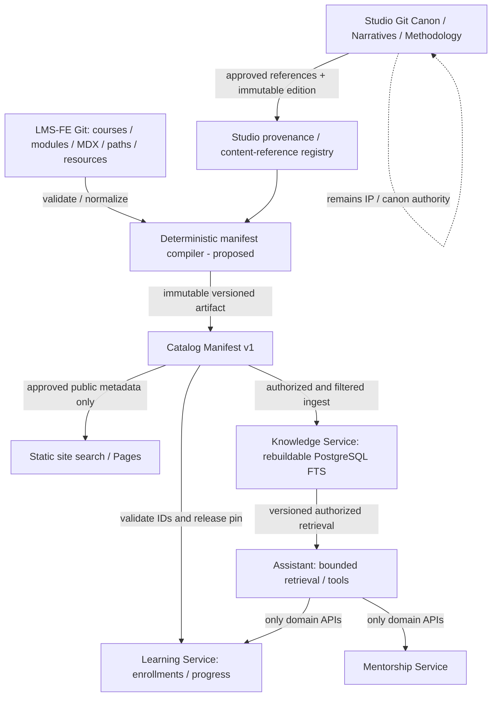

# Reltroner LMS — Phase 3A-03E Catalog Manifest & Versioning Contract (Design Candidate)

> **Date:** 2026-10-09 Asia/Jakarta  
> **Phase:** 3A-03E — Discovery / catalog architecture  
> **Status:** DESIGN DRAFT COMPLETE / REVIEW PENDING / NOT FROZEN / NOT IMPLEMENTED  
> **Execution:** GitHub connector read-only. No BE/FE/Studio source, infrastructure, database or identity changes.  
> **Audience:** system architect, release manager, LMS-FE/LMS-BE implementers, future AI handoff.  
> **Authority rule:** Phase 0C and Phase 1 LMS contracts remain FROZEN. Studio constitution governs Studio intellectual-property/narrative content, **not** LMS service deployment or identity invariants. A cross-project integration requirement is a contract proposal until ratified.

## 0. Executive decision and evidence-quality warning

**Recommended:** a deterministic, source-controlled LMS Catalog Manifest v1, with permanent opaque catalog IDs, versioned release snapshots, explicit publish/archival semantics, and a separate provenance-only Studio reference registry. The LMS must not become a second canonical Asthortera lore database or a runtime course CMS. Learning stores learner state against stable LMS IDs; Knowledge stores rebuildable derived indexes; Assistant cites approved source versions and never infers canonical truth from drafts; Mentorship owns bookings, not course/canon state.

**Observed:** FE has 3 course records, 10 modules, 31 `.mdx` lesson paths, 2 paths, and 28 resource IDs at pinned baseline. Courses/modules/paths/resources have explicit IDs; Contentlayer lessons derive `slug` and `courseSlug` from filenames/paths and **do not define a first-class `id` in the live MDX schema**. `src/types/lesson.ts` declares an `id`, but the Contentlayer source does not implement that field. Search generators use inconsistent lesson-ID constructions. No approved unified manifest artifact currently exists at this snapshot. Backend six `routes/api.php` are effectively empty and no LMS domain migrations were tracked at inspected BE SHA.

**Not observed / not claimed:** release-compiled manifest, actual Studio article canon release manifest, active learner completion criteria, full real lesson-ID stability, all URL redirects, signed artifact publication, active Knowledge ingestion, persisted learner artifacts, any live LMS integration tests, or a new business endpoint for creator projects.

## 1. Authoritative inputs (pinned)

| Source | Git commit / file blob | Authority | Direct observations |
|---|---|---|---|
| `Reltroner/reltroner-studio` | commit `f7b6e6c73fcd81c945524cb81602d2984c6b4720`, constitution blob `a8a77066ad7de30a6a806a818e5483bd1fa85688` | **Binding for Studio brand, creative/narrative/canon operations only** | Master v2.2: one studio/two value engines; Creative Compound Machine; Current Lore/Backstory/Wiki modes; prepublication mutability vs released canon; canon statuses; evergreen archive; progressive disclosure |
| `Reltroner/LMS-FE` | commit `f2d40417d0eea71e2c3e329ec6e32933b3e6cbd7` | Initial canonical LMS course content repo | `src/catalog`, `content/courses`, Contentlayer source, search/validation scripts |
| `Reltroner/LMS-BE` | commit `e30a61780994d85671cbf079e6b9ce899b3fe837` | Accepted six Laravel service **foundation only** | Business API and persistence integration not implemented |
| `Reltroner/progress-documentation` | logical contract blob `cf089b8df4b5ccb1761b504ffae662a0053bf03e` | **FROZEN LMS Phase 1** | Git-owned Catalog, no runtime CRUD, Learning owned progress, Knowledge derived indexes, Assistant delegation |
| Same | placement contract blob `b899761c9e833f9fa567055801b9ba0834ed56eb` | **FROZEN LMS Phase 0C** | Cloudflare Pages static delivery, Git content authority, private service endpoints, low-resource VPS |
| Same | ledger blob `866cc8c3b126ee6fae0cab8ac5160552cf41ad4a` | Living status and proposed gates | Manifest still to be designed, Phase3A only discovery |
| Same | identity/ADR path `lms/reltroner-lms-phase3a-03c-2d-provisioning-adr-review-20261009.md`, observed blob `c2296c0c3e142843dd8a986570dea2e850958e36` | Candidate security architecture; **not human-ratified** | Separate LMS browser clients, 19 candidate capability mappings, no HRM mutation; cumulative document also contains appended 3A-03D proposal |

**Document-integrity finding:** the referenced ADR Markdown presently includes concatenated 3A-03C-2C evidence, preliminary 3A-03C-2D draft, fuller identity ADR, and 3A-03D persistence/event report. Headings inside one file are not all independent signed decisions. Future AI should rely on internal section status and precedence, not filename alone. Recommend splitting later under approved documentation cleanup.

## 2. New Studio-derived product requirements and boundary decisions

Studio Constitution sections 1.3, 24, 27, 46–50, 51 and 54 establish distinct requirements:

| Studio doctrine | LMS-relevant implication | Ownership and scope |
|---|---|---|
| **One Studio, Two Value Engines:** creator-facing creative systems and audience-facing civilization simulation | A learner can study methodology; a reader can consume canon/narrative. Neither requires forcing Asthortera seasons into course rows | LMS Catalog controls course curriculum; Studio controls IP/canon narrative. Distinct content representations and IDs |
| **Creative Compound Machine:** output becomes input and prior consequences remain relevant | Course metadata may map prerequisites, outcomes, learning paths and optional reference graphs; creator work products may later need submission/feedback | **Potential new feature** `learner_artifacts`/reviews; requires scope, storage, API, privacy and authorization ADR. Not automatically included in existing Phase 1 endpoints |
| **Current Lore + Backstory + Wiki** are separate epistemic modes | Studio reference record may advertise `epistemic_mode` and source URL for reading/navigation/retrieval | Studio-owned classification when published and available. LMS must not invent mode or rewrite underlying canon |
| **Season → Episode → Chapter** with 37-season forward-open architecture | Studio source references may capture hierarchy and causal links without converting them into Course/Module/Lesson | Studio content graph remains outside LMS Catalog authority. No novel CMS added |
| **Prepublication freedom / published canon effectively immutable** | Separate `lms_status` from Studio `canon_status` and `release_edition`; never treat a draft lesson marked published as proof of published canon | Studio canon release gate belongs to Studio; LMS ingestion uses approved published export only |
| **Evergreen / causal continuity** | Stable IDs, historical aliases, versioned indexes, supersession relationships, retrievable references | Canon linkage must preserve origin and edition; changes recorded, never silent semantic rewrite |
| **Progressive disclosure / epistemic routing** | Optional concept/prerequisite/reference edges and disclosure tier for user experience, not arbitrary entitlement escalation | Presentation/Knowledge derive navigational depth; entitlement remains Keycloak+backend capability/ACL |
| **Epistemic honesty and technical restraint** | Display cited provenance and confidence; avoid premature AI/graph/search infrastructure | Begin with static index and PostgreSQL FTS; no invented functionality or local LLM deployment |

**Cross-constitution interpretation:** Studio is a **referenced source domain** with its own binding rules; its master constitution does not supersede LMS I-01..I-20 or P1-I01..P1-I24. A monetization, creator-project database, wiki authoring, user manuscript storage, canon-contribution workflow, or franchise API addition is **CHANGE REQUEST**, not silent expansion of existing Learning or Knowledge services.

## 3. Current LMS-FE catalog inventory and gap analysis

### 3.1 Course and path records (verified)

| Entity | Stable source ID | Status | Relation |
|---|---|---|---|
| Backend Engineering Fundamentals | `course-backend-engineering` | published | `full-stack-backend-engineer` path, 2 modules / 3 MDX lesson files |
| Worldbuilding Operating System | `course-worldbuilding-operating-system` | draft | `worldbuilding-creator` path, 5 modules / 15 lesson files |
| In-World Living Lab | `course-in-world-living-lab` | draft | prerequisite Worldbuilding OS, 3 modules / 13 lesson files |
| Full Stack Backend Engineer | `path-full-stack-backend-engineer` | published | Backend Engineering |
| Worldbuilding Creator Path | `path-worldbuilding-creator` | draft | Worldbuilding OS → In-World Living Lab |

**Derived inventory totals:** 3 courses; 10 modules; 31 MDX lesson paths (3+15+13); 2 learning paths; 28 resource IDs (Backend 2, Worldbuilding OS 13, In-World Living Lab 13). Counts are a tree/source inventory, **not a passed build or content-quality audit**.

### 3.2 Existing source schema

- `Course.id`, `Course.slug`, `Course.aliases?`, `modules[].id`, `modules[].slug`, `lessonSlugs`, `pathSlugs` and prerequisite course slugs are explicit.
- `LearningPath.id`, `.slug`, `.courseSlugs` are explicit.
- `Resource.id`, `.courseSlug`, `.type`, `.url` are explicit; URLs can use pinned jsDelivr tag `@v0.1.0`; this is an asset version, not an immutable catalog release version.
- `contentlayer.config.ts` `Lesson` frontmatter requires title, summary, kind, status, level, duration, objectives, outputs and tags, but **does not require `id`**. The lesson's route identity is currently derived from filename/parent path.
- `scripts/validate-content.ts` checks frontmatter validity, duplicate course/path slugs and presence of path/module/lesson references; it does **not** freeze permanent lesson IDs, enforce historical alias/archival compatibility, compute manifest hash, or compare to previous releases.
- `scripts/check-orphans.ts` enforces one module reference for each current MDX file; this may be kept as a curriculum rule but not interpreted as a canon graph rule.
- `scripts/validate-resources.ts` checks duplicate resource IDs and local resource references; it does not enforce a cross-release resource deprecation policy.
- `scripts/generate-search-index.ts` emits `lesson:${courseSlug}:${lessonSlug}` while `src/lib/content/search-index.ts` emits `lesson:${lesson._id}`. **Inconsistent identifier derivation** can prevent uniform referencing; actual user-visible bug not proven.
- `getLessonContext()` may fallback to `unassigned` with MAX_SAFE_INTEGER ordering if references do not resolve; production manifest validation should reject rather than silently output incomplete graph edges.

### 3.3 Immediate design gaps

1. `lesson_id` global/stable and non-path-derived *after migration*.
2. Historical stable ID/slug alias registry and tombstones.
3. Immutable, deterministic catalog build artifact plus release pinning.
4. Global/within-course unique ID and graph validation.
5. Canon versus course publication/preview distinction.
6. Content origin/edition provenance, consent/license/visibility for Studio references.
7. Release selection and compatibility when progress was earned under old curriculum.
8. Schema, consumer behavior, and rollback/reindex safety.

## 4. Ownership architecture (no seventh canonical business service)



- **Content Catalog** is a source-controlled **logical context**, not a new runtime application/DB mandated by this phase.
- **Gateway** authenticates/routes only. It never becomes the catalog mutation authority.
- **Learning** stores durable learner progress keyed by stable IDs and approved content versions; it cannot publish course/canon.
- **Knowledge** indexes only approved/authorized content; reindex must be reproducible. Search relevance does not establish historical truth.
- **Assistant** cites exact published snapshot/source provenance; no direct writes to Learning/Mentorship/Studio or user-submitted canon authority.
- **Mentorship** may reference a course or a creator-methodology reference as context, but owns offerings/availability/booking, not the referenced curriculum.
- **Audit** records privileged release actions when integration requires, without becoming canonical publishing storage.

## 5. Manifest v1 contract — candidate (not ratified)

### 5.1 Top-level canonical structure

```json
{
  "schema_version": 1,
  "catalog_version": "sha256:<64 lowercase hex of canonical version input>",
  "source": { "repository": "Reltroner/LMS-FE", "commit_sha": "f2d40417d0eea71e2c3e329ec6e32933b3e6cbd7" },
  "release_class": "public | internal_preview",
  "courses": [],
  "modules": [],
  "lessons": [],
  "paths": [],
  "resources": [],
  "studio_references": [],
  "tombstones": []
}
```

This is a **proposal**, not an existing file. Complete illustrative JSON and JSON Schema are provided as companion artifacts in this handoff. No production release hash has been produced.

### 5.2 Entity semantics

| Entity | Mandatory identity/relation | Optional context | Owner |
|---|---|---|---|
| `courses[]` | `id`, `slug`, `status`, `module_ids`, `path_ids`, `revision` | category, title, aliases, prerequisites, author | LMS-FE source |
| `modules[]` | `id`, `course_id`, `lesson_ids`, `order` | slug, title | LMS-FE source |
| `lessons[]` | `id`, `course_id`, `module_id`, `slug`, `status`, `content_digest` | learning objectives, `kind`, `resource_ids`, `source_path` | LMS-FE source |
| `paths[]` | `id`, `slug`, `course_ids`, `status` | prerequisites/order/estimated hours | LMS-FE source |
| `resources[]` | `id`, `course_id`, `type`, `url`, `source_revision` | title, usage, source content digest | LMS-FE source; third-party origin controls its own content |
| `studio_references[]` | `reference_id`, immutable `source_ref` (repo/commit/path), access classification, `canon_status` when attested | narrative mode, hierarchical relations, edition, canonical URL | **Studio** governs the referenced item; LMS stores metadata only |
| `tombstones[]` | retired `id`, status, previous aliases, last valid version, optional replacement | reason and migration guidance | LMS catalog change control |

### 5.3 ID rules

- Entity IDs are **globally unique within a type** and immutable once published or referenced by durable user state. To make cross-type collisions obvious, a **globally unique across all entity classes** validator is recommended.
- Preserve existing `course-*`, `module-*`, `path-*` and resource IDs. Do **not** regenerate these on every build.
- Introduce explicit lesson `id` in MDX metadata or a checked-in immutable lesson-ID registry: **chosen candidate: checked-in `id` frontmatter**, with a migration mapping generated once from pinned source path. Example: `lesson-backend-engineering-01-http-overview`. Once frozen, moving/renaming the MDX file must not alter its `id`.
- Slug, URL, filename, course order, title and season/episode/chapter ordinal are **presentation/navigation attributes**, not durable business keys.
- An alias is unique, points to one canonical ID, and never changes semantic owner. Historic routes redirect to the canonical route (implementation-specific) without assigning a new business identity.
- Moving published lesson content between courses (or splitting/merging required lesson states) demands a documented migration/compatibility decision; ID preservation alone does not prove equivalent learning outcomes.
- Do not recycle tombstoned identifiers. Do not delete mapping metadata while historical enrollments/bookmarks/progress may reference it.
- IDs are **not version numbers**; a content edition is a separate field. A meaningful new identity requires a new ID and `supersedes` mapping, not silent reuse.

### 5.4 Publication and visibility — two independent dimensions

**LMS:** `draft`, `published`, `archived` (source already has these statuses). Separate artifact channel `internal_preview` vs `public`.

**Studio canon (Studio constitutional vocabulary):** `concept`, `development_material`, `planned_forward_architecture`, `structured_canon`, `production_candidate`, `published_canon`, `superseded_archived_draft`.

These dimensions are **never collapsed**. Example: a published *lesson about drafting lore* does NOT certify the fictional draft discussed in it as public canon. An article accessible at a public URL is not necessarily a canonical release of the fictional narrative. Studio references without an authoritative canon status or approved release are **`not_attested` for this LMS export and not eligible for public-canon answer claims**.

**Public manifest rule:** include only approved published LMS content and explicitly distributable Studio references. Draft course lessons and unpublished canon source excerpts never leak into public static manifest/index, even if a private preview contains them. Stored reference metadata must not reveal private titles or paths publicly if they are confidential. A public publication decision is distinct from a paid entitlement decision.

**Knowledge rule:** on content ingestion, verify release class + distribution rights + effective viewer ACL. Preserve document source version. Private or restricted documents must not leak by search result, snippet, embedding metadata or Assistant citation. A missing approval flag means **deny ingestion to public channel**.

### 5.5 Reproducible artifact identity

Candidate deterministic process:

1. Checkout verified pinned Git source commit(s) and approved Studio reference-export revision(s).
2. Validate source metadata, schema, cross-links, rights/publication status, aliases, tombstones, ID stability against previous release.
3. Normalize Unicode (NFC), line endings/whitespace policy and timestamps; sort entity arrays and ID sets by a published rule; preserve ordered lesson/course arrays where order has domain meaning.
4. Serialize a **version-input object** with canonical JSON rules (e.g. RFC 8785 JCS) that includes `schema_version`, release class, relevant source SHA, all public/referenced semantic fields and source edition proofs. **Exclude** `catalog_version`, volatile build timestamps, transient build-host metadata and CDN URL mutation.
5. Compute `catalog_version = "sha256:" + SHA-256(canonical(version-input))`; produce final manifest with this value. Publish content-addressed path; never overwrite a different artifact at the same digest URL.
6. Capture manifest checksum, source commit(s), validation report, builder version and release decision in versioned release metadata. Assert equal byte output for two independent builds of the same pinned inputs.
7. Do **not** equate raw Git commit hash with catalog content hash. A Git commit containing docs-only changes can still leave curriculum semantics unchanged, depending on the hashed input contract.

`catalog_version` is **global manifest version**; `course.revision` is **course-local curriculum revision** (hash/monotonic value chosen in sign-off). Course-local revision helps avoid invalidating progress in unchanged courses after unrelated catalog edits.

### 5.6 Contract compatibility

- Schema additions are nonbreaking only if existing consumers explicitly support their treatment of unknown optional fields. Required-field removal/type changes demand `schema_version` bump and migration.
- `catalog_version` is immutable; future release can be activated by pointer to a new artifact only after consumers validate it.
- Keep previous approved manifests accessible long enough for active learners, historic completion review and reindex/rollback needs; retention **TBD from evidence and privacy policy**, not invented.
- Allow server-side version compatibility window; decide if the old catalog is read-only or still writable based on course revision compatibility. Reject unknown/unapproved client-sent version.
- Draft → published involves validated release gate, not just changing frontend status.
- Archived means no new enrollment by default, but previously enrolled learners/history must have an explicit policy (read-only vs continue existing). Never auto-delete progress.
- A semantic rewrite of Studio published canon needs distinct new edition/release evidence and a clear old-to-new historical link; no silent cross-edition substitution in Assistant replies.

## 6. Learning integration contract (requires Phase 5 implementation)

- `POST /api/v1/learning/enrollments`: resolve canonical `course_id` from approved manifest; only enroll in eligible published courses; write `principal_id=sub`, stable `course_id`, and approved `course_revision/catalog_version` snapshot atomically with domain outbox event. Client-provided principal IDs not trusted.
- `GET progress`: compute from durable `lesson_id`-scoped facts and enrollment's approved curriculum snapshot. Return explicit `curriculum_revision` if versioning is exposed by approved API schema.
- `PUT lesson progress`: accept only stable ID (or resolve documented URL alias to stable ID); check lesson belongs to enrollment's curriculum revision and principal ownership; idempotent update; version/concurrency semantics and order fixed in API contract before implementation.
- Existing API endpoint uses `{course_id}` and `{lesson_id}`, thus stable opaque IDs are the target. Slug routes are **frontend navigation** only.
- `course completion`: must be deterministic from required lesson IDs and completion-policy revision; adding a lesson to a later revision must **not** silently revoke an already-earned completion.
- `bookmark`: use stable `content_id` and retain alias/archived reference semantics. Arbitrary Studio reference bookmarks are NOT included automatically; requiring them needs an API/schema compatibility decision.
- **Creator output gap:** course documents describe deliverables such as Starter Bible v0.1 and In-World Life Journal v0.1, but current catalog only models course metadata and downloadable resources. Storage/submission/grading/mentor review of learner-created artifacts is **NEW DOMAIN FEATURE** and not implicitly authorized by a static `outputs[]` list. Define Learning-owned learner submission metadata, file storage policy, access, scan, sharing and assessment API **only after ADR and product acceptance**.

## 7. Knowledge integration contract (requires Phase 8 implementation)

- Ingest only from immutable approved manifest and Studio export with explicit authorizing release reference, provenance and visibility.
- `knowledge.index.requested` and `.completed` are existing frozen semantic families; track source `catalog_version` and Studio edition identifiers without modifying their meanings.
- Versioned index release candidate: `index_release_id`, `catalog_version`, `source_ref_set_digest`, `schema_version`, `visibility_policy_version`, checksum, `status`. Atomically promote fully validated release; retain prior active index on failed rebuild.
- Public static search on Pages gets only published/public records; private search through Knowledge must filter **before retrieval/snippet generation** using server-side effective capability and ACL (not tags supplied by browser).
- Never use Knowledge as writable canon source or infer canon status from index presence.
- `Current Lore`, `Backstory`, `Wiki` may be **source-attested** search/navigation facets; a single excerpt is not guaranteed complete truth about whole universe/season. Prefer mode-aware citation and minimum useful context, not unnecessary large lore dumps.
- Causal and semantic links (e.g. `explains`, `depends_on`, `recontextualizes`, `precedes`, `references`) are **candidate metadata edges** only when source evidence supplies their meaning. Do not infer canonical causality solely from co-occurrence or LLM output.

## 8. Assistant integration contract (requires Phase 9 implementation)

- Assistant may query only permission-approved Knowledge releases and return citations containing source title/URL/version/edition; observed datum vs model synthesis clearly distinguished.
- Never present `concept`, `development_material`, or `production_candidate` as confirmed `published_canon`.
- If a question asks what is canon but only unverified/draft references exist, reply with appropriate uncertainty and/or decline confirmation; do not fabricate a canonical story event.
- Creator-facing modes can teach methodology without asserting a learner's private generated lore is canonical Studio IP. User-created artifacts are separate principals' private works unless sharing/license grant exists.
- Mutations use authorized domain APIs, not model-inferred state changes. No new chat-history DB, no guest AI by default; external LLM/no local inference on initial VPS.

## 9. Mentorship, business and IP extension impact register

| Potential future requirement | Candidate data authority | Compatibility/change gate |
|---|---|---|
| Mentor offers based on an LMS course/path | Mentorship stores opaque references, Catalog remains source | Validate reference version and immutable offering snapshot; no cross-DB join |
| Creator mentorship reviewing submission | Learning submission state + Mentorship session context via APIs | New API, permissions, consent/file policy and cross-domain audit ADR |
| Interactive simulation / 30-day learner journal | Learning owns learner-specific durable output **if approved** | New storage and privacy contract; downloadable worksheet alone creates no server data |
| Studio wiki/season/episode/chapter exploration | Studio governs canon, Knowledge indexes approved material | Referenced external source IDs / editions; no initial canonical content CRUD |
| Paid membership, crowdfunding, entitlement/payments | Not frozen into current LMS domains | Separate commercial/finance authority and permission model ADR; no implicit paid financial ledger in Mentorship |
| Studio canon contribution from learners | Studio editorial source remains authority | Mandatory editorial approval/release workflow; learner draft never auto-promoted |
| Seasonal continuity / changing chronology before canon freeze | Studio source, source release snapshots | Do not build runtime timeline engine without demonstrable product need |
| AI-assisted concept generation | Assistant orchestration; user owns user work as policy defines | Explicit content licensing, privacy, AI provider data handling, no canonical claims |

## 10. Negative/acceptance test inventory — ALL SPECIFIED / NOT EXECUTED

| ID | Scenario | Required outcome |
|---|---|---|
| CM-T01 | Duplicate course IDs | Build FAIL |
| CM-T02 | Duplicate module/lesson/path/resource IDs | Build FAIL |
| CM-T03 | Duplicate aliases or alias mapping to different IDs | Build FAIL |
| CM-T04 | Missing referenced course, module or lesson | Build FAIL |
| CM-T05 | Orphaned MDX lesson / multiple module references | Build FAIL under current curriculum policy |
| CM-T06 | Missing mandatory stable lesson ID | Build FAIL after accepted migration |
| CM-T07 | Rename MDX file/slug with unchanged stable ID and valid alias | PASS; Learning history preserved |
| CM-T08 | Published stable ID silently changed | Build FAIL without migration/ADR |
| CM-T09 | Tombstoned ID reused | Build FAIL |
| CM-T10 | Course references unknown path/prerequisite | Build FAIL |
| CM-T11 | Prerequisite course cycle | Build FAIL unless future policy explicitly allows |
| CM-T12 | Draft course/lesson in public manifest | Build FAIL |
| CM-T13 | Unattested draft Studio reference in public-canon export | Build FAIL |
| CM-T14 | Studio source claims `published_canon` without release provenance | Build FAIL |
| CM-T15 | Rebuilt manifest from same pinned inputs differs byte-for-byte | Build FAIL |
| CM-T16 | Version digest differs from canonical payload digest | Build FAIL |
| CM-T17 | Any source change to volatile timestamp changes manifest version | Build FAIL of determinism requirement |
| CM-T18 | Resource URL uses unpinned mutable repo branch where pinned resource is required | Build FAIL |
| CM-T19 | Resource referenced from lesson absent | Build FAIL |
| CM-T20 | Unknown schema major version consumed by domain service | Fail closed/contract error |
| CM-T21 | Old course revision has completed progress; later course adds lesson | Completion remains valid for earned version |
| CM-T22 | Unapproved new enrollments in archived course | Reject; preserve existing history |
| CM-T23 | Lesson moved to new module without changing stable ID | Requires documented compatibility; no silent progress loss |
| CM-T24 | Learner tries to update progress for another principal | Deny |
| CM-T25 | Learner sends arbitrary catalog_version/lesson_id outside approved snapshot | Deny / domain conflict |
| CM-T26 | Knowledge reindex aborted mid-release | Previous active index remains available |
| CM-T27 | Public search returns private/unpublished Studio source | Zero disclosure; FAIL if leak |
| CM-T28 | Assistant treats development material as published canon | Reject/regression failure |
| CM-T29 | Assistant citation references missing/unapproved Studio edition | Reject/uncertain, no unsupported canon assertion |
| CM-T30 | Two distinct sources use same slug but different canonical authority | Disambiguate by source system and stable ID |
| CM-T31 | Published course references retired resource without compatibility alias | Build FAIL/release blocked |
| CM-T32 | Real URL route alias directs to different canonical ID after reorganization | FAIL; immutable alias resolution |
| CM-T33 | Partial manifest consumed as full production release | Reject by `release_class` and provenance |
| CM-T34 | Studio master constitution changes with no approved Studio export update | No implicit public canon change; remain pinned |
| CM-T35 | Cross-service direct catalog database mutation attempted | No write path / permission denied |
| CM-T36 | Learner-generated content automatically promoted to Studio canon | Reject absent explicit Studio editorial approval |
| CM-T37 | Model attempts direct domain state mutation | Reject; service API only |
| CM-T38 | Catalog full rebuild after new version, old idempotent progress | No duplicate/erased progress |
| CM-T39 | Partial data schema/consumer mismatches | Block promotion, keep previous release |
| CM-T40 | Consumer builds from git `main` rather than release SHA | Block; reproducibility violation |

These forty cases are **test specifications** for later implementation. No CI, DB, runtime, or release tests have been run in Phase 3A-03E.

## 11. ADR register and necessary decisions

| ADR/decision | Proposed recommendation | Status |
|---|---|---|
| `ADR-LMS-CATALOG-001` | Single immutable LMS manifest compiled from pinned Git, no canonical runtime content DB | RECOMMENDED / NOT SIGNED |
| `ADR-LMS-CATALOG-002` | Explicit permanent `lesson_id` in frontmatter, plus alias/tombstone registry and one-time ID migration | RECOMMENDED / NOT SIGNED |
| `ADR-LMS-CATALOG-003` | SHA-256 JCS canonical artifact identity + separately hashed course revisions; artifact channels preview/public | RECOMMENDED / NOT SIGNED |
| `ADR-LMS-CATALOG-004` | Historical progress pinned to enrollment curriculum revision; no retroactive completion revocation | RECOMMENDED / NOT SIGNED |
| `ADR-LMS-CATALOG-005` | Studio provenance/release/rights sidecar; no automatic canon import or source rewrite | RECOMMENDED / NOT SIGNED |
| `ADR-LMS-CATALOG-006` | Public/personalized Knowledge ingestion split with independent ACL and index-release pinning | RECOMMENDED / NOT SIGNED |
| `ADR-LMS-CATALOG-007` | Creator-produced submissions, assessments and mentorship review require new product/API/storage/privacy approval | OPEN / DEFERRED |
| `ADR-LMS-CATALOG-008` | Studio seasons/episodes/chapters/epistemic modes remain Studio-owned, represented as external references only when warranted | RECOMMENDED / NOT SIGNED |

### Open questions not to guess

1. Stable ID migration audit of all 31 lessons and historic course progress (none currently observed); exact `id` frontmatter adoption strategy.
2. Precise published/draft lesson statuses and effective public static build filtering, verified via actual build output rather than source assumptions.
3. Whether creator projects, assignments/submissions, private journaling, mentor feedback and paid access become required initial product scope.
4. Studio authoritative **release registry/export** for canon status/editions; current Constitution alone does NOT certify individual articles as published canon.
5. Which Studio pages can be indexed/quoted/processed by external LLM under approved license/access rules.
6. Public URL alias redirect policy under Next.js static export.
7. Release retention and backward-compatibility budget for prior manifests, course revisions, assets and search indexes.
8. Publication/release sign-off actor and material-change/semantic-version threshold.
9. Whether course progress counting all lessons, required checkpoints, or course-specific custom completion rubric is appropriate; do not invent from available MDX frontmatter.
10. Exact metadata-schema choice (single manifest vs contract + sidecar) and JSON Schema major-version policy ratification.

## 12. Implementation roadmap proposal (NOT AUTHORIZED)

| Gate | Later phase | Scope and artifacts | Acceptance |
|---|---|---|---|
| 3A-03E | **Now — design** | Source inventory, this document, sample manifest/JSON Schema, compatibility/Studio impact ADR | Design review only; no mutation |
| 3A wrap | Final architecture ratification | Resolve boundary changes and approve source/consumers/DoD | Human sign-off and explicit changelog |
| 3B | Catalog schema + CI contracts | Versioned manifest schema; compiler/validator test harness; generate deterministic fixtures | reproducible build tests and negative gates |
| 4 | Trust/routing/persistence | Capability/ACL enforcement before private features | auth and DB controls PASS |
| 5 | Learning | Snapshot-aware enrollment/progress/bookmarks/completion | real DB + cross-version E2E PASS |
| 8 | Knowledge | Versioned index, permission-safe ingestion, Studio approval checks | reindex and leakage negative tests PASS |
| 9 | Assistant | Canon-version-sensitive retrieval/tool policies and citations | safety/provenance/cost suite PASS |
| 10 | Frontend + assets | Stable URLs, archive redirects, independent static/public and authenticated search | learner/admin journeys PASS |
| 12 | Release certification | Invariants + mandatory final DoD evidence | no unresolved mandatory FAIL/BLOCKED |

Implementation must not unfreeze Phase 0C/1, commit to BE/FE, deploy production, provision DB, create new endpoints or change Studio canon without independently approved mutation scope.

## 13. Required evidence/AI handoff template

```text
Checkpoint: 3A-03E
Phase state: DESIGN DRAFT COMPLETE / NOT FROZEN
Studio commit: f7b6e6c73fcd81c945524cb81602d2984c6b4720
Studio master constitution blob: a8a77066ad7de30a6a806a818e5483bd1fa85688
LMS-FE commit: f2d40417d0eea71e2c3e329ec6e32933b3e6cbd7
LMS-BE commit: e30a61780994d85671cbf079e6b9ce899b3fe837
Phase 1 contract: cf089b8df4b5ccb1761b504ffae662a0053bf03e
Phase 0C contract: b899761c9e833f9fa567055801b9ba0834ed56eb
Catalog actual v1 compiler: NOT IMPLEMENTED
Actual v1 manifest/public release hash: NONE
Sample fixture: ILLUSTRATIVE / NOT PROD
Schema: CANDIDATE / NOT SIGNED
Test cases: CM-T01..CM-T40 SPECIFIED / NOT EXECUTED
Mutations: NONE
Next: Catalog ADR review, then 3A remaining acceptance/gaps and 3B change-control planning
```

**Stop conditions:** If future product plans require LMS to be the canon authoring engine, to store private creative projects, to implement Studio editorial release decisions, or to accept premium purchases, stop and open new business-boundary ADR(s). Do not silently add these to the existing Learning schema or Knowledge index.

## 14. Reference URLs

- [Studio Master Source of Truth at pinned commit](https://github.com/Reltroner/reltroner-studio/blob/f7b6e6c73fcd81c945524cb81602d2984c6b4720/content/principles/reltroner-studio-master-source-of-truth.md)
- [LMS-FE pinned content source](https://github.com/Reltroner/LMS-FE/tree/f2d40417d0eea71e2c3e329ec6e32933b3e6cbd7)
- [LMS Logical Service Boundary & API Contract](https://github.com/Reltroner/progress-documentation/blob/main/lms/logical-service-boundary-api-contract.md)
- [LMS Master Infrastructure Placement Contract](https://github.com/Reltroner/progress-documentation/blob/main/lms/master-infrastructure-placement-contract.md)
- [Identity ADR, with appended persistence draft](https://github.com/Reltroner/progress-documentation/blob/main/lms/reltroner-lms-phase3a-03c-2d-provisioning-adr-review-20261009.md)
- [End-to-End Engineering Progress Ledger](https://github.com/Reltroner/progress-documentation/blob/main/lms/engineering-end-to-end-progress-ledger.md)
- [RFC 8785 JSON Canonicalization Scheme](https://www.rfc-editor.org/rfc/rfc8785)

**Final decision:** `3A-03E DESIGN DRAFT PRODUCED — REVIEW AND SOURCE-OF-TRUTH SIGN-OFF PENDING; 3B STILL BLOCKED`.
