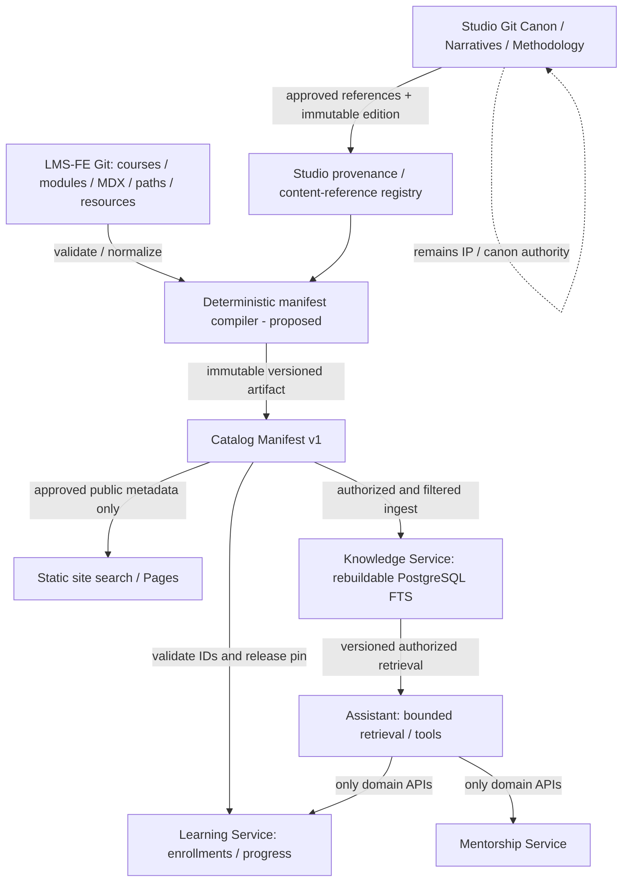

# Reltroner LMS — Phase 3A-03E Catalog Manifest & Versioning Contract (Design Candidate)

> **Date:** 2026-10-09 Asia/Jakarta  
> **Phase:** 3A-03E — Discovery / catalog architecture  
> **Status:** DESIGN DRAFT COMPLETE / REVIEW PENDING / NOT FROZEN / NOT IMPLEMENTED  
> **Execution:** GitHub connector read-only. No BE/FE/Studio source, infrastructure, database or identity changes.  
> **Audience:** system architect, release manager, LMS-FE/LMS-BE implementers, future AI handoff.  
> **Authority rule:** Phase 0C and Phase 1 LMS contracts remain FROZEN. Studio constitution governs Studio intellectual-property/narrative content, **not** LMS service deployment or identity invariants. A cross-project integration requirement is a contract proposal until ratified.

## 0. Executive decision and evidence-quality warning

**Recommended:** a deterministic, source-controlled LMS Catalog Manifest v1, with permanent opaque catalog IDs, versioned release snapshots, explicit publish/archival semantics, and a separate provenance-only Studio reference registry. The LMS must not become a second canonical Asthortera lore database or a runtime course CMS. Learning stores learner state against stable LMS IDs; Knowledge stores rebuildable derived indexes; Assistant cites approved source versions and never infers canonical truth from drafts; Mentorship owns bookings, not course/canon state.

**Observed:** FE has 3 course records, 10 modules, 31 `.mdx` lesson paths, 2 paths, and 28 resource IDs at pinned baseline. Courses/modules/paths/resources have explicit IDs; Contentlayer lessons derive `slug` and `courseSlug` from filenames/paths and **do not define a first-class `id` in the live MDX schema**. `src/types/lesson.ts` declares an `id`, but the Contentlayer source does not implement that field. Search generators use inconsistent lesson-ID constructions. No approved unified manifest artifact currently exists at this snapshot. Backend six `routes/api.php` are effectively empty and no LMS domain migrations were tracked at inspected BE SHA.

**Not observed / not claimed:** release-compiled manifest, actual Studio article canon release manifest, active learner completion criteria, full real lesson-ID stability, all URL redirects, signed artifact publication, active Knowledge ingestion, persisted learner artifacts, any live LMS integration tests, or a new business endpoint for creator projects.

## 1. Authoritative inputs (pinned)

| Source | Git commit / file blob | Authority | Direct observations |
|---|---|---|---|
| `Reltroner/reltroner-studio` | commit `f7b6e6c73fcd81c945524cb81602d2984c6b4720`, constitution blob `a8a77066ad7de30a6a806a818e5483bd1fa85688` | **Binding for Studio brand, creative/narrative/canon operations only** | Master v2.2: one studio/two value engines; Creative Compound Machine; Current Lore/Backstory/Wiki modes; prepublication mutability vs released canon; canon statuses; evergreen archive; progressive disclosure |
| `Reltroner/LMS-FE` | commit `f2d40417d0eea71e2c3e329ec6e32933b3e6cbd7` | Initial canonical LMS course content repo | `src/catalog`, `content/courses`, Contentlayer source, search/validation scripts |
| `Reltroner/LMS-BE` | commit `e30a61780994d85671cbf079e6b9ce899b3fe837` | Accepted six Laravel service **foundation only** | Business API and persistence integration not implemented |
| `Reltroner/progress-documentation` | logical contract blob `cf089b8df4b5ccb1761b504ffae662a0053bf03e` | **FROZEN LMS Phase 1** | Git-owned Catalog, no runtime CRUD, Learning owned progress, Knowledge derived indexes, Assistant delegation |
| Same | placement contract blob `b899761c9e833f9fa567055801b9ba0834ed56eb` | **FROZEN LMS Phase 0C** | Cloudflare Pages static delivery, Git content authority, private service endpoints, low-resource VPS |
| Same | ledger blob `866cc8c3b126ee6fae0cab8ac5160552cf41ad4a` | Living status and proposed gates | Manifest still to be designed, Phase3A only discovery |
| Same | identity/ADR path `lms/reltroner-lms-phase3a-03c-2d-provisioning-adr-review-20261009.md`, observed blob `c2296c0c3e142843dd8a986570dea2e850958e36` | Candidate security architecture; **not human-ratified** | Separate LMS browser clients, 19 candidate capability mappings, no HRM mutation; cumulative document also contains appended 3A-03D proposal |

**Document-integrity finding:** the referenced ADR Markdown presently includes concatenated 3A-03C-2C evidence, preliminary 3A-03C-2D draft, fuller identity ADR, and 3A-03D persistence/event report. Headings inside one file are not all independent signed decisions. Future AI should rely on internal section status and precedence, not filename alone. Recommend splitting later under approved documentation cleanup.

## 2. New Studio-derived product requirements and boundary decisions

Studio Constitution sections 1.3, 24, 27, 46–50, 51 and 54 establish distinct requirements:

| Studio doctrine | LMS-relevant implication | Ownership and scope |
|---|---|---|
| **One Studio, Two Value Engines:** creator-facing creative systems and audience-facing civilization simulation | A learner can study methodology; a reader can consume canon/narrative. Neither requires forcing Asthortera seasons into course rows | LMS Catalog controls course curriculum; Studio controls IP/canon narrative. Distinct content representations and IDs |
| **Creative Compound Machine:** output becomes input and prior consequences remain relevant | Course metadata may map prerequisites, outcomes, learning paths and optional reference graphs; creator work products may later need submission/feedback | **Potential new feature** `learner_artifacts`/reviews; requires scope, storage, API, privacy and authorization ADR. Not automatically included in existing Phase 1 endpoints |
| **Current Lore + Backstory + Wiki** are separate epistemic modes | Studio reference record may advertise `epistemic_mode` and source URL for reading/navigation/retrieval | Studio-owned classification when published and available. LMS must not invent mode or rewrite underlying canon |
| **Season → Episode → Chapter** with 37-season forward-open architecture | Studio source references may capture hierarchy and causal links without converting them into Course/Module/Lesson | Studio content graph remains outside LMS Catalog authority. No novel CMS added |
| **Prepublication freedom / published canon effectively immutable** | Separate `lms_status` from Studio `canon_status` and `release_edition`; never treat a draft lesson marked published as proof of published canon | Studio canon release gate belongs to Studio; LMS ingestion uses approved published export only |
| **Evergreen / causal continuity** | Stable IDs, historical aliases, versioned indexes, supersession relationships, retrievable references | Canon linkage must preserve origin and edition; changes recorded, never silent semantic rewrite |
| **Progressive disclosure / epistemic routing** | Optional concept/prerequisite/reference edges and disclosure tier for user experience, not arbitrary entitlement escalation | Presentation/Knowledge derive navigational depth; entitlement remains Keycloak+backend capability/ACL |
| **Epistemic honesty and technical restraint** | Display cited provenance and confidence; avoid premature AI/graph/search infrastructure | Begin with static index and PostgreSQL FTS; no invented functionality or local LLM deployment |

**Cross-constitution interpretation:** Studio is a **referenced source domain** with its own binding rules; its master constitution does not supersede LMS I-01..I-20 or P1-I01..P1-I24. A monetization, creator-project database, wiki authoring, user manuscript storage, canon-contribution workflow, or franchise API addition is **CHANGE REQUEST**, not silent expansion of existing Learning or Knowledge services.

## 3. Current LMS-FE catalog inventory and gap analysis

### 3.1 Course and path records (verified)

| Entity | Stable source ID | Status | Relation |
|---|---|---|---|
| Backend Engineering Fundamentals | `course-backend-engineering` | published | `full-stack-backend-engineer` path, 2 modules / 3 MDX lesson files |
| Worldbuilding Operating System | `course-worldbuilding-operating-system` | draft | `worldbuilding-creator` path, 5 modules / 15 lesson files |
| In-World Living Lab | `course-in-world-living-lab` | draft | prerequisite Worldbuilding OS, 3 modules / 13 lesson files |
| Full Stack Backend Engineer | `path-full-stack-backend-engineer` | published | Backend Engineering |
| Worldbuilding Creator Path | `path-worldbuilding-creator` | draft | Worldbuilding OS → In-World Living Lab |

**Derived inventory totals:** 3 courses; 10 modules; 31 MDX lesson paths (3+15+13); 2 learning paths; 28 resource IDs (Backend 2, Worldbuilding OS 13, In-World Living Lab 13). Counts are a tree/source inventory, **not a passed build or content-quality audit**.

### 3.2 Existing source schema

- `Course.id`, `Course.slug`, `Course.aliases?`, `modules[].id`, `modules[].slug`, `lessonSlugs`, `pathSlugs` and prerequisite course slugs are explicit.
- `LearningPath.id`, `.slug`, `.courseSlugs` are explicit.
- `Resource.id`, `.courseSlug`, `.type`, `.url` are explicit; URLs can use pinned jsDelivr tag `@v0.1.0`; this is an asset version, not an immutable catalog release version.
- `contentlayer.config.ts` `Lesson` frontmatter requires title, summary, kind, status, level, duration, objectives, outputs and tags, but **does not require `id`**. The lesson's route identity is currently derived from filename/parent path.
- `scripts/validate-content.ts` checks frontmatter validity, duplicate course/path slugs and presence of path/module/lesson references; it does **not** freeze permanent lesson IDs, enforce historical alias/archival compatibility, compute manifest hash, or compare to previous releases.
- `scripts/check-orphans.ts` enforces one module reference for each current MDX file; this may be kept as a curriculum rule but not interpreted as a canon graph rule.
- `scripts/validate-resources.ts` checks duplicate resource IDs and local resource references; it does not enforce a cross-release resource deprecation policy.
- `scripts/generate-search-index.ts` emits `lesson:${courseSlug}:${lessonSlug}` while `src/lib/content/search-index.ts` emits `lesson:${lesson._id}`. **Inconsistent identifier derivation** can prevent uniform referencing; actual user-visible bug not proven.
- `getLessonContext()` may fallback to `unassigned` with MAX_SAFE_INTEGER ordering if references do not resolve; production manifest validation should reject rather than silently output incomplete graph edges.

### 3.3 Immediate design gaps

1. `lesson_id` global/stable and non-path-derived *after migration*.
2. Historical stable ID/slug alias registry and tombstones.
3. Immutable, deterministic catalog build artifact plus release pinning.
4. Global/within-course unique ID and graph validation.
5. Canon versus course publication/preview distinction.
6. Content origin/edition provenance, consent/license/visibility for Studio references.
7. Release selection and compatibility when progress was earned under old curriculum.
8. Schema, consumer behavior, and rollback/reindex safety.

## 4. Ownership architecture (no seventh canonical business service)



- **Content Catalog** is a source-controlled **logical context**, not a new runtime application/DB mandated by this phase.
- **Gateway** authenticates/routes only. It never becomes the catalog mutation authority.
- **Learning** stores durable learner progress keyed by stable IDs and approved content versions; it cannot publish course/canon.
- **Knowledge** indexes only approved/authorized content; reindex must be reproducible. Search relevance does not establish historical truth.
- **Assistant** cites exact published snapshot/source provenance; no direct writes to Learning/Mentorship/Studio or user-submitted canon authority.
- **Mentorship** may reference a course or a creator-methodology reference as context, but owns offerings/availability/booking, not the referenced curriculum.
- **Audit** records privileged release actions when integration requires, without becoming canonical publishing storage.

## 5. Manifest v1 contract — candidate (not ratified)

### 5.1 Top-level canonical structure

```json
{
  "schema_version": 1,
  "catalog_version": "sha256:<64 lowercase hex of canonical version input>",
  "source": { "repository": "Reltroner/LMS-FE", "commit_sha": "f2d40417d0eea71e2c3e329ec6e32933b3e6cbd7" },
  "release_class": "public | internal_preview",
  "courses": [],
  "modules": [],
  "lessons": [],
  "paths": [],
  "resources": [],
  "studio_references": [],
  "tombstones": []
}
```

This is a **proposal**, not an existing file. Complete illustrative JSON and JSON Schema are provided as companion artifacts in this handoff. No production release hash has been produced.

### 5.2 Entity semantics

| Entity | Mandatory identity/relation | Optional context | Owner |
|---|---|---|---|
| `courses[]` | `id`, `slug`, `status`, `module_ids`, `path_ids`, `revision` | category, title, aliases, prerequisites, author | LMS-FE source |
| `modules[]` | `id`, `course_id`, `lesson_ids`, `order` | slug, title | LMS-FE source |
| `lessons[]` | `id`, `course_id`, `module_id`, `slug`, `status`, `content_digest` | learning objectives, `kind`, `resource_ids`, `source_path` | LMS-FE source |
| `paths[]` | `id`, `slug`, `course_ids`, `status` | prerequisites/order/estimated hours | LMS-FE source |
| `resources[]` | `id`, `course_id`, `type`, `url`, `source_revision` | title, usage, source content digest | LMS-FE source; third-party origin controls its own content |
| `studio_references[]` | `reference_id`, immutable `source_ref` (repo/commit/path), access classification, `canon_status` when attested | narrative mode, hierarchical relations, edition, canonical URL | **Studio** governs the referenced item; LMS stores metadata only |
| `tombstones[]` | retired `id`, status, previous aliases, last valid version, optional replacement | reason and migration guidance | LMS catalog change control |

### 5.3 ID rules

- Entity IDs are **globally unique within a type** and immutable once published or referenced by durable user state. To make cross-type collisions obvious, a **globally unique across all entity classes** validator is recommended.
- Preserve existing `course-*`, `module-*`, `path-*` and resource IDs. Do **not** regenerate these on every build.
- Introduce explicit lesson `id` in MDX metadata or a checked-in immutable lesson-ID registry: **chosen candidate: checked-in `id` frontmatter**, with a migration mapping generated once from pinned source path. Example: `lesson-backend-engineering-01-http-overview`. Once frozen, moving/renaming the MDX file must not alter its `id`.
- Slug, URL, filename, course order, title and season/episode/chapter ordinal are **presentation/navigation attributes**, not durable business keys.
- An alias is unique, points to one canonical ID, and never changes semantic owner. Historic routes redirect to the canonical route (implementation-specific) without assigning a new business identity.
- Moving published lesson content between courses (or splitting/merging required lesson states) demands a documented migration/compatibility decision; ID preservation alone does not prove equivalent learning outcomes.
- Do not recycle tombstoned identifiers. Do not delete mapping metadata while historical enrollments/bookmarks/progress may reference it.
- IDs are **not version numbers**; a content edition is a separate field. A meaningful new identity requires a new ID and `supersedes` mapping, not silent reuse.

### 5.4 Publication and visibility — two independent dimensions

**LMS:** `draft`, `published`, `archived` (source already has these statuses). Separate artifact channel `internal_preview` vs `public`.

**Studio canon (Studio constitutional vocabulary):** `concept`, `development_material`, `planned_forward_architecture`, `structured_canon`, `production_candidate`, `published_canon`, `superseded_archived_draft`.

These dimensions are **never collapsed**. Example: a published *lesson about drafting lore* does NOT certify the fictional draft discussed in it as public canon. An article accessible at a public URL is not necessarily a canonical release of the fictional narrative. Studio references without an authoritative canon status or approved release are **`not_attested` for this LMS export and not eligible for public-canon answer claims**.

**Public manifest rule:** include only approved published LMS content and explicitly distributable Studio references. Draft course lessons and unpublished canon source excerpts never leak into public static manifest/index, even if a private preview contains them. Stored reference metadata must not reveal private titles or paths publicly if they are confidential. A public publication decision is distinct from a paid entitlement decision.

**Knowledge rule:** on content ingestion, verify release class + distribution rights + effective viewer ACL. Preserve document source version. Private or restricted documents must not leak by search result, snippet, embedding metadata or Assistant citation. A missing approval flag means **deny ingestion to public channel**.

### 5.5 Reproducible artifact identity

Candidate deterministic process:

1. Checkout verified pinned Git source commit(s) and approved Studio reference-export revision(s).
2. Validate source metadata, schema, cross-links, rights/publication status, aliases, tombstones, ID stability against previous release.
3. Normalize Unicode (NFC), line endings/whitespace policy and timestamps; sort entity arrays and ID sets by a published rule; preserve ordered lesson/course arrays where order has domain meaning.
4. Serialize a **version-input object** with canonical JSON rules (e.g. RFC 8785 JCS) that includes `schema_version`, release class, relevant source SHA, all public/referenced semantic fields and source edition proofs. **Exclude** `catalog_version`, volatile build timestamps, transient build-host metadata and CDN URL mutation.
5. Compute `catalog_version = "sha256:" + SHA-256(canonical(version-input))`; produce final manifest with this value. Publish content-addressed path; never overwrite a different artifact at the same digest URL.
6. Capture manifest checksum, source commit(s), validation report, builder version and release decision in versioned release metadata. Assert equal byte output for two independent builds of the same pinned inputs.
7. Do **not** equate raw Git commit hash with catalog content hash. A Git commit containing docs-only changes can still leave curriculum semantics unchanged, depending on the hashed input contract.

`catalog_version` is **global manifest version**; `course.revision` is **course-local curriculum revision** (hash/monotonic value chosen in sign-off). Course-local revision helps avoid invalidating progress in unchanged courses after unrelated catalog edits.

### 5.6 Contract compatibility

- Schema additions are nonbreaking only if existing consumers explicitly support their treatment of unknown optional fields. Required-field removal/type changes demand `schema_version` bump and migration.
- `catalog_version` is immutable; future release can be activated by pointer to a new artifact only after consumers validate it.
- Keep previous approved manifests accessible long enough for active learners, historic completion review and reindex/rollback needs; retention **TBD from evidence and privacy policy**, not invented.
- Allow server-side version compatibility window; decide if the old catalog is read-only or still writable based on course revision compatibility. Reject unknown/unapproved client-sent version.
- Draft → published involves validated release gate, not just changing frontend status.
- Archived means no new enrollment by default, but previously enrolled learners/history must have an explicit policy (read-only vs continue existing). Never auto-delete progress.
- A semantic rewrite of Studio published canon needs distinct new edition/release evidence and a clear old-to-new historical link; no silent cross-edition substitution in Assistant replies.

## 6. Learning integration contract (requires Phase 5 implementation)

- `POST /api/v1/learning/enrollments`: resolve canonical `course_id` from approved manifest; only enroll in eligible published courses; write `principal_id=sub`, stable `course_id`, and approved `course_revision/catalog_version` snapshot atomically with domain outbox event. Client-provided principal IDs not trusted.
- `GET progress`: compute from durable `lesson_id`-scoped facts and enrollment's approved curriculum snapshot. Return explicit `curriculum_revision` if versioning is exposed by approved API schema.
- `PUT lesson progress`: accept only stable ID (or resolve documented URL alias to stable ID); check lesson belongs to enrollment's curriculum revision and principal ownership; idempotent update; version/concurrency semantics and order fixed in API contract before implementation.
- Existing API endpoint uses `{course_id}` and `{lesson_id}`, thus stable opaque IDs are the target. Slug routes are **frontend navigation** only.
- `course completion`: must be deterministic from required lesson IDs and completion-policy revision; adding a lesson to a later revision must **not** silently revoke an already-earned completion.
- `bookmark`: use stable `content_id` and retain alias/archived reference semantics. Arbitrary Studio reference bookmarks are NOT included automatically; requiring them needs an API/schema compatibility decision.
- **Creator output gap:** course documents describe deliverables such as Starter Bible v0.1 and In-World Life Journal v0.1, but current catalog only models course metadata and downloadable resources. Storage/submission/grading/mentor review of learner-created artifacts is **NEW DOMAIN FEATURE** and not implicitly authorized by a static `outputs[]` list. Define Learning-owned learner submission metadata, file storage policy, access, scan, sharing and assessment API **only after ADR and product acceptance**.

## 7. Knowledge integration contract (requires Phase 8 implementation)

- Ingest only from immutable approved manifest and Studio export with explicit authorizing release reference, provenance and visibility.
- `knowledge.index.requested` and `.completed` are existing frozen semantic families; track source `catalog_version` and Studio edition identifiers without modifying their meanings.
- Versioned index release candidate: `index_release_id`, `catalog_version`, `source_ref_set_digest`, `schema_version`, `visibility_policy_version`, checksum, `status`. Atomically promote fully validated release; retain prior active index on failed rebuild.
- Public static search on Pages gets only published/public records; private search through Knowledge must filter **before retrieval/snippet generation** using server-side effective capability and ACL (not tags supplied by browser).
- Never use Knowledge as writable canon source or infer canon status from index presence.
- `Current Lore`, `Backstory`, `Wiki` may be **source-attested** search/navigation facets; a single excerpt is not guaranteed complete truth about whole universe/season. Prefer mode-aware citation and minimum useful context, not unnecessary large lore dumps.
- Causal and semantic links (e.g. `explains`, `depends_on`, `recontextualizes`, `precedes`, `references`) are **candidate metadata edges** only when source evidence supplies their meaning. Do not infer canonical causality solely from co-occurrence or LLM output.

## 8. Assistant integration contract (requires Phase 9 implementation)

- Assistant may query only permission-approved Knowledge releases and return citations containing source title/URL/version/edition; observed datum vs model synthesis clearly distinguished.
- Never present `concept`, `development_material`, or `production_candidate` as confirmed `published_canon`.
- If a question asks what is canon but only unverified/draft references exist, reply with appropriate uncertainty and/or decline confirmation; do not fabricate a canonical story event.
- Creator-facing modes can teach methodology without asserting a learner's private generated lore is canonical Studio IP. User-created artifacts are separate principals' private works unless sharing/license grant exists.
- Mutations use authorized domain APIs, not model-inferred state changes. No new chat-history DB, no guest AI by default; external LLM/no local inference on initial VPS.

## 9. Mentorship, business and IP extension impact register

| Potential future requirement | Candidate data authority | Compatibility/change gate |
|---|---|---|
| Mentor offers based on an LMS course/path | Mentorship stores opaque references, Catalog remains source | Validate reference version and immutable offering snapshot; no cross-DB join |
| Creator mentorship reviewing submission | Learning submission state + Mentorship session context via APIs | New API, permissions, consent/file policy and cross-domain audit ADR |
| Interactive simulation / 30-day learner journal | Learning owns learner-specific durable output **if approved** | New storage and privacy contract; downloadable worksheet alone creates no server data |
| Studio wiki/season/episode/chapter exploration | Studio governs canon, Knowledge indexes approved material | Referenced external source IDs / editions; no initial canonical content CRUD |
| Paid membership, crowdfunding, entitlement/payments | Not frozen into current LMS domains | Separate commercial/finance authority and permission model ADR; no implicit paid financial ledger in Mentorship |
| Studio canon contribution from learners | Studio editorial source remains authority | Mandatory editorial approval/release workflow; learner draft never auto-promoted |
| Seasonal continuity / changing chronology before canon freeze | Studio source, source release snapshots | Do not build runtime timeline engine without demonstrable product need |
| AI-assisted concept generation | Assistant orchestration; user owns user work as policy defines | Explicit content licensing, privacy, AI provider data handling, no canonical claims |

## 10. Negative/acceptance test inventory — ALL SPECIFIED / NOT EXECUTED

| ID | Scenario | Required outcome |
|---|---|---|
| CM-T01 | Duplicate course IDs | Build FAIL |
| CM-T02 | Duplicate module/lesson/path/resource IDs | Build FAIL |
| CM-T03 | Duplicate aliases or alias mapping to different IDs | Build FAIL |
| CM-T04 | Missing referenced course, module or lesson | Build FAIL |
| CM-T05 | Orphaned MDX lesson / multiple module references | Build FAIL under current curriculum policy |
| CM-T06 | Missing mandatory stable lesson ID | Build FAIL after accepted migration |
| CM-T07 | Rename MDX file/slug with unchanged stable ID and valid alias | PASS; Learning history preserved |
| CM-T08 | Published stable ID silently changed | Build FAIL without migration/ADR |
| CM-T09 | Tombstoned ID reused | Build FAIL |
| CM-T10 | Course references unknown path/prerequisite | Build FAIL |
| CM-T11 | Prerequisite course cycle | Build FAIL unless future policy explicitly allows |
| CM-T12 | Draft course/lesson in public manifest | Build FAIL |
| CM-T13 | Unattested draft Studio reference in public-canon export | Build FAIL |
| CM-T14 | Studio source claims `published_canon` without release provenance | Build FAIL |
| CM-T15 | Rebuilt manifest from same pinned inputs differs byte-for-byte | Build FAIL |
| CM-T16 | Version digest differs from canonical payload digest | Build FAIL |
| CM-T17 | Any source change to volatile timestamp changes manifest version | Build FAIL of determinism requirement |
| CM-T18 | Resource URL uses unpinned mutable repo branch where pinned resource is required | Build FAIL |
| CM-T19 | Resource referenced from lesson absent | Build FAIL |
| CM-T20 | Unknown schema major version consumed by domain service | Fail closed/contract error |
| CM-T21 | Old course revision has completed progress; later course adds lesson | Completion remains valid for earned version |
| CM-T22 | Unapproved new enrollments in archived course | Reject; preserve existing history |
| CM-T23 | Lesson moved to new module without changing stable ID | Requires documented compatibility; no silent progress loss |
| CM-T24 | Learner tries to update progress for another principal | Deny |
| CM-T25 | Learner sends arbitrary catalog_version/lesson_id outside approved snapshot | Deny / domain conflict |
| CM-T26 | Knowledge reindex aborted mid-release | Previous active index remains available |
| CM-T27 | Public search returns private/unpublished Studio source | Zero disclosure; FAIL if leak |
| CM-T28 | Assistant treats development material as published canon | Reject/regression failure |
| CM-T29 | Assistant citation references missing/unapproved Studio edition | Reject/uncertain, no unsupported canon assertion |
| CM-T30 | Two distinct sources use same slug but different canonical authority | Disambiguate by source system and stable ID |
| CM-T31 | Published course references retired resource without compatibility alias | Build FAIL/release blocked |
| CM-T32 | Real URL route alias directs to different canonical ID after reorganization | FAIL; immutable alias resolution |
| CM-T33 | Partial manifest consumed as full production release | Reject by `release_class` and provenance |
| CM-T34 | Studio master constitution changes with no approved Studio export update | No implicit public canon change; remain pinned |
| CM-T35 | Cross-service direct catalog database mutation attempted | No write path / permission denied |
| CM-T36 | Learner-generated content automatically promoted to Studio canon | Reject absent explicit Studio editorial approval |
| CM-T37 | Model attempts direct domain state mutation | Reject; service API only |
| CM-T38 | Catalog full rebuild after new version, old idempotent progress | No duplicate/erased progress |
| CM-T39 | Partial data schema/consumer mismatches | Block promotion, keep previous release |
| CM-T40 | Consumer builds from git `main` rather than release SHA | Block; reproducibility violation |

These forty cases are **test specifications** for later implementation. No CI, DB, runtime, or release tests have been run in Phase 3A-03E.

## 11. ADR register and necessary decisions

| ADR/decision | Proposed recommendation | Status |
|---|---|---|
| `ADR-LMS-CATALOG-001` | Single immutable LMS manifest compiled from pinned Git, no canonical runtime content DB | RECOMMENDED / NOT SIGNED |
| `ADR-LMS-CATALOG-002` | Explicit permanent `lesson_id` in frontmatter, plus alias/tombstone registry and one-time ID migration | RECOMMENDED / NOT SIGNED |
| `ADR-LMS-CATALOG-003` | SHA-256 JCS canonical artifact identity + separately hashed course revisions; artifact channels preview/public | RECOMMENDED / NOT SIGNED |
| `ADR-LMS-CATALOG-004` | Historical progress pinned to enrollment curriculum revision; no retroactive completion revocation | RECOMMENDED / NOT SIGNED |
| `ADR-LMS-CATALOG-005` | Studio provenance/release/rights sidecar; no automatic canon import or source rewrite | RECOMMENDED / NOT SIGNED |
| `ADR-LMS-CATALOG-006` | Public/personalized Knowledge ingestion split with independent ACL and index-release pinning | RECOMMENDED / NOT SIGNED |
| `ADR-LMS-CATALOG-007` | Creator-produced submissions, assessments and mentorship review require new product/API/storage/privacy approval | OPEN / DEFERRED |
| `ADR-LMS-CATALOG-008` | Studio seasons/episodes/chapters/epistemic modes remain Studio-owned, represented as external references only when warranted | RECOMMENDED / NOT SIGNED |

### Open questions not to guess

1. Stable ID migration audit of all 31 lessons and historic course progress (none currently observed); exact `id` frontmatter adoption strategy.
2. Precise published/draft lesson statuses and effective public static build filtering, verified via actual build output rather than source assumptions.
3. Whether creator projects, assignments/submissions, private journaling, mentor feedback and paid access become required initial product scope.
4. Studio authoritative **release registry/export** for canon status/editions; current Constitution alone does NOT certify individual articles as published canon.
5. Which Studio pages can be indexed/quoted/processed by external LLM under approved license/access rules.
6. Public URL alias redirect policy under Next.js static export.
7. Release retention and backward-compatibility budget for prior manifests, course revisions, assets and search indexes.
8. Publication/release sign-off actor and material-change/semantic-version threshold.
9. Whether course progress counting all lessons, required checkpoints, or course-specific custom completion rubric is appropriate; do not invent from available MDX frontmatter.
10. Exact metadata-schema choice (single manifest vs contract + sidecar) and JSON Schema major-version policy ratification.

## 12. Implementation roadmap proposal (NOT AUTHORIZED)

| Gate | Later phase | Scope and artifacts | Acceptance |
|---|---|---|---|
| 3A-03E | **Now — design** | Source inventory, this document, sample manifest/JSON Schema, compatibility/Studio impact ADR | Design review only; no mutation |
| 3A wrap | Final architecture ratification | Resolve boundary changes and approve source/consumers/DoD | Human sign-off and explicit changelog |
| 3B | Catalog schema + CI contracts | Versioned manifest schema; compiler/validator test harness; generate deterministic fixtures | reproducible build tests and negative gates |
| 4 | Trust/routing/persistence | Capability/ACL enforcement before private features | auth and DB controls PASS |
| 5 | Learning | Snapshot-aware enrollment/progress/bookmarks/completion | real DB + cross-version E2E PASS |
| 8 | Knowledge | Versioned index, permission-safe ingestion, Studio approval checks | reindex and leakage negative tests PASS |
| 9 | Assistant | Canon-version-sensitive retrieval/tool policies and citations | safety/provenance/cost suite PASS |
| 10 | Frontend + assets | Stable URLs, archive redirects, independent static/public and authenticated search | learner/admin journeys PASS |
| 12 | Release certification | Invariants + mandatory final DoD evidence | no unresolved mandatory FAIL/BLOCKED |

Implementation must not unfreeze Phase 0C/1, commit to BE/FE, deploy production, provision DB, create new endpoints or change Studio canon without independently approved mutation scope.

## 13. Required evidence/AI handoff template

```text
Checkpoint: 3A-03E
Phase state: DESIGN DRAFT COMPLETE / NOT FROZEN
Studio commit: f7b6e6c73fcd81c945524cb81602d2984c6b4720
Studio master constitution blob: a8a77066ad7de30a6a806a818e5483bd1fa85688
LMS-FE commit: f2d40417d0eea71e2c3e329ec6e32933b3e6cbd7
LMS-BE commit: e30a61780994d85671cbf079e6b9ce899b3fe837
Phase 1 contract: cf089b8df4b5ccb1761b504ffae662a0053bf03e
Phase 0C contract: b899761c9e833f9fa567055801b9ba0834ed56eb
Catalog actual v1 compiler: NOT IMPLEMENTED
Actual v1 manifest/public release hash: NONE
Sample fixture: ILLUSTRATIVE / NOT PROD
Schema: CANDIDATE / NOT SIGNED
Test cases: CM-T01..CM-T40 SPECIFIED / NOT EXECUTED
Mutations: NONE
Next: Catalog ADR review, then 3A remaining acceptance/gaps and 3B change-control planning
```

**Stop conditions:** If future product plans require LMS to be the canon authoring engine, to store private creative projects, to implement Studio editorial release decisions, or to accept premium purchases, stop and open new business-boundary ADR(s). Do not silently add these to the existing Learning schema or Knowledge index.

## 14. Reference URLs

- [Studio Master Source of Truth at pinned commit](https://github.com/Reltroner/reltroner-studio/blob/f7b6e6c73fcd81c945524cb81602d2984c6b4720/content/principles/reltroner-studio-master-source-of-truth.md)
- [LMS-FE pinned content source](https://github.com/Reltroner/LMS-FE/tree/f2d40417d0eea71e2c3e329ec6e32933b3e6cbd7)
- [LMS Logical Service Boundary & API Contract](https://github.com/Reltroner/progress-documentation/blob/main/lms/logical-service-boundary-api-contract.md)
- [LMS Master Infrastructure Placement Contract](https://github.com/Reltroner/progress-documentation/blob/main/lms/master-infrastructure-placement-contract.md)
- [Identity ADR, with appended persistence draft](https://github.com/Reltroner/progress-documentation/blob/main/lms/reltroner-lms-phase3a-03c-2d-provisioning-adr-review-20261009.md)
- [End-to-End Engineering Progress Ledger](https://github.com/Reltroner/progress-documentation/blob/main/lms/engineering-end-to-end-progress-ledger.md)
- [RFC 8785 JSON Canonicalization Scheme](https://www.rfc-editor.org/rfc/rfc8785)

**Final decision:** `3A-03E DESIGN DRAFT PRODUCED — REVIEW AND SOURCE-OF-TRUTH SIGN-OFF PENDING; 3B STILL BLOCKED`.

# Reltroner LMS — Phase 3A-03F Cross-Contract Review & Business Requirement Reconciliation

> **Record ID:** LMS-3A-03F-REVIEW-20261009  
> **Date / reporting timezone:** 2026-10-09 / Asia-Jakarta  
> **Status:** CROSS-CONTRACT REVIEW COMPLETE AS DESIGN / OPEN DECISIONS / **NOT FROZEN** / NOT IMPLEMENTED  
> **Scope:** source-based design review and business-requirement reconciliation only; no source-code, VPS, Keycloak, PostgreSQL, Redis, GitHub file mutation, or deployment.  
> **Decision owner:** project owner (ratification pending).  
> **Architecture:** independently deployable six Laravel microservices in one backend monorepo; not modular monolith.  
> **Evidence quality:** GitHub source trees/files were reviewed; no current production build, effective token, database integration, or end-to-end test execution asserted.

## 0. Executive decision — read before using in another AI

**Phase 3A-03F design review result: `COMPLETE WITH OPEN DESIGN GATES`**. No observed contradiction requires altering 20 frozen physical invariants I-01..I-20 or 24 frozen logical invariants P1-I01..P1-I24. All extension requirements are **proposals**, not silently incorporated into the 26 frozen API operations, 19 frozen capability names, four databases, or nine event families. The implementation readiness gate remains CLOSED until explicit ratification and 3B acceptance criteria.

**Highest-impact new observed concern:** the pinned LMS-FE source builds static route parameters for **all** courses, lessons, and paths, including draft entities, and generates search records without a publication-status filter. There is a plausible unintended-publication **source/build risk**. It is **NOT evidence of actual public deployment leakage**, because a built production artifact and hosted pages were not inspected. Ensure no unpublished Studio canon enters public/static generated artifacts. Record `CC-01` as P0 **release blocker**, not as an already exploited production vulnerability.

**New business/domain question:** existing creator courses include downloadable templates and promised final deliverables; no demonstrated backend upload/submission/assessment/mentor-review capability. Those features must be either explicitly deferred or accepted with a new versioned API/capability/storage/privacy/retention contract. Do not infer submission CRUD merely because a lesson says “journal” or “project.”

**Document governance observation:** GitHub's file `lms/reltroner-lms-phase3a-03c-2d-provisioning-adr-review-20261009.md` is a combined 821-line record: lines 1–75 contain 3A-03C-2C evidence, 76–199 contain a preliminary ADR, 200–448 contain Identity ADR-LMS-KC-001 candidate, and 449–821 contain Phase 3A-03D Persistence/Event Model. Its title does **not** describe its whole contents. Retain it for provenance; create separate standalone canonical ADRs in a controlled **documentation-only** follow-up, with explicit statuses and stable links. Living ledger is not yet refreshed for 3A-03C…03F.

## 1. Live repository directory verification

At GitHub `Reltroner/progress-documentation/main` observed commit `4478c9fdb3ab0c11024dcb2396cd26280b4ab364`, the `lms/` directory contained **seven** files:

| File | Live blob SHA | Classification |
|---|---|---|
| `master-infrastructure-placement-contract.md` | `b899761c9e833f9fa567055801b9ba0834ed56eb` | Binding physical contract; FROZEN |
| `logical-service-boundary-api-contract.md` | `cf089b8df4b5ccb1761b504ffae662a0053bf03e` | Binding service and API contract; FROZEN |
| `engineering-end-to-end-progress-ledger.md` | `866cc8c3b126ee6fae0cab8ac5160552cf41ad4a` | Living progress/DoD ledger; current phase stale |
| `reltroner-lms-phase3a-03c-2d-provisioning-adr-review-20261009.md` | `c2296c0c3e142843dd8a986570dea2e850958e36` | Combined Identity evidence/ADR and Persistence/Event draft; not human ratified |
| `reltroner-lms-phase3a-03e-catalog-manifest-versioning-20261009.md` | `b568a6d59260bc7774a494609c7aae23d2595bb3` | Catalog design candidate, not frozen |
| `reltroner-lms-catalog-manifest-v1.candidate.schema.json` | `1f4f54751a1ebd3be089526ea6ed3343a96eaecf` | Draft JSON Schema, not a production compiler |
| `reltroner-lms-catalog-manifest-v1.partial-example.json` | `b497e10e4f20a314d00fce17531c98ba26b5768a` | Partial fixture, not a real release |

Other authoritative snapshots:
- `Reltroner/LMS-BE@e30a61780994d85671cbf079e6b9ce899b3fe837`: accepted Phase 2D foundation only. Six API route files contain `<?php`; no domain DB migrations tracked.
- `Reltroner/LMS-FE@f2d40417d0eea71e2c3e329ec6e32933b3e6cbd7`: 3 course definitions (1 published, 2 draft); 10 modules; 31 MDX lesson paths; 2 learning paths (1 published, 1 draft); 28 resource IDs; static Contentlayer build.
- `Reltroner/reltroner-studio@f7b6e6c73fcd81c945524cb81602d2984c6b4720`, `content/principles/reltroner-studio-master-source-of-truth.md`, blob `a8a77066ad7de30a6a806a818e5483bd1fa85688`, **binding Studio constitution v2.2**, updated 2026-10-08. Studio authority covers Studio creative IP, narrative, canon, modes, edition and brand; it does **not** supersede LMS infrastructure/identity/service authority.

### 1.1 Precedence and authority resolution

1. Phase 0C FROZEN: infrastructure topology, hosting, database isolation, public ingress, minimum spending.
2. Phase 1 FROZEN: six service responsibilities, API families, OIDC trust, event semantics, catalog source control, data ownership.
3. Studio binding constitution **for Studio subject matter**: Current Lore/Backstory/Wiki modes, canon release gates/editions, Creative Compound Machine, audience/creator value, IP integrity.
4. Reviewed ADRs **only after owner sign-off**: concrete identity config, outbox mechanics, manifest/schema/ID compatibility, service-call trust, etc.
5. Living ledger: observational status/evidence; cannot overwrite normative contracts.
6. Current source: descriptive implementation truth, not automatic architecture authority.

Where a proposed business feature conflicts with #1/#2, use an impact-specific ADR/versioned revised contract; NEVER silently grant an exception.

## 2. Business value model and domain separation

Studio's apex product structure is one intellectual engine and two value paths:
- **Creator-facing:** Creative Compound Machine; methodology, systems thinking, worldbuilding anti-stagnation, creator education.
- **Audience-facing:** Asthortera/The Abyss of Comfort civilizational simulation; experience and narrative, with Current Lore/Backstory/Wiki cognitive modes.
- Studio's content operating system seeks evergreen library/canon compounding, not a generic feed or SaaS dashboard. Published canon is effectively immutable; drafts remain creatively mutable; semantic revision requires versioned edition/release.

**Engineering conclusion:** LMS courses are **educational delivery**, not Studio canon authority. Studio-authored IP may appear as approved source-attested references or educational examples. The Studio constitution does not obligate six new services, a content CMS, graph DB, temporal simulation engine, publishing platform, paid-access accounting ledger, or a learner portfolio system in LMS v1.

### 2.1 Six-service authority crosswalk

| Service | Owns (frozen) | Studio-derived permissible extension under existing routes | Prohibited/extra-ADR boundary |
|---|---|---|---|
| Gateway | External JWT validation, capability routing, principal projection, request correlation | Forward `catalog_version` metadata without becoming its authority | Cannot own canon, enrollment, booking, role grants or submissions |
| Learning | Enrollment, lesson progress, completion, bookmarks | Stable course/lesson revision context; creator course deliverable description; version-pinned completion | Actual uploaded creator artifacts, grading, mentor feedback require new privacy/storage/API policy; cannot edit Studio canon |
| Mentorship | Offerings, availability, bookings, sessions | Contextual `course_id` or methodology source reference in offering; approved course snapshot | No payment ledger, shared user-creation DB, direct Learning writes or canonical curriculum edits |
| Knowledge | Rebuildable public/private search index + ingestion checkpoint | Approved Studio provenance/edition, source-attested narrative mode facets, authorized public/private index | No writable canon, auto-approval of drafts, prompt-generated facts elevated to canon, raw private source leaks |
| Assistant | Authenticated orchestration, RAG, tools through domain APIs | Mode-aware explanations and cited canonical/edition source; creator learning guidance | No canonical writing, hidden mutation, learner-private data leak, invented canon status, guest AI by default |
| Audit | Durable append-only privileged/security events; admin workflow | Trace accepted privileged release events if integrated, privacy-sensitive role changes | Cannot falsely claim Git commits automatically produce events; no cross-system transaction with Keycloak |

## 3. Cross-contract review matrix — authoritative vs design vs gaps

| ID | Topic | Reconciliation | State | Required next gate |
|---|---|---|---|---|
| CC-01 | Public/draft static output | FE static route generation/search uses all records; publication filter missing in inspected functions. Draft courses exist. Potential unintended exposure; hosted artifacts unverified. | **P0 PRE-RELEASE BLOCKER** | Build-output negative suite; public-only whitelist at every artifact stage |
| CC-02 | Lesson identity | Course/module/path/resources have explicit IDs; MDX lacks first-class immutable lesson ID; `_id` vs `courseSlug:slug` differ in search pipelines. | OPEN DESIGN / IMPLEMENTATION GAP | One-time ID registry; immutable IDs; deterministic alias migration; dual-generator parity tests |
| CC-03 | Curriculum + historic learner state | Progress endpoint uses stable `{course_id}/{lesson_id}`; revised manifest proposes pinned course revision. No tables/APIs implemented. | DESIGN CONSISTENT, DRAFT | Define completion policy revision, enrolled revision upgrade opt-in, archived behavior, unknown-ID policy |
| CC-04 | Studio canon vs course publication | Studio's `published_canon` cannot be inferred from LMS `published` or public URL. | DESIGN RULE REQUIRED | Two distinct status dimensions and source-attested edition; default `not_attested` |
| CC-05 | Search provenance and preview rights | Public edge search, private Knowledge and Assistant share references but different entitlements and audiences. | DESIGN OPEN | Independent public/private release filtering; no snippet or citation leakage; license/LLM-use approval |
| CC-06 | Git → Knowledge event provenance | Frozen `knowledge.index.requested/completed` families do not specify who authenticates a Git release into Knowledge workflow. | **CONTRACT DESIGN GAP** | Explicit authenticated internal ingestion trigger and durable job/outbox; no unowned Git-to-DB write |
| CC-07 | Keycloak provisioning | Exact `lms-user/lms-admin/lms-api` clients absent at observed realm; Identity ADR design candidate. | OPEN ADR | Owner sign-off then Phase 4 controlled provisioning; HRM regressions |
| CC-08 | Internal service workload trust | Loopback not auth; signed assertion/workload identity proposed, format/rotation/replay still open. | **OPEN CRITICAL DESIGN** | Separate ADR and abuse/negative contract suite before private domain APIs ship |
| CC-09 | API coverage | 26 frozen external operations; no canonical course mutation or submit/review endpoints. | FROZEN SEMANTIC SCOPE | OpenAPI schemas and capabilities in 3B; any new family requires change control |
| CC-10 | Capability coverage | 19 capabilities frozen; `admin.learning.*` has no initial public admin Learning API; `mentorship/availability` authorization policy unspecified. | GAP / RESERVED CAPABILITIES | Bind to explicit current operations or leave unused; do not invent routes/roles |
| CC-11 | Booking durability | Slot occupancy and idempotency are independent DB guarantees; booking/API design pending. | DRAFT | PostgreSQL constraints + race tests; event outbox consistent |
| CC-12 | Audit-Keycloak role change | Role action spans separate Keycloak and audit authority; no distributed commit. | OPEN CRITICAL DESIGN | Durable operation intent + outcome/reconciliation, admin adapter least-privilege |
| CC-13 | Publisher/inbox failure | Redis ephemeral; outbox/inbox proposed; no runtime tests. | DESIGN DRAFT | Signed event schema, at-least-once, dedup, DLQ/retry/retention, replay tests |
| CC-14 | Studio editorial release | Studio canon freeze editorial flow is distinct from LMS catalog build and from Git commit visibility. | BUSINESS RULE | Attested release artifact, publication actor, version & legal rights; no automatic canon promotion |
| CC-15 | Creator deliverable | Course says produce project bible/journal; backend submissions, private data and reviews absent. | **NEW REQUIREMENT CANDIDATE** | Owner must explicitly include or defer; ADR+API+RBAC+storage/privacy if included |
| CC-16 | Paid mentorship/membership | Studio mentions memberships/funding; initial Mentorship has no payment/payout/ledger authority. | OUT OF SCOPE CURRENT V1 | Separate commercial/finance ADR if required; never proxy into bookings |
| CC-17 | Long-horizon story graph | Studio season/episode/chapter; lore modes, causal dependency preservation. LMS manifest currently only references Studio. | NO CONFLICT | Studio owns canonical graph; Knowledge may index attested edges; no new LMS runtime graph authority |
| CC-18 | Frontend auth drift | `.env.example` references legacy issuer/client; UI role fallback to student. | OBSERVED DRIFT | Controlled FE cutover only after effective claims validation; server denies missing permission |
| CC-19 | Observability and rollback | Catalog and Knowledge versions need consistency through deployment/rollback. | OPEN | Version pin policy, promotion pointer, rollback, reindex, safe retention thresholds |
| CC-20 | Evidence/governance | Identity ADR file contains concatenated 3A-03C and 3A-03D docs; ledger not refreshed. | **DOCUMENTATION BLOCKER TO 3A FREEZE** | Split into canonical docs preserving historical source; update ledger link/status and owner decisions |
| CC-21 | Runtime capacity/cost | 1 vCPU/~4GB VPS shared with HRM/Keycloak; FTS/outbox/indexing/LLM calls increase load. | RELEASE GATE | Measured CPU/RAM I/O profiles, throttled workers, no optional new service by default |
| CC-22 | CI/release-proof | 3A design tests are specified only; FE build and BE implementation not certified. | OPEN | 3B six-service CI + FE publication guard; signed release artifact promotion |

### 3.1 Source-to-production disclaimer for CC-01

Inspected source:
- `src/app/(learn)/courses/[slug]/page.tsx`: `generateStaticParams()` enumerates all courses/aliases.
- `src/app/(learn)/courses/[slug]/lessons/[lesson]/page.tsx`: uses `getAllLessonRouteParams()`.
- `src/lib/content/lesson-registry.ts`: `getAllLessonRouteParams()` iterates `getAllCourses()` with no status gate.
- `src/app/(learn)/paths/[slug]/page.tsx`: `generateStaticParams()` enumerates all paths.
- `scripts/generate-search-index.ts`: maps all `courses`, `learningPaths`, and parsed lesson files.
- `src/lib/content/search-index.ts`: `getSearchIndex()` maps all registry courses/lessons/paths.
- `src/catalog/courses/*.ts`: two courses marked `draft`.

**Not tested:** actual built `out/`, pages served by Cloudflare, origin cache, routing/auth middleware; do not assert public exposure occurred. Static output, if publicly deployed, must not be treated as access-controlled just because React hides links.

## 4. API-operation and capability reconciliation

Frozen **26** `/api/v1` operations: `me=1`, Learning=8, Mentorship=7, Knowledge=1, Assistant=1, Admin principal=3, Admin mentorship=3, Admin audit=2. Business endpoint families **do not** include project submissions, assessments, Studio editorial authoring or payment processing. Do not create extra route families under generic `POST /courses`, `PATCH /lessons` or an unapproved learner upload API.

Frozen **19** capabilities: Learning (6), Mentorship (4), Knowledge/Assistant (2), Admin (7). Keycloak ADR candidate stores them as `lms-api` client roles at `resource_access['lms-api'].roles`; this is not runtime-verified. `lms-user` and `lms-admin` are separate browser trust contexts; no default privilege from persona, `production_user`, frontend UI role, or just authenticating.

| Operation ambiguity | Required policy decision |
|---|---|
| `GET /api/v1/me` | Authenticated principal; effective capabilities sanitized; no invented `me.read` permission |
| `GET /api/v1/mentorship/offerings[/{id}]` | Public vs authenticated guest policy; if public, forbid private mentor metadata |
| `GET /api/v1/mentorship/availability` | Authenticated? Should require existing offering capability or new dedicated permission? Do not silently alter frozen 19 names |
| `GET /api/v1/knowledge/search` | Required `knowledge.search`; per-document ACL separate and enforced by Knowledge |
| `POST /api/v1/assistant/query` | `assistant.use`; downstream tool calls need independently authorized delegated permissions |
| `admin.learning.read/override` | Capabilities are reserved but have no initial explicit admin-learning route; default deny, no phantom API |
| `PUT .../progress` | Path IDs stable; enrollment revision server-resolved, not arbitrary user-provided `catalog_version` |
| `PATCH .../principals/{id}/roles` | Keycloak + Audit transaction split with uncertainty reconciliation; not made safe by signing JWT alone |

Potential **new business endpoint** impact (`NEW API FAMILY`) is a change proposal, not v1 work:
- project/submission creation, revision, private storage, attachment, grading/feedback, rubric, mentor review;
- source-backed Studio canon publication/release management;
- payments, subscriptions, access entitlements.
If scoped into current version, author a separate ADR with explicit effect on 26 route families, 19-capability namespace and DoD. Otherwise defer and keep worksheets client-side/download-only.

## 5. Persistence, events, and catalog versioning reconciliation

### 5.1 Durable domain truth remains four databases

| DB | Authority | New requirement resolution |
|---|---|---|
| `lms_learning_db` | Enrollment, learner progress, completion, bookmarks | Store stable `course_id`, `lesson_id`, approved `course_revision`, historical completion policy and outbox; **no Studio canon content** |
| `lms_mentorship_db` | Offers, slots, booking, sessions, durable `Idempotency-Key` records | Store versioned course/methodology reference snapshot as context; avoid cross-DB joins; no payment ledger |
| `lms_knowledge_db` | Search/index derived release/checkpoints | Rebuildable from authorized immutable LMS catalog and attested Studio reference releases; strict ACL/visibility |
| `lms_audit_db` | Append-only privileged events and durable administrative operation intent/outcome | Cannot claim Keycloak external role mutation and Audit commit as atomic; reconciliation required |

Gateway/Assistant have no mandatory durable DB; Redis remains ephemeral. Each producer owns `outbox_events` as needed and each consumer's durable correctness effects require `inbox_events` in its own DB. Public content releases originate Git; no Git-owned runtime SQL business table is created to make events easier.

### 5.2 Catalog → Learning

- `schema_version=1` (candidate) describes shape; `catalog_version=sha256(...)` identifies manifest; `course.revision` binds learner progress, not every unrelated manifest change.
- Course/module/path/resource IDs are already explicit in FE snapshot. MDX lesson ID and cross-release aliases must be introduced once and never regenerated from mutable path.
- Lesson ordering and chapter ordinals are not unique durable identities.
- Enrollment only into eligible released courses. Completion derives from required lesson set at the enrollment's accepted curriculum revision; later course updates must not silently erase prior completion.
- Historic manifest version availability, release retention, migration and course upgrade policy remain decisions. No speculative forever-retention commitment.

### 5.3 Catalog/Studio → Knowledge → Assistant

**Recommended authenticated ingest sequence (not yet a frozen transport contract):**

1. Studio editorially releases specific eligible canonical sources/editions through its own Git/release flow; creator approval/rights recorded outside Knowledge.
2. LMS catalog compiler builds a validated immutable manifest with distinct `lms_status`, `release_class`, `studio_canon_status`, `studio_source_commit` and rights/visibility attestation for eligible references.
3. Approved deploy/release workflow sends a **signed/authenticated internal ingestion request** to Knowledge (or an approved trusted worker), with artifact URI, digest, release metadata; no new public browser endpoint required.
4. Knowledge validates digests, provenance, release class, rights and ACL; persists `ingestion_job` and `knowledge.index.requested` in one Knowledge-owned database transaction as applicable.
5. Worker builds a new derived versioned index, validates ACL/content completeness, atomically switches current index pointer, and emits `knowledge.index.completed` with status outcome as contract defines.
6. Assistant query pins an allowed index release; citations carry **actual** source/release/edition provenance. Draft and `not_attested` items cannot be described as Studio published canon.

The exact ownership of `knowledge.index.requested` **is not yet frozen**. The numbered sequence is a candidate solution to CC-06 requiring sign-off. It avoids pretending a Git commit itself is already a durable cross-service event. Published/archived Studio canon and educational `published` courses are independent status dimensions.

### 5.4 Outbox and reconciliation

Frozen event types (9):

- `learning.enrollment.created`
- `learning.progress.updated`
- `learning.course.completed`
- `mentorship.booking.created`
- `mentorship.booking.cancelled`
- `mentorship.session.completed`
- `identity.role.changed`
- `knowledge.index.requested`
- `knowledge.index.completed`

At-least-once transport (Redis) + transactional outbox + consumer dedup; no Redis-only correctness, cross-database 2PC, or exactly-once global assertion. The Keycloak adapter may emit `identity.role.changed` only after canonical mutation outcome has been verified and recorded; ambiguous results stay reconcilable, never announce false success. Audit mutation intent must exist durably before attempting a security-sensitive cross-authority operation, and failures cannot be silently dropped.

## 6. Studio business requirement triage — avoid scope creep

| BR ID | Studio/source requirement or product possibility | Proposed disposition for **LMS initial architecture** | Needed if promoted |
|---|---|---|---|
| BR-01 | Creator-facing systematic worldbuilding education / anti-stagnation | **IN-SCOPE AS CONTENT/CURRICULUM** (existing courses) | Stable lessons, outcomes, release version |
| BR-02 | Audience-facing Asthortera/continuous narrative and civilization laboratory | **IN-SCOPE AS APPROVED REFERENCE/SEARCH ONLY** | Studio attestation, mode/source metadata; no LMS canon writer |
| BR-03 | Current Lore/Backstory/Wiki narrative modes | **METADATA/FACET CANDIDATE** only if source-attested | Index schemas, source citations, no invented modes |
| BR-04 | Published canon immutability, edition and archival | **MANDATORY INTEGRATION CONSTRAINT** whenever Studio material referenced | Versioned provenance, canon release attestation, no silent semantic rewrite |
| BR-05 | Creative Compound Machine and cross-domain causal narrative | **TEACHING/RETRIEVAL CONTENT**; not durable workflow engine | Avoid LLM-generated canonical dependency graph |
| BR-06 | Studio course worksheets and downloadable resources | **IN-SCOPE STATIC DELIVERY** | Pinned asset release URLs, broken-link check |
| BR-07 | User-generated project bible or 30-day journal **persisted in LMS** | **DEFER FROM V1 unless owner explicitly promotes** | Learner-owned submission/entity/API/file storage privacy, consent, retention, rubrics |
| BR-08 | Assessment/rubric submission/grading/mentor review | **DEFER / NEW BUSINESS FEATURE** | Role+object permissions, API/version, audit, Learning vs Mentorship data ownership |
| BR-09 | Mentorship with creator-output review | **DEFER cross-service reviewer workflow**; basic bookings remain in scope | Signed limited cross-service data access, consent, session artifacts |
| BR-10 | Paid private sessions, subscriptions, Patreon/Kickstarter | **DEFER financial/commercial ledger from Mentorship** | Separate payments/entitlements authority, no debt in core learning DB |
| BR-11 | Studio narrative editorial CMS or wiki content CRUD via LMS admin | **OUT OF SCOPE / DISALLOWED BY CURRENT FROZEN CONTRACT** | Major contract revision, Studio editorial approval, separate ownership model |
| BR-12 | Personalization, reader's private notes / favorites on Studio canon | **DEFER until explicit product use case** | New principal privacy/ACL/retention, decision if Learning bookmark family extends |
| BR-13 | Source-approved Studio content searchable via universal Ctrl+K | **IN-SCOPE AS FUTURE AUTHORIZED/STATIC INDEX INTEGRATION** | Separate public vs private rights, rebuild, citation, performance |
| BR-14 | Guest AI or unrestricted LLM-based canon generator | **OUT OF SCOPE INITIAL**, authenticated Assistant only | Abuse/cost/rights contract, prompt/data policy |
| BR-15 | Cross-course creator pathways and prerequisites | **IN-SCOPE AS VERSIONED CATALOG RELATION** | Stable IDs, ordered path validation, cycle checks, completion meaning |
| BR-16 | Institutional equivalence: every lore element = LMS entity | **REJECT** | Creates false domain ownership and runaway service complexity |

**Why defer is a positive explicit decision:** supporting downloadable templates and course outcomes does not require server-side submissions. A future phase can add it when a concrete learner-to-mentor feedback loop and privacy model are approved. Do not implement product architecture based on inferred monetization hopes alone.

## 7. Decision register and ratification gates

| ID | Proposed decision | Recommendation | Owner action / status |
|---|---|---|---|
| ADR-03F-01 | Authority precedence / no crossing LMS-vs-Studio canon | Keep frozen LMS topology + Studio canon publication authority separate | RECOMMENDED; sign-off pending |
| ADR-03F-02 | Public static publication filtering | Enforce published/approved-only route/search/asset build, deny drafts by default | RECOMMENDED; test harness Phase 3B / FE release |
| ADR-03F-03 | Stable ID + historic curriculum revision model | Approve 03E candidates, specify one-time migration and long-term alias/tombstones | RECOMMENDED; sign-off pending |
| ADR-03F-04 | Source-attested Studio reference + rights | Require edition/status/release evidence and access/license policy for every imported reference | RECOMMENDED; sign-off pending |
| ADR-03F-05 | Knowledge ingest trigger ownership | Authenticated internal release-to-Knowledge request; Knowledge owns ingest job and events | PROPOSED; open protocol/auth design |
| ADR-03F-06 | Creator submissions/assessments v1 | **Defer** initial server-side storage/review unless owner chooses scope expansion | NEEDS EXPLICIT PRODUCT DECISION |
| ADR-03F-07 | Paid product/entitlement v1 | Exclude financial ledger and paid access from existing six-service v1 scope | RECOMMENDED; sign-off pending |
| ADR-03F-08 | Internal workload/delegated principal auth | Separate signed identity + workload authentication, fail closed | CRITICAL ADR STILL OPEN |
| ADR-03F-09 | Admin-Keycloak audit reconciliation | Durable operation intent and verified outcomes; no fake atomicity | CRITICAL ADR STILL OPEN |
| ADR-03F-10 | Document split / ledger refresh | Preserve combined historical file; issue separate 03C/03D canonical docs and 03F status overlay | DOCUMENTATION SIGN-OFF PENDING |
| ADR-03F-11 | Availability and capability binding | Document policy for `mentorship/availability` and unused admin-learning capabilities, no silent new route | OPEN CONTRACT DECISION |
| ADR-03F-12 | Resource/cost governance | Prefer PostgreSQL FTS, Redis outbox, external LLM; schedule bounded workers on shared 1-vCPU VPS | RECOMMENDED; measured release budget pending |

### 7.1 Phase 3A design closure — necessary prerequisites (no runtime test claim)

- [ ] Project owner records a positive/negative ratification decision for 03C-2D Identity ADR candidate, 03D Persistence ADR candidates and 03E Catalog candidate; do not mistake 'recommended' for 'FROZEN'.
- [ ] Decide BR-07/08/09: learner artifact/submission/mentor assessment is **deferred** (recommended) or included with expanded contract/versioned API/permissions/data/storage scope.
- [ ] Specify denial-by-default publication filter on all public FE generation paths and list production build artifact checks.
- [ ] Resolve or explicitly gate CC-06 (Git release → authenticated Knowledge ingestion request + producer authority) and CC-10 route-policy ambiguity.
- [ ] Approve separate ADR direction for internal service caller identity, delegation, role revocation freshness, key rotation and spoofing protections (implementation blocked until detailed signed spec).
- [ ] Approve durable audit intent/outcome/reconciliation design for Keycloak administrative mutations; existing HRM no-change constraint explicit.
- [ ] Give standalone canonical identity and persistence documents clear decision status, linking to original concatenated historical evidence rather than erasing it.
- [ ] Refresh `engineering-end-to-end-progress-ledger.md` with 03A–03F evidence, exact referenced SHAs, statuses and open blockers; do not rewrite normative contracts.
- [ ] Trace all 20 I-xx and 24 P1-Ixx to planned acceptance evidence; no signing without a source-to-test matrix.
- [ ] Explicitly record Phase 3A design closure decision and what is deferred to 3B/4–12. **No implementation begins merely because this review is complete.**

### 7.2 Phase 3B/implementation acceptance gates (NOT executed in this review)

- **FE-PRIV-01:** Public export has zero routes, pages, metadata, sitemap entries, JSON search records, and bundled indexes for draft/preview-only content; missing status defaults deny.
- **FE-PRIV-02:** Alias, archived, source-attested published references remain valid; no published route redirects to drafts/private URLs.
- **CM-01:** Manifest canonicalization deterministic under repeated builds; checksum and schema version reflect approved inputs; course revision separate from global hash.
- **CM-02:** Stable lesson IDs unchanged under slug/path rename and graph repairs; moved/split semantic content requires reviewed mapping.
- **LR-01:** Historical enrollments continue to refer to accepted curriculum revision; earned completions not retroactively revoked.
- **KC-01:** Wrong issuer/audience/`azp`/capability denied; client roles filtered and no student default backend authorization.
- **INT-01:** Forge/spoof/replay/stale internal delegations denied by private service.
- **EV-01:** Crash after DB commit before Redis dispatch, duplicated broker deliveries, out-of-order event and Redis outage recover without losing business truth.
- **KN-01:** Private/unattested draft content never surfaced in public snippet, search, embedding, or Assistant citation; invalid releases never promoted.
- **AD-01:** Keycloak role-change ambiguous response remains auditable and reconcilable without false success.
- **MT-01:** Concurrent bookings cannot both allocate capacity-one slot, regardless of different idempotency keys.
- **OPS-01:** HRM auth/scopes/worker unaffected; measured VPS performance/cost/safety adequate.

All tests are *proposed requirements*, not PASS evidence.

## 8. Invariant and global DoD traceability (44 frozen invariants, 16 proposed product DoDs)

### 8.1 Infrastructure invariants I-01..I-20

| Invariant grouping | 03F effect | Disposition |
|---|---|---|
| I-01..I-03 learner/admin/backend hostnames | Separate static FE, only public Gateway | PRESERVED |
| I-04..I-07 Keycloak trust, client separation, authorization | 03C Identity ADR pending signing; no learner-to-admin escalation | PRESERVED AS RULE, UNTESTED |
| I-08 private services, I-17 public ingress | No direct external domain API, authenticated internal trigger | PRESERVED, INTEGRATION TEST OPEN |
| I-09..I-12 PostgreSQL ownership/Redis ephemeral | 4 DBs + source-controlled catalog + outbox | PRESERVED, IMPLEMENTATION PENDING |
| I-13..I-14 hosting/static frontend | Assets versioned, Pages static | PRESERVED |
| I-15..I-16 AI/Cloudflare nonauthority | External LLM, Cloudflare not source of truth | PRESERVED |
| I-18 immutable assets, I-19 versioned API | Release manifests/references source-pinned, 26 routes remain | PRESERVED |
| I-20 justification for complexity | Do not create new service/DB/CMS without proof | PRESERVED |

### 8.2 Logical invariants P1-I01..P1-I24

| Invariant grouping | 03F effect | Disposition |
|---|---|---|
| P1-I01..I07 ownership | Six-service owners remain distinct; Studio canon separate from LMS curriculum | PRESERVED |
| P1-I08..I12 identity & capabilities | JWT+Keycloak+capabilities, no frontend fallback | PRESERVED; 03C proof pending |
| P1-I13..I14 API ingress | 26 frozen routes / Gateway only | PRESERVED |
| P1-I15..I17 no cross-DB write, no distributed TX, outbox | Local durable producer and consumer receipts | PRESERVED; 03D pending ratification |
| P1-I18..I19 public/private search | Draft never public; Knowledge private ACL | PRESERVED; FE gap to remediate |
| P1-I20..I21 Assistant authorization | Only via domain APIs, authenticated-only initial | PRESERVED |
| P1-I22..I24 content CRUD exclusion, instructor admin plane, identity projections | Source-controlled catalog, no shared user DB | PRESERVED |

### 8.3 Global DoD 01..16 classification

| DoD | Affected contract/review | Current evidence state |
|---|---|---|
| DOD-01 governance | 03A–03F and owner ratifications | PENDING |
| DOD-02 service/runtime independence | Phase 2D skeleton + Phase 4 deploy | PARTIAL FOUNDATION |
| DOD-03 identity | 03C ADR / Keycloak clients absent | PENDING |
| DOD-04 API/OpenAPI | 26 routes, schema not implemented | PENDING |
| DOD-05 catalog/history | 03E + publication filter | DRAFT |
| DOD-06 Learning durable journey | 03D + 03E | PENDING |
| DOD-07 Mentorship | 03D slot/idempotency | PENDING |
| DOD-08 Audit/admin | 03C + 03D reconciliation | PENDING |
| DOD-09 Knowledge | 03E + 03F ingest/ACL | PENDING |
| DOD-10 Assistant | 03C + 03E provenance | PENDING |
| DOD-11 learner/admin FE | FE-PRIV + OIDC cutover | PENDING |
| DOD-12 private/TLS boundaries | Phase 4/11 probes | PENDING |
| DOD-13 CI/CD | Phase 3B and release jobs | PENDING |
| DOD-14 reliability/backup | Outbox, restore/failure drills | PENDING |
| DOD-15 performance/spending | 1-vCPU shared runtime measured before capacity promises | PENDING |
| DOD-16 release certification | Evidence-based final signoff | PENDING |

## 9. Proposed documentation-only change set (NOT APPLIED)

Do **not** silently rewrite binding contracts or delete historical combined files. A future docs-only change (explicitly approved) may:

1. Create `lms/reltroner-lms-phase3a-03f-cross-contract-business-reconciliation-20261009.md` using this standalone review text, status `DESIGN REVIEW COMPLETE / NOT FROZEN`.
2. Copy 03D content from historical file lines 449–821 into a standalone `lms/reltroner-lms-phase3a-03d-persistence-event-model-20261009.md`, preserving exact content and original source link, marking review candidate.
3. Add standalone Identity ADR from lines 200–448 as `lms/adr-lms-kc-001-identity-provisioning.md` with provenance to original, retaining `NOT HUMAN-RATIFIED` until signed.
4. Update living ledger sections 0, 2, 3, 10, 11, 12 and 14 with dated append-only checkpoint log. Pin reviewed file/blob/commit IDs and list CC-01..22 and BR-01..16, keeping 20+24 invariants unchanged.
5. Optionally create a single decision index linking all ADRs/fixtures and an explicit source hierarchy. Do **not** promote pending candidates to FROZEN, edit `LMS-FE` or `LMS-BE`, or provision anything as a side effect of archival.

### 9.1 Minimal living-ledger status overlay — ready to review

```markdown
### Phase 3A-03F (2026-10-09) — Cross-contract review
- Result: design review complete; architecture ratification and freeze PENDING.
- Sources: Studio constitution v2.2, six-service LMS-BE baseline, LMS-FE catalog snapshot,
  Keycloak 3A-03C evidence, 3A-03D Persistence draft and 3A-03E Manifest draft.
- High-impact FE source risk: draft content is included in static route/search generation
  without a publication filter; production leakage not verified; release blocked pending test.
- No change to frozen 20 physical / 24 logical invariants; 26 API operations,
  19 capabilities, nine event families and four logical DB ownership domains preserved.
- Business expansion: learner submissions/review and paid flows explicitly deferred pending
  owner decision and a versioned contract; Studio canon authority remains external to LMS.
- Unresolved: internal service trust, Keycloak/admin Audit reconciliation, Knowledge
  release ingestion origin, manifest/ID historical policy, FE public publication gates,
  authoritative ADR sign-offs, cross-release compatibility and CI acceptance.
- No production mutation and no code implementation were performed for 3A-03F.
```

## 10. Next deterministic engineering action

**Checkpoint:** `3A-03F DESIGN REVIEW COMPLETED / CONTRACT FREEZE BLOCKED`. The next work item should be **3A-04 — Decision Ratification + Phase 3A Freeze Readiness**, *not* immediate provisioning or Laravel implementation. Specifically: review CC-01/02/06/08/12/15/20 and ADR-03F-01..12; decide whether creator artifact storage/submissions are in v1; accept or revise all nonfrozen ADR drafts; normalize documentation; define exact Phase 3B entry/exit controls. Once sign-offs are recorded, move to 3B *contract+CI design/implementation*, and keep Phase 4 (provisioning) separately gated.

**Hard stop:** source design does not demonstrate production security, correctness, privacy or publication readiness. No token, key, production DB, DNS/TLS, invoice, package upgrade or deployment action is authorized by this document.

---

## Source references (read using connected GitHub)

1. `https://github.com/Reltroner/progress-documentation/tree/main/lms`
2. `https://github.com/Reltroner/progress-documentation/blob/main/lms/master-infrastructure-placement-contract.md`
3. `https://github.com/Reltroner/progress-documentation/blob/main/lms/logical-service-boundary-api-contract.md`
4. `https://github.com/Reltroner/progress-documentation/blob/main/lms/engineering-end-to-end-progress-ledger.md`
5. `https://github.com/Reltroner/progress-documentation/blob/main/lms/reltroner-lms-phase3a-03c-2d-provisioning-adr-review-20261009.md`
6. `https://github.com/Reltroner/progress-documentation/blob/main/lms/reltroner-lms-phase3a-03e-catalog-manifest-versioning-20261009.md`
7. `https://github.com/Reltroner/progress-documentation/blob/main/lms/reltroner-lms-catalog-manifest-v1.candidate.schema.json`
8. `https://github.com/Reltroner/progress-documentation/blob/main/lms/reltroner-lms-catalog-manifest-v1.partial-example.json`
9. `https://github.com/Reltroner/reltroner-studio/blob/main/content/principles/reltroner-studio-master-source-of-truth.md`
10. `https://github.com/Reltroner/LMS-FE/tree/f2d40417d0eea71e2c3e329ec6e32933b3e6cbd7`
11. `https://github.com/Reltroner/LMS-BE/tree/e30a61780994d85671cbf079e6b9ce899b3fe837`
